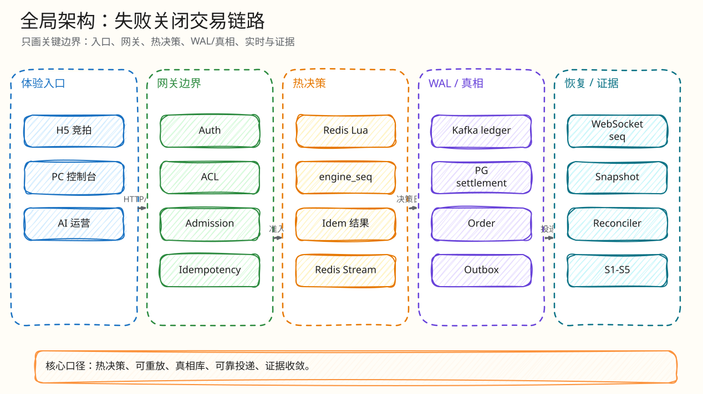

# 项目总览：实时竞拍大师

父文档：[文档库入口](../README.md)
子文档：[产品范围](01-product-scope.md)、[最小闭环索引](02-minimal-closed-loops.md)、[模板覆盖说明](03-template-coverage.md)、[可视化覆盖矩阵](04-visualization-map.md)、[系统架构](../01-architecture/00-system-architecture.md)
相关提交材料：`submission/第五组-李烨文-训练营结项文档.md`、`submission/championship-review-2026-06-10/评委视角终审-直播竞拍全栈系统.md`

## 一句话定位

这不是单纯的 React + WebSocket + 数据库竞拍 demo，而是一套“失败关闭”的实时交易链路：

```text
H5/PC 请求
  -> Go Gateway 鉴权 / ACL / admission / 幂等入口
  -> Redis Lua 单写者原子决策
  -> Redis Stream 本地决策日志
  -> Kafka 有序 WAL / group-commit ACK
  -> PostgreSQL 结算、审计、订单真相
  -> Outbox / WebSocket 广播
  -> Reconciler / Monitor / S1-S5 门禁校验
```

## 核心能力清单

| 能力 | 当前实现 | 代码入口 | 证据 |
|---|---|---|---|
| 竞拍规则 | 0 元起拍、加价网格、封顶成交、反狙击延时、绝对硬顶、误触确认、取消 | `backend/internal/redisengine/engine.go`, `backend/internal/auction/rules.go` | Redis engine 集成测试、PTS 校验脚本 |
| 热出价路径 | Redis Lua 一次原子执行，拒绝也消耗 `engine_seq` | `AuctionHandler.PlaceBid`, `Engine.placeBidWithSnapshot` | `backend/internal/redisengine/*_test.go`, `tests/pts/verify-l4b-pts-correctness.sh` |
| 持久性 | Redis AOF + Stream、Kafka ledger、PG settlement、Outbox | `cmd/server/main.go`, `redisengine/kafka_ledger.go`, `outbox/relay.go` | S1-S5、risk simulator |
| 实时同步 | WS ticket、last_seq 恢复、history/snapshot、慢消费者断开 | `backend/internal/realtime/server.go`, `frontend/mobile-h5/src/main.tsx` | `tests/load/s5-reconnect-recovery.js`, Playwright |
| AI 运营 | 选品、解说、哨兵、Q&A、复盘；AI 不碰钱/胜者/终态 | `backend/internal/ai`, `gateway/ai_handlers.go` | AI repository/provider tests |
| 可观测 | Prometheus、Grafana、Alertmanager、OpenTelemetry、Tempo、Pyroscope | `infra/docker-compose.yml`, `observability/metrics.go` | `/metrics`, dashboards, alert rules |

## 全局架构图


<!-- excalidraw-generated:start -->
<div class="excalidraw-diagram" style="overflow-x: auto; width: 100%; margin: 12px 0 18px 0; padding: 12px 12px 14px 12px; border: 1px solid #e2e8f0; border-radius: 8px; background: #fffdf7;">
  <a href="../assets/excalidraw/00-project-00-overview-01.excalidraw">打开可编辑 Excalidraw 源文件</a>
  <br />
  
</div>
<!-- excalidraw-generated:end -->

## 最小业务闭环

1. 主播在 PC 端创建商品和拍品，配置起拍价、加价幅度、封顶价、延时策略、误触阈值。
2. 拍品排期后规则冻结，到时由 scheduler 或主播启动进入 `ACTIVE`。
3. 买家 H5 端进入房间，获取快照和 WS ticket，连接 `/ws?room_id=...&auction_id=...&last_seq=...`。
4. 买家点击出价，H5 生成 `client_bid_id`，HTTP `Idempotency-Key` 必须等于该值。
5. 网关鉴权、ACL、admission 后调用 Redis engine。
6. Lua 脚本在 Redis 内原子完成规则、幂等、ACL、延时、封顶、误触、序号和决策日志写入。
7. HTTP 返回最终决策：`ENGINE_ACCEPTED`、`ENGINE_REJECTED`、`ENGINE_SOLD`、`FAT_FINGER_CONFIRM_REQUIRED` 或恢复/暂停错误。
8. Kafka settlement worker 幂等落 PG，终态建单，写 outbox。
9. Outbox relay 发布 WS 事件，H5/PC 按 seq 更新 UI；若 seq gap，H5 拉快照恢复。

## 代码版本与材料版本差异

6 月 10 日评审材料基于 `a8b1224`。当前工作树 HEAD 是 `ab0a41d`，已有后续修复。例如评审材料指出 H5 出价 `fetch` 无超时；当前 `frontend/mobile-h5/src/main.tsx` 已实现 `fetchWithTimeout` + `AbortController` + 8s 上限。新文档按当前代码写，同时把旧问题作为工程演进案例记录。

## 工业对标摘要

| 维度 | 工业常见做法 | 本项目取舍 |
|---|---|---|
| 高争用决策 | 把热点判断放进单写者或强序组件，避免 DB 行锁排队 | Redis Lua 原子决策，PG 退居结算/审计 |
| 消息持久化 | Kafka 用于顺序日志和重放，exactly-once 依赖幂等 producer/事务或幂等消费者 | 不吹 Kafka EOS；使用 at-least-once WAL + PG 唯一约束/CAS 幂等消费 |
| 实时投递 | WS 长连接 + 服务端序号 + 快照恢复，慢消费者需要背压策略 | Hub 有界队列，慢消费者断开，last_seq 恢复 |
| AI in commerce | AI 生成内容需事实约束、人工确认、审计 | AI 只辅助运营，不参与价格、胜者、订单终态 |

## 答辩时的 30 秒版本

“项目最核心的是失败关闭的实时交易链路。出价不走 PostgreSQL 行锁，而是进 Redis Lua 单写者脚本，一次原子操作完成幂等、规则、ACL、延时、封顶和决策日志；Kafka 是有序 WAL 和结算重放源；PostgreSQL 是订单与审计真相；Outbox/WS 把结果广播给 H5/PC；Reconciler 和 S1-S5 门禁证明赢家、序号、拒绝原因、结算和 outbox 没漂移。AI 只做运营助手，永远不碰钱和胜者。”
