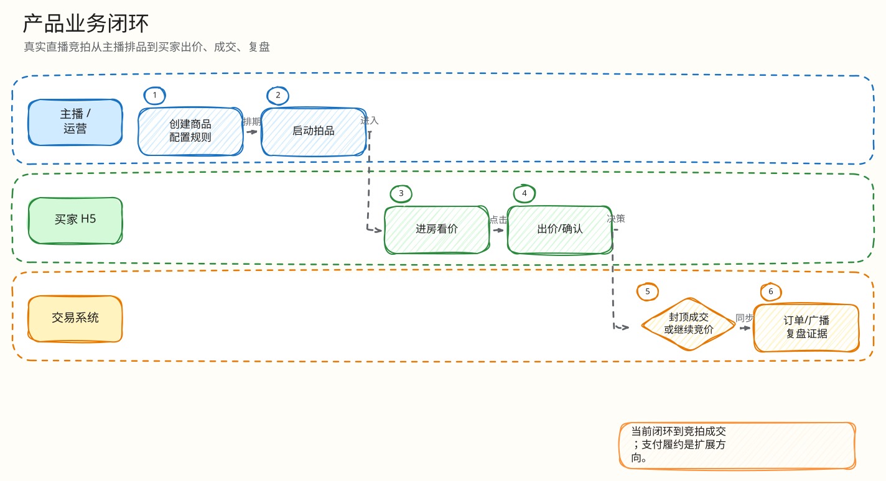

# 产品范围与业务场景

父文档：[项目总览](00-overview.md)
相关文档：[领域模型](../02-domain/00-domain-model-and-rules.md)、[H5 竞拍闭环](../05-frontend/01-mobile-h5-closed-loop.md)、[PC 控制台闭环](../05-frontend/02-pc-console-closed-loop.md)

## 目标用户

| 角色 | 真实诉求 | 系统能力 |
|---|---|---|
| 主播 / 商家 | 快速上架、讲清规则、制造紧张感、控制风险 | PC 发品、规则配置、AI 选品草稿、AI 解说、监控、飞行记录器、取消/排期/开拍 |
| 买家 | 看清商品与规则、快速出价、弱网下不被骗、不因误触损失 | H5 直播间、服务端权威倒计时、误触确认、结果页、mock 支付、Q&A |
| 运维 / 测试 | 知道系统是否在骗人，故障时能定位和恢复 | Prometheus/Grafana、告警、Reconciler、S1-S5、风险模拟器 |
| 评委 / 面试官 | 判断是否只是 demo，还是有工程纵深 | 可追溯代码、测试门禁、缺陷边界、扩展路线 |

## 用户主流程

<!-- excalidraw-generated:start -->

  <a href="../assets/excalidraw/00-project-01-product-scope-01.excalidraw">打开可编辑 Excalidraw 源文件</a>
   
  

<!-- excalidraw-generated:end -->

## 明确已实现

| 模块 | 已实现范围 | 代码/路由 |
|---|---|---|
| 商品 | 图片上传、商品创建、媒体服务 | `/api/items/upload-url`, `/api/items/upload`, `/api/items` |
| 拍品 | 创建、规则修改、排期、取消、启动、列表/详情 | `/api/auctions`, `/rules`, `/schedule`, `/start`, `/cancel` |
| 出价 | 手动出价、误触确认、幂等、实时反馈 | `/api/auctions/{id}/bids`, `/bids/confirm` |
| 代理最高价 | `max_bid_intents` 存储、取消、摘要、热路径自动响应 | `/max-bid-intent`, `redisengine.resolveHotMaxBids` |
| 订单/支付 | SOLD 建单、mock 支付、provider webhook、支付幂等 | `/orders`, `/orders/{id}/pay-mock`, `/payments/fake-provider/webhook` |
| 直播互动 | 聊天、系统消息、liveops 小任务、抽奖 | `/rooms/{room}/chat`, `/system-messages`, `/liveops` |
| AI | 选品草稿、系统解说、商品 Q&A、哨兵告警、复盘高光 | `/host/ai/listing-drafts`, `/product-qa`, `/commentary`, `/recap` |
| 监控 | outbox、scheduler、rejects、recovery、redis-engine、flight recorder | `/api/monitor/*` |

## 明确不是生产上线范围

| 边界 | 当前状态 | 答辩口径 |
|---|---|---|
| 真实支付 | mock provider + webhook + 幂等/异常事件 | 证明订单/支付状态机，不处理真实资金清结算 |
| 真直播流 | H5 有直播位和竞拍体验，无真实 CDN 推流 | 本项目聚焦竞拍交易内核，不做直播基础设施 |
| 多 AZ / RF=3 | 本地 Kafka 单 broker RF=1，文档给出扩展路径 | 当前证据证明单节点链路正确性，不证明生产容灾等级 |
| 真实风控封禁 | 哨兵告警永不自动封禁 | 正确价值观：AI 和规则引擎不自动伤害用户权益 |
| 完整电商售后 | 订单、mock 支付、历史存在；售后/退款非本期核心 | 可作为 P1/P2 扩展 |

## 产品评委会追问什么

| 问题 | 30 秒回答 | 进一步展开 |
|---|---|---|
| 和普通拍卖 demo 有什么区别？ | 普通 demo 证明页面能动；本项目证明交易真相可恢复、可对账、可失败关闭。 | 指向 Redis Lua、Kafka settlement、PG 唯一约束、S1-S5 门禁。 |
| 买家弱网会不会误以为自己赢了？ | 不会。H5 出价后只是 pending，终态来自服务端；断连/恢复中禁用危险操作。 | 指向 `isDangerousActionDisabled`、`recoverFromSnapshot`、WS `last_seq`。 |
| 商家恶意改规则怎么办？ | 排期后规则冻结，热路径只读冻结规则；取消是显式终态并留事件。 | 指向 `UpdateRules` 状态守卫和 `Cancel` 路径。 |
| AI 会不会乱承诺保真/升值？ | AI 输出有 schema、事实白名单和不安全词回退，选品强制人审。 | 指向 `NormalizeListingDraft`、`NormalizeProductQAAnswer`、job 审计表。 |

## 工业参考

TikTok Shop 官方资料中有 LIVE Countdown Bidding 这类直播电商倒计时竞拍功能；这说明“直播间内限时出价/倒计时抢拍”是贴近真实业务的场景。工业上这类业务最敏感的是信任、实时性、规则透明和失败时不误导用户。本项目把这些转成工程约束：服务端权威、不可伪造的决策序号、拒绝有据、恢复中禁用危险操作。
