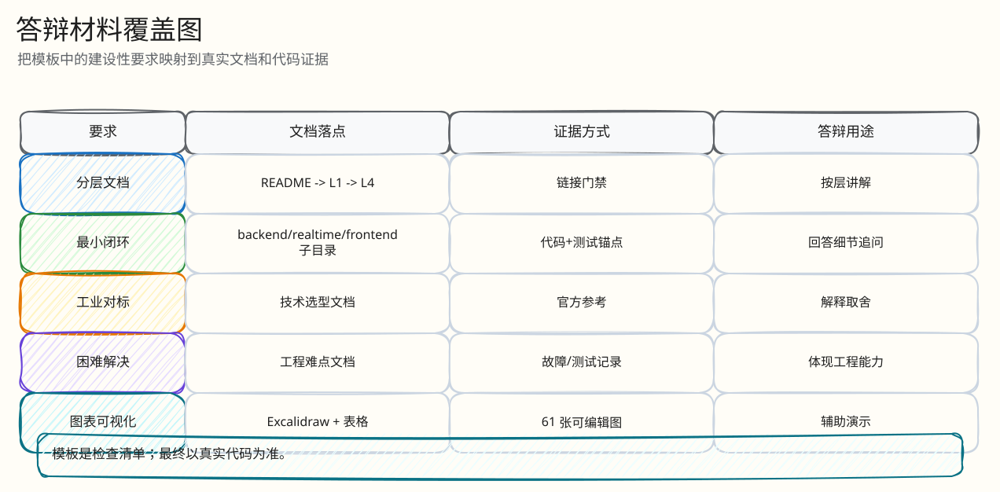

# 模板要求覆盖说明

父文档：[项目总览](00-overview.md)
子文档：[可视化覆盖矩阵](04-visualization-map.md)
相关文档：[最小闭环索引](02-minimal-closed-loops.md)、[最终提交材料覆盖矩阵](../10-appendix/submission-coverage.md)

本文把 `构建文档库模版提示词.txt` 的建设性要求映射到当前 `docs/`。模板的层级和模块名是示例，本项目没有机械生成“L0-L4 共 30 篇”的空壳，而是按真实代码里的闭环边界组织：项目层、架构层、领域层、后端交易层、实时层、前端层、观测证据层、风险测试层、答辩层、附录层。

## 图 0-3-1：模板要求到真实文档的映射

<!-- excalidraw-generated:start -->

  <a href="../assets/excalidraw/00-project-03-template-coverage-01.excalidraw">打开可编辑 Excalidraw 源文件</a>
   
  

<!-- excalidraw-generated:end -->

这张图展示了模板不是被忽略，而是被“落到真实系统边界”。例如模板里的“L4 单次出价完整流程”对应 [单次出价闭环](../03-backend/01-bid-decision-closed-loop.md)，模板里的“断线重连与状态恢复”对应 [WebSocket 恢复闭环](../04-realtime/01-websocket-recovery-closed-loop.md)，模板里的“故障与恢复机制”对应 [Redis 丢失恢复](../03-backend/03-redis-loss-recovery.md) 和 [测试/SRE 拷问](../09-judge-defense/02-sre-test-defense.md)。

## 表 0-3-1：模板强制项覆盖矩阵

| 模板强制项 | 当前落点 | 代码/证据锚点 | 答辩用途 |
|---|---|---|---|
| 100% 基于真实代码 | [代码地图](../10-appendix/code-map.md) + 各闭环文档 | `backend/cmd/server/main.go`, `gateway/router.go`, `redisengine/engine.go` | 被要求现场定位代码时不慌 |
| 分层父子链接 | [README](../README.md) 文档地图 | 每篇顶部父文档/子文档/相关文档 | 评委从任一主题追问都能跳转 |
| 工业界标杆对标 | [技术选型与工业对标](../01-architecture/02-technology-selection-and-benchmark.md) | Redis/PostgreSQL/Kafka/MDN/Prometheus/OTel 官方资料 | 解释为什么这么选，而不是堆技术 |
| 最小闭环逻辑 | [最小闭环索引](02-minimal-closed-loops.md) | H5 -> Gateway -> Lua -> Kafka -> PG -> Outbox -> WS | 讲清“一个请求怎么完整走完” |
| 数据一致性保障 | [数据与一致性](../01-architecture/01-data-consistency.md) | migrations 唯一约束、engine_seq、settlement CAS | 防守 exactly-once/幂等问题 |
| 困难与解决方案 | [工程难点与解决方案](../03-backend/05-engineering-difficulties.md) | Redis Lua、Kafka ACK、H5 timeout、rebuild | 展示真实工程能力 |
| 性能与容量 | [证据映射](../07-performance-and-evidence/00-evidence-map.md) | `tests/pts`, `tests/load`, S1-S5 | 防止把历史数字讲成生产 SLA |
| 评委拷问 | [答辩索引](../09-judge-defense/00-defense-index.md) | 架构/SRE/产品三类追问 | 高压问答脚本 |
| 图表与可视化 | [可视化覆盖矩阵](04-visualization-map.md) | Excalidraw、表格、代码索引 | 满足“能用图不用长段文字” |

## 表 0-3-2：模板层级的适配结果

| 模板层级 | 模板意图 | 当前实现 | 为什么这样适配 |
|---|---|---|---|
| L0 项目总览 | 一眼理解项目 | `00-project/00-overview.md` | 覆盖业务定位、主链路、工业对标摘要、30 秒答辩 |
| L1 系统架构 | 服务拆分、技术选型、数据架构 | `01-architecture/*` | 把架构、一致性、技术选型拆成三篇，避免总览过长 |
| L2 模块详细设计 | 核心模块 | `02-domain`, `03-backend`, `04-realtime`, `05-frontend`, `06-observability` | 按真实代码模块和答辩追问边界组织 |
| L3 关键组件实现 | 代码级组件 | `03-backend/01-05`, `04-realtime/01`, `05-frontend/01-02` | 用“闭环文档”承接关键组件，避免只有类图没有业务流 |
| L4 最小闭环逻辑 | 一个请求/故障怎么进出 | [最小闭环索引](02-minimal-closed-loops.md) 指向各底层文档 | 本项目的最小闭环跨多个组件，单独成文比按目录碎片化更好答辩 |

## 图 0-3-2：答辩阅读路径

<!-- excalidraw-generated:start -->

  <a href="../assets/excalidraw/00-project-03-template-coverage-02.excalidraw">打开可编辑 Excalidraw 源文件</a>
   
  

<!-- excalidraw-generated:end -->

这张图的用法是：不要从头背所有文档。评委问“为什么不用 PG 行锁”，走架构；问“用户弱网重复点会不会重复扣款”，走 H5 闭环和出价闭环；问“证据在哪里”，走证据映射；问“生产还差什么”，走风险矩阵和答辩边界。

## 模板中没有机械照搬的部分

| 模板示例 | 当前处理 | 原因 |
|---|---|---|
| eBay/淘宝/LMAX/Twitter 每篇都展开 | 集中在技术选型文档引用官方/一手技术资料，产品场景引用 TikTok Shop Countdown Bidding | 外部博客容易过时；本项目答辩关键是用工业原则解释代码取舍 |
| 每篇 3000-8000 字 | 关键闭环较长，索引/附录较短 | 文档库要可用，不为字数堆内容 |
| 每篇都放长代码片段 | 用路径、函数名、行号范围和短片段索引 | 代码会变，长贴代码容易失真；答辩时按代码地图现场定位更可靠 |
| 30 篇 L4 | 用闭环索引聚合 10 个最小闭环 | 当前项目的最小闭环跨端到端链路，过度拆分会破坏可讲性 |

## 自检清单

| 检查项 | 当前状态 | 下一步维护方式 |
|---|---|---|
| 所有链接可跳转 | 用脚本检查相对 md 链接 | 每次新增文档后复跑链接检查 |
| 图表有标题编号 | 新增文档按“图/表 编号”写；历史核心文档继续逐步补编号 | 答辩优先读带编号图表的闭环文档 |
| 技术选型有对比矩阵 | 已集中到技术选型文档 | 新增技术栈时追加 |
| 困难有根因和验证 | 已集中到工程难点文档 | 新增缺陷修复后追加 |
| 评委问题有角色视角 | 已拆架构/SRE/产品 | 后续可补前端/安全专项 |
| 无空白待填项 | 文档不使用“以后再填”的空白条目 | 未实现能力写成边界 |
