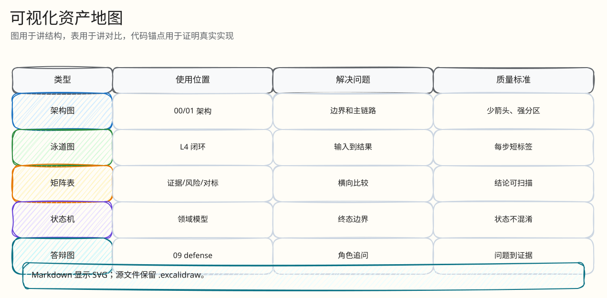
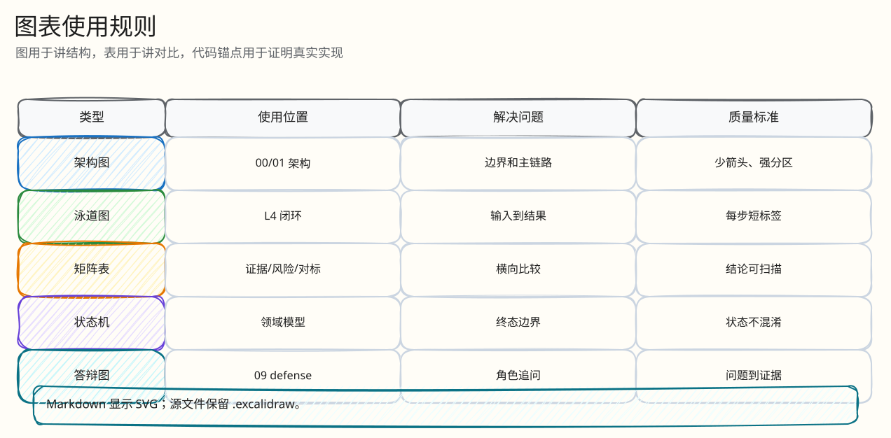

# 可视化覆盖矩阵

父文档：[模板要求覆盖说明](03-template-coverage.md)
相关文档：[最小闭环索引](02-minimal-closed-loops.md)、[代码地图](../10-appendix/code-map.md)

`构建文档库模版提示词.txt` 第“四、图表与可视化强制要求”要求每篇文档至少包含架构/部署图、时序图、对比表、数据流图、代码片段等可视化。当前文档库按“核心闭环文档必须完整覆盖，索引/附录文档按用途覆盖”的方式执行。图形资产统一迁移为 Excalidraw：Markdown 中嵌入 SVG 预览，同时保留 `.excalidraw` 源文件，便于答辩前继续手工调整。

## 图 0-4-1：可视化类型总览

<!-- excalidraw-generated:start -->

  <a href="../assets/excalidraw/00-project-04-visualization-map-01.excalidraw">打开可编辑 Excalidraw 源文件</a>
   
  

<!-- excalidraw-generated:end -->

这张图展示每种图表在答辩中的作用。评委不是为了看图而看图，而是用图快速定位系统边界、时序、取舍、数据变化、代码证据和风险证据。

## 表 0-4-1：核心文档可视化覆盖

| 文档 | 架构/部署图 | 时序图 | 对比表 | 数据流/状态图 | 代码证据 | 备注 |
|---|---:|---:|---:|---:|---:|---|
| [项目总览](00-overview.md) | 是 | 闭环步骤 | 是 | 主链路图 | 代码入口表 | L0 全景 |
| [产品范围](01-product-scope.md) | 业务时序 | 是 | 是 | 范围表 | 路由/功能表 | 产品答辩 |
| [最小闭环索引](02-minimal-closed-loops.md) | 闭环映射 | 场景路径 | 是 | 场景到文档 | 文档锚点 | 快速导航 |
| [系统架构](../01-architecture/00-system-architecture.md) | 是 | 主链路 | 是 | 组件数据流 | 组件代码表 | 架构主答辩 |
| [数据与一致性](../01-architecture/01-data-consistency.md) | 存储边界 | 是 | 是 | 一致性状态 | migrations | exactly-once 防守 |
| [技术选型与工业对标](../01-architecture/02-technology-selection-and-benchmark.md) | 选型版图 | 无需请求时序 | 是 | 取舍流 | 官方来源表 | 对标和 trade-off |
| [领域模型](../02-domain/00-domain-model-and-rules.md) | 领域状态图 | 规则流 | 是 | stateDiagram | 规则文件 | 规则拷问 |
| [单次出价闭环](../03-backend/01-bid-decision-closed-loop.md) | 数据流图 | 是 | 是 | Redis Lua 流 | 函数/脚本行号 | 最核心 L4 |
| [出价热路径 L4](../03-backend/auction-bid/00-index.md) | 子树图 | 分支图 | 是 | 幂等/规则/ACK | 代码锚点 | 第二期下钻 |
| [Kafka 结算闭环](../03-backend/02-kafka-settlement-closed-loop.md) | 数据流图 | 是 | 是 | settlement 状态 | migrations/worker | 异步一致性 |
| [结算 L4](../03-backend/settlement/00-index.md) | 子树图 | 是 | 是 | redelivery/order/outbox | 代码锚点 | exactly-once 追问 |
| [Redis 丢失恢复](../03-backend/03-redis-loss-recovery.md) | 恢复流程图 | 故障步骤 | 是 | RECONCILING 流 | rebuild 函数 | 失败关闭 |
| [恢复 L4](../03-backend/recovery/00-index.md) | 子树图 | 是 | 表格 | checkpoint/rebuild | 代码锚点 | 故障恢复追问 |
| [AI 运营闭环](../03-backend/04-ai-ops-closed-loop.md) | 是 | AI 请求流 | 是 | schema/fallback | provider/repository | AI 边界 |
| [工程难点与解决方案](../03-backend/05-engineering-difficulties.md) | 难点分布图 | 故障闭环 | 是 | 根因到验证 | 代码证据表 | 工程能力 |
| [WebSocket 恢复](../04-realtime/01-websocket-recovery-closed-loop.md) | 连接恢复图 | 是 | 表格 | last_seq 流 | `ServeWS`/Hub | 弱网恢复 |
| [WebSocket L4](../04-realtime/websocket/00-index.md) | 子树图 | 是 | 表格 | ticket/last_seq/slow | 代码锚点 | 实时链路追问 |
| [H5 竞拍闭环](../05-frontend/01-mobile-h5-closed-loop.md) | UI 状态流 | 是 | 表格 | pending/uncertain | TS 函数 | 前端答辩 |
| [H5 L4](../05-frontend/mobile-h5/00-index.md) | 子树图 | 是 | 表格 | timeout/countdown/gap | 代码锚点 | 弱网体验追问 |
| [PC 控制台闭环](../05-frontend/02-pc-console-closed-loop.md) | 工作台流 | API 表 | 是 | 主播流程 | 路由表 | 主播侧业务 |
| [观测与运维](../06-observability/00-ops-observability.md) | 观测链路 | 事故定位步骤 | 是 | 告警面 | 配置路径 | SRE 答辩 |
| [证据映射](../07-performance-and-evidence/00-evidence-map.md) | 证据层级 | 运行顺序 | 是 | claims -> evidence | tests 路径 | 证明链 |
| [风险矩阵](../08-tests-and-risk/00-risk-and-abuse-matrix.md) | 风险分布 | 事故故事 | 是 | 攻击到防线 | 测试路径 | 测试拷问 |
| [答辩索引](../09-judge-defense/00-defense-index.md) | 主线图 | 问答路径 | 是 | 问题到文档 | 文档锚点 | 高压问答 |

## 图 0-4-2：一次出价的可视化分层

<!-- excalidraw-generated:start -->

  <a href="../assets/excalidraw/00-project-04-visualization-map-02.excalidraw">打开可编辑 Excalidraw 源文件</a>
   
  

<!-- excalidraw-generated:end -->

如果评委要求“只讲一个闭环”，这张图就是答辩顺序。每一层都能跳到对应底层文档和代码路径。

## 表 0-4-2：图表规范

| 规范 | 执行方式 |
|---|---|
| 图表必须有编号和标题 | 新增文档使用 `图 目录号-序号`、`表 目录号-序号` |
| 图表节点必须能解释 | 每张图后都有“这张图展示...”或上下文说明 |
| 对比表必须有结论 | 选型表最后一列固定写“本项目选择/结论” |
| 时序图必须标同步/异步/超时 | 出价文档标 40ms Kafka ACK，H5 文档标 8s timeout |
| 数据流必须标输入/处理/输出 | 单次出价、Kafka、Redis 恢复文档都按闭环写 |
| 代码片段必须可定位 | 用文件路径、函数名、行号范围；长代码不整段复制 |

## 表 0-4-3：答辩场景到图表的快捷索引

| 评委场景 | 优先展示图表 | 讲解重点 |
|---|---|---|
| “画一下整体架构” | [项目总览 图：全局架构图](00-overview.md) + [系统架构主链路](../01-architecture/00-system-architecture.md) | Redis 是热决策，Kafka 是 WAL，PG 是真相，Outbox/WS 是投递 |
| “一次出价到底怎么走” | [单次出价时序图](../03-backend/01-bid-decision-closed-loop.md) | H5 idempotency -> Gateway -> Lua -> Kafka ACK/ENGINE_DURABLE |
| “Kafka 重复会不会双订单” | [Kafka 结算时序图](../03-backend/02-kafka-settlement-closed-loop.md) + 幂等表 | PG unique/CAS 吸收 at-least-once |
| “Redis 数据没了怎么办” | [Redis 恢复流程图](../03-backend/03-redis-loss-recovery.md) | fail-closed，不从 PG 猜测热态 |
| “弱网用户体验” | [H5 单次出价时序图](../05-frontend/01-mobile-h5-closed-loop.md) | 8s timeout、uncertain、同 key 重试 |
| “怎么证明不是文档吹” | [证据映射表](../07-performance-and-evidence/00-evidence-map.md) | verifier、S1-S5、risk simulator、代码路径 |
