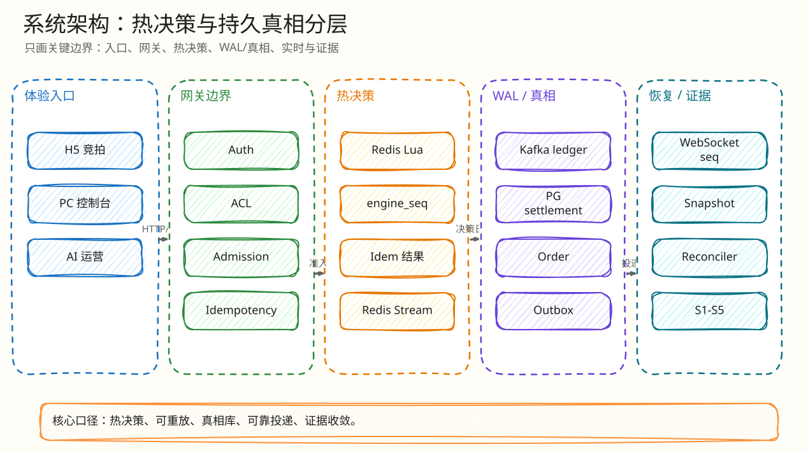

# 系统架构

父文档：[文档库入口](../README.md)
子文档：[数据与一致性](01-data-consistency.md)、[技术选型与工业对标](02-technology-selection-and-benchmark.md)、[热出价闭环](../03-backend/01-bid-decision-closed-loop.md)、[实时恢复](../04-realtime/01-websocket-recovery-closed-loop.md)
关键代码：`backend/cmd/server/main.go`, `backend/internal/gateway/router.go`, `backend/internal/redisengine/engine.go`, `backend/internal/outbox/relay.go`

## 架构目标

1. 热路径延迟低：最后一秒大量买家竞争同一拍品时，避免 PostgreSQL 同一行锁排队。
2. 交易真相可恢复：Redis 是热态，不是最终真相；Kafka/PG 能重放和对账。
3. 失败关闭：热态缺失、脚本异常、漂移、权限不明时，不给假成功。
4. 体验实时但服务器权威：H5/PC 只展示服务端决策，不能本地宣布赢家。

## 运行时组件

`cmd/server/main.go` 当前启动的关键组件：

| 组件 | 是否默认启动 | 代码证据 | 作用 |
|---|---:|---|---|
| HTTP Gateway | 是 | `http.Server{Handler: gateway.NewRouterWithRealtimeAndLedger(...)}` | REST API、鉴权、路由 |
| Realtime Server | 是 | `realtime.NewServerWithOptions(...)` | WS ticket、恢复、Hub |
| Outbox Relay | 是，除非 `DISABLE_EMBEDDED_OUTBOX_RELAY` | `outbox.NewRelay(...).Run(...)` | PG outbox -> WS |
| AI Commentary Worker | 是，除非禁用 | `RunAutoCommentaryWorker(...)` | 自动解说任务 |
| Kafka Settlement Worker | 是 | `redisengine.NewWorker(...).Run(...)` 和额外 `RunKafkaSettlement` | Kafka -> PG settlement |
| Scheduler Runner | 是 | `scheduler.NewRunner(...).WithFencer(redisengine.New(...))` | 到时启动/结束/终态 fencing |

## 路由边界

`gateway.NewRouterWithRealtimeAndLedger` 把系统分成四类 API：

| 类别 | 路由示例 | 说明 |
|---|---|---|
| 公共健康/指标 | `/healthz`, `/readyz`, `/metrics` | 运维入口 |
| 交易 API | `/api/auctions/{id}/bids`, `/bids/confirm`, `/orders/{id}/pay-mock` | 买家热路径和支付路径 |
| 主播 API | `/api/auctions`, `/rules`, `/schedule`, `/start`, `/cancel`, `/host/*` | 商品、规则、监控、AI |
| 实时 API | `/api/auth/ws-ticket`, `/ws` | WS ticket + 长连接恢复 |

## 技术选型矩阵

| 问题 | 方案 A | 方案 B | 方案 C | 本项目选择 |
|---|---|---|---|---|
| 热出价决策 | PostgreSQL `SELECT FOR UPDATE` | 应用层锁/Redlock/etcd | Redis Lua 单写者 | Redis Lua：一次 RTT 内完整规则，避免热点行锁排队 |
| 决策持久化 | 只写 PG | Redis Stream only | Kafka WAL + PG settlement | Kafka + PG：可重放、可对账、可区分 durability |
| 实时同步 | HTTP polling | SSE | WebSocket + snapshot recovery | WebSocket：双向/低延迟；HTTP snapshot 兜底 |
| AI 输出 | 直接自由文本 | 完全不用 AI | JSON schema + 归一化 + fallback | 受控 AI：运营辅助，不污染交易真相 |
| 可观测 | 日志 | Prometheus only | Prometheus + OTel + dashboards | 多层观测：指标、trace、panel、告警、flight recorder |

完整选型论证见：[技术选型与工业对标](02-technology-selection-and-benchmark.md)。

## 架构主链路


<!-- excalidraw-generated:start -->
<div class="excalidraw-diagram" style="overflow-x: auto; width: 100%; margin: 12px 0 18px 0; padding: 12px 12px 14px 12px; border: 1px solid #e2e8f0; border-radius: 8px; background: #fffdf7;">
  <a href="../assets/excalidraw/01-architecture-00-system-architecture-01.excalidraw">打开可编辑 Excalidraw 源文件</a>
  <br />
  
</div>
<!-- excalidraw-generated:end -->

## 为什么不是 PostgreSQL 行锁热路径

PostgreSQL 官方文档说明，显式锁在冲突时会等待；`SELECT ... FOR UPDATE` 对被返回行加锁，其他冲突更新必须等锁释放。对“同一个拍品最后一秒 1000 人出价”来说，所有请求竞争同一 `auctions` 行，低延迟目标会被串行锁等待放大。

本项目仍保留 PG legacy 入口 `PlaceBidPostgresLegacyForTests`，用于测试/对照，但默认热路径由配置 `BidEngineMode: "redis_ledger"` 和网关装配 `redisengine.New(...)` 指向 Redis ledger。

## Redis Lua 为什么成立

Redis 官方 Lua/EVAL 文档说明脚本在 Redis 服务端执行，适合把应用逻辑放进 Redis 内高效、原子执行。项目将幂等、规则、ACL、误触、延时、封顶、XADD 决策流都放在同一个脚本内。这样热路径不需要：

- 先读 Redis 再回应用判断再写 Redis；
- 先查 DB ACL 再回 Redis 决策；
- 接受后再异步补幂等记录。

脚本内写入 `idem_key`、`pending_key`、`log_stream_key` 和热态 hash，形成“决策与日志同原子操作”。

## Kafka/PG 的边界

Kafka exactly-once 语义在官方/Confluent 资料中依赖幂等 producer、事务 producer/consumer 协作等条件。当前项目使用 `segmentio/kafka-go` 风格 ledger，不把 Kafka 层宣传为严格 EOS；实际口径是：

```text
Redis Lua: 单次决策原子
Kafka: at-least-once 有序决策 WAL / 重放源
PG: 唯一约束 + engine_seq CAS 的 exactly-once 业务效果边界
```

这比“宣称 exactly-once”更容易防守：Kafka 可以重复投递，PG settlement 幂等吸收重复。

## 当前部署拓扑

`infra/docker-compose.yml` 提供本地功能/证据环境：

| 服务 | 版本/配置 | 重要边界 |
|---|---|---|
| PostgreSQL | `postgres:16-alpine` | 本地单实例 |
| Redis | `redis:7-alpine`, `appendonly yes`, `appendfsync always`, `noeviction` | 热态 + AOF；不是多副本 HA |
| Kafka | `apache/kafka:3.9.1`, KRaft, RF=1 | 功能证据，不是生产 RF=3 |
| MinIO | S3 兼容对象存储 | 商品/高光资源 |
| Prometheus/Grafana/Alertmanager | 指标、面板、告警 | 本地观测闭环 |
| Tempo/OTel/Pyroscope | trace/profile | 调试和瓶颈定位 |

## 扩展路线

| 增长/故障场景 | 先崩点 | 扩展方式 |
|---|---|---|
| 单拍品出价 QPS 10x | Redis 单线程 Lua 执行和 Kafka append | 按拍品分片；单拍品仍需单写者，优化 Lua 和 relay batch |
| 多热门拍品同时运行 | Redis/Kafka/WS 资源共享 | Redis Cluster `{auctionID}` hash tag、Kafka 按 auction 分区、WS gateway 按 room 路由 |
| Kafka broker 宕机 | 本地 RF=1 不具备生产容灾 | RF=3、minISR=2、acks=all、多 broker 压测 |
| Redis 丢失 | 热态缺失进入 RECONCILING | 从 Kafka/PG checkpoint 重建，增加 Redis HA/epoch fencing |
| WS 10k+ 在线 | 单 gateway fd/内存/队列 | 多 gateway、LB 粘性/room route、连接成本压测 |

## 评委拷问

| 问题 | 30 秒回答 | 3 分钟展开 |
|---|---|---|
| Kafka 是不是过度设计？ | 不是为了炫技，而是决策 WAL、重放源、故障证据。 | Redis 是热态，PG 是真相；中间需要一个有序日志承接“已决策但未结算”的状态，否则 Redis 丢失后无法解释哪些决策该恢复。 |
| Redis 单点怎么办？ | 当前本地是单 Redis；故障策略是 fail-closed，而不是假成功。 | 生产扩展用 Redis HA/Cluster + epoch fencing；本项目已实现 RECONCILING、checkpoint 和恢复，但没有声称多 AZ 证据。 |
| 为什么不用 Redlock？ | 业务不是多进程互斥，而是单热点全序决策。 | Redlock 增加 RTT 和协调成本；Redis Lua 已经在单线程内原子执行并给出序号。 |
