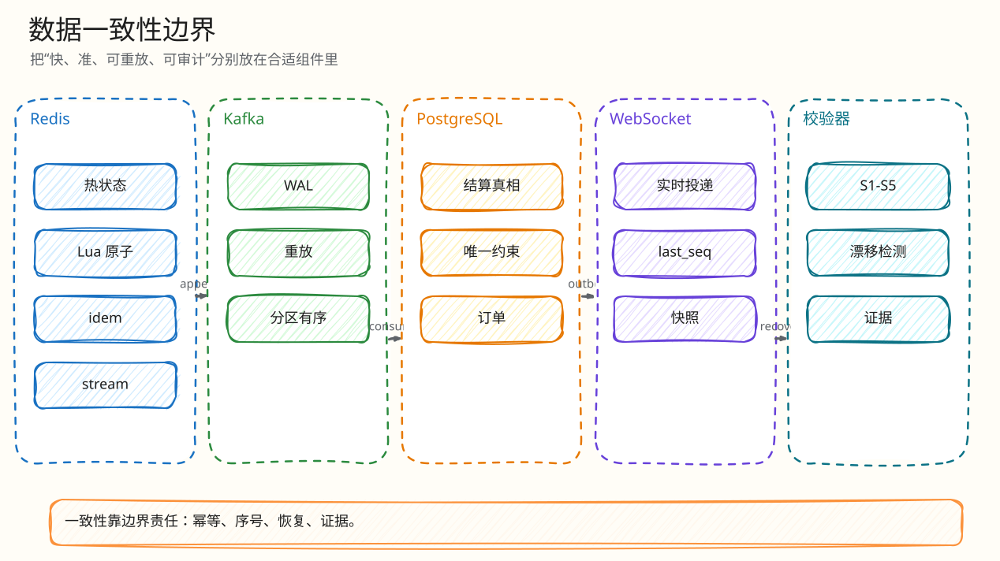

# 数据与一致性设计

父文档：[系统架构](00-system-architecture.md)
相关文档：[热出价闭环](../03-backend/01-bid-decision-closed-loop.md)、[Kafka 结算闭环](../03-backend/02-kafka-settlement-closed-loop.md)、[Redis 丢失恢复](../03-backend/03-redis-loss-recovery.md)

## 数据分层

| 层 | 代表数据 | 作用 | 一致性边界 |
|---|---|---|---|
| Redis hot state | `bid:{auction}:engine:state`, idem key, pending hash | 决策时的最新价、赢家、序号、暂停态 | 单 Lua 原子；Redis AOF 本地持久 |
| Redis Stream | `bid:{auction}:engine:log` | 决策日志，relay 输入 | 与 Lua 决策同原子写入 |
| Kafka | `auction.bid-events`, `auction.dlq` | 有序 WAL、重放源、结算输入 | at-least-once；append ack 可作为响应 durability |
| PostgreSQL | `auctions`, `bids`, `orders`, `redis_engine_settlements` | 审计、订单、结算真相 | 唯一约束 + CAS 吸收重复 |
| Outbox | `outbox_events`, `outbox_delivery` | 持久事件投递 | PG 事务内写，relay 发布 |
| Frontend state | H5/PC 本地 state | 展示和交互 | 只接受服务端 seq/快照，不本地决策 |

## 关键约束

| 约束 | 数据库证据 |
|---|---|
| 同拍品同用户同 `client_bid_id` 不重复 | `bids UNIQUE (auction_id, user_id, client_bid_id)` |
| 每个拍品至多一张订单 | `orders.auction_id UNIQUE` |
| 公共事件按拍品 seq 唯一 | `auction_events UNIQUE (auction_id, seq)` |
| Redis engine settlement 按 engine seq 唯一 | `redis_engine_settlements UNIQUE (auction_id, engine_epoch, engine_seq)` |
| bids engine seq 唯一 | `ux_bids_engine_seq ON bids(auction_id, engine_epoch, engine_seq)` |
| 活跃拍品按房间唯一 | `ux_auctions_room_active WHERE status='ACTIVE'` |

## 一致性链路

<!-- excalidraw-generated:start -->

  <a href="../assets/excalidraw/01-architecture-01-data-consistency-01.excalidraw">打开可编辑 Excalidraw 源文件</a>
   
  

<!-- excalidraw-generated:end -->

## 幂等模型

| 层 | 幂等键 | 防护对象 |
|---|---|---|
| HTTP -> Redis | `Idempotency-Key == client_bid_id` | 用户重试、浏览器超时后重发 |
| Redis Lua | `requestHash(auctionID,userID,clientBidID,amount)` | 同键改金额、跨用户重放 |
| Kafka settlement | `auction_id + engine_epoch + engine_seq` | Kafka 重复投递 |
| PG bid/order | 唯一约束 | 重复业务效果 |
| 支付 | payment idempotency record + provider event unique | 支付双击和 webhook 重放 |

## response 状态不要混淆

| 字段 | 意义 | 不能误解为 |
|---|---|---|
| `result=ENGINE_ACCEPTED` | Redis 引擎已经接受该出价 | 已经完成 PG 结算/订单 |
| `durability_status=ENGINE_DURABLE` | Redis AOF/Stream 边界已达，Kafka ACK 未同步确认 | 数据丢失或失败 |
| `durability_status=KAFKA_ACKED` | relay 已确认 Kafka append 并唤醒 HTTP latch | 订单已建 |
| `settlement_status=PENDING` | 等待 Kafka worker 落 PG | 失败 |
| `ORDER_PENDING` | SOLD 后订单已创建，待支付 | 资金已真实扣款 |

## 典型故障与处理

| 故障 | 期望行为 | 当前代码 |
|---|---|---|
| 客户端重试同一请求 | 返回同一结果 | Redis idem key / PG idempotency |
| 同 key 改金额 | 拒绝 `IDEMPOTENCY_KEY_REUSED_WITH_DIFFERENT_REQUEST` | Lua `existing[1] ~= request_hash` |
| Redis state 缺失 | `RECONCILING`，冷启动/恢复，不给假成功 | `placeBidWithSnapshot` -> `runColdStart` |
| Kafka append 慢/失败 | 返回 `ENGINE_DURABLE`，relay/settlement 后续收敛 | `waitKafkaAck(..., 40ms)` + circuit breaker |
| Kafka 重复投递 | PG 不产生重复 bid/order | `redis_engine_settlements` 唯一约束、bids CAS |
| Outbox 投递慢 | outbox backlog 可监控/重试 | `outbox/relay.go`, `/api/monitor/outbox` |
| WS seq gap | H5 快照恢复 | `ServeWS.recoveryMessages`, `recoverFromSnapshot` |

## 最容易被问倒的边界

| 追问 | 防守答案 |
|---|---|
| “你保证 exactly-once 吗？” | 不在 Kafka 层吹 exactly-once。当前是 at-least-once WAL + 幂等消费者，PG 是 exactly-once 业务效果边界。 |
| “Redis AOF always 就等于生产持久性吗？” | 不是。它是本地 durable 边界；生产还需要 Redis HA/磁盘/副本策略。文档里只把它称为 `ENGINE_DURABLE`。 |
| “Kafka RF=1 怎么证明不丢？” | 本地 RF=1 证明功能链路，不证明 broker 容灾。生产应 RF=3/minISR=2/acks=all 并重跑 S1-S5。 |
| “Reconciler 发现漂移会自动修吗？” | 对危险漂移先暂停/告警/恢复，不是盲目继续接受出价；恢复路径需校验通过才 resume。 |
