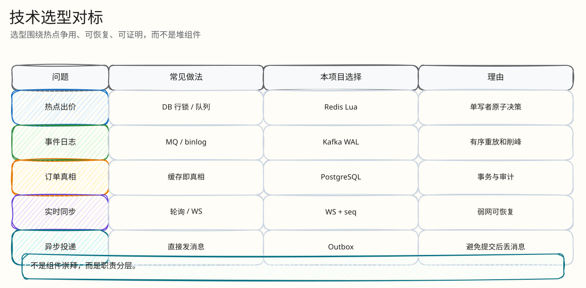
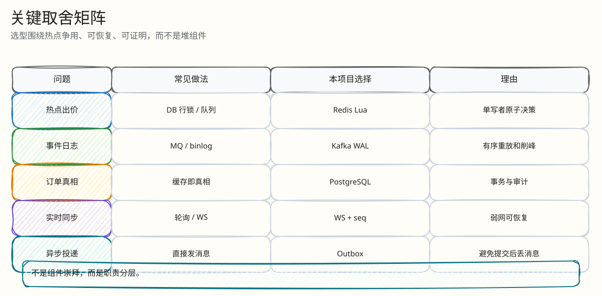

# 技术选型与工业对标

父文档：[系统架构](00-system-architecture.md)
相关文档：[数据与一致性](01-data-consistency.md)、[工程难点与解决方案](../03-backend/05-engineering-difficulties.md)、[参考资料](../10-appendix/references.md)

本文回答“为什么是 Redis Lua + Kafka + PostgreSQL + WebSocket + Prometheus/OTel”，并明确没有宣传为已完成的生产多 AZ 架构。外部资料只用于工业边界和术语确认，当前实现以代码为准。

## 图 1-2-1：选型版图

<!-- excalidraw-generated:start -->

  <a href="../assets/excalidraw/01-architecture-02-technology-selection-and-benchmark-01.excalidraw">打开可编辑 Excalidraw 源文件</a>
   
  

<!-- excalidraw-generated:end -->

这张图展示核心取舍：热路径先做权威决策，再异步结算到 PG，而不是把所有正确性压力压在单个 PG 热行上。

## 表 1-2-1：热出价决策选型

| 方案 | 延迟/吞吐 | 一致性 | 运维复杂度 | 主要风险 | 本项目结论 |
|---|---|---|---|---|---|
| PostgreSQL `SELECT FOR UPDATE` | 高争用下排队明显 | 事务语义强 | 低 | 同拍品热行锁等待放大 p99 | 保留 legacy/test，对默认热路径不采用 |
| 应用层 mutex | 单实例简单 | 多实例困难 | 中 | 实例崩溃/扩容后锁语义复杂 | 不采用 |
| Redlock/etcd 锁 | 多实例互斥 | 依赖锁租约/时钟/网络 | 高 | 每次出价增加协调 RTT，锁内仍要读写状态 | 不采用 |
| Redis Lua 单写者 | 单 RTT 内原子决策 | Redis 脚本原子执行 | 中 | Lua 可维护性、单拍品单线程上限 | 采用；代码在 `backend/internal/redisengine/engine.go` |

官方 Redis 文档说明，Lua 脚本在 Redis 服务端执行，读写数据高效，并且脚本执行期间具备原子语义；这正好匹配“同一拍品必须给出单一全序决策”的需求。代价是脚本变长、维护成本上升，因此本项目把工程债记录在 [工程难点与解决方案](../03-backend/05-engineering-difficulties.md)。

## 表 1-2-2：持久化与结算选型

| 方案 | 好处 | 问题 | 本项目选择 |
|---|---|---|---|
| Lua 后同步写 PG | 用户响应前 PG 已落库 | 热路径重新被 PG 网络/事务/锁尾延迟支配 | 不采用 |
| Redis Stream only | 实现简单 | Redis 丢失后审计和重放能力弱 | 只作为本地决策日志的一段 |
| Kafka exactly-once 事务链路 | 理论语义强 | 需要 producer/consumer 事务协作，复杂度高 | 当前不宣传 Kafka 层 EOS |
| Kafka at-least-once WAL + PG 幂等 | 可重放、可对账，工程边界清晰 | 需要处理重复投递和 lag | 采用；PG unique/CAS 保证业务效果幂等 |

Confluent/Kafka 资料把 delivery semantics 分为 at-most-once、at-least-once、exactly-once，并指出 exactly-once 需要事务和消费者配置配合。本项目当前更稳妥的口径是：Kafka 是有序 WAL/重放源，PG 的唯一约束和 CAS 才是业务 exactly-once 的落点。

## 表 1-2-3：实时同步选型

| 方案 | 优点 | 缺点 | 本项目结论 |
|---|---|---|---|
| HTTP polling | 简单、易缓存 | 延迟和服务端浪费高 | 不适合作为实时竞拍主通道 |
| SSE | 单向推送简单 | 客户端到服务端仍需 HTTP；复杂恢复仍要另写 | 可用于只读公告，不作为主通道 |
| WebSocket | 双向低延迟，浏览器普遍支持 | 传统 WS 无自动背压，需要服务端限队列/断慢客户端 | 采用；`ServeWS` + Hub 有界队列 + last_seq 恢复 |
| WebSocketStream | 支持 stream backpressure | MDN 标为 experimental/non-standard，兼容性不足 | 作为未来方向，不用于当前 H5 |

MDN WebSocketStream 文档明确它能利用 Streams backpressure，但同时标注实验性和非标准。当前项目选择标准 WebSocket，并在服务端用慢消费者断开保护广播系统。

## 表 1-2-4：观测选型

| 方案 | 覆盖面 | 适合回答的问题 | 本项目结论 |
|---|---|---|---|
| 只写日志 | 单事件细节 | “某个请求发生了什么” | 不够，难以看趋势 |
| Prometheus + Alertmanager | 指标/告警 | “系统现在坏没坏，是否持续坏” | 采用 |
| OpenTelemetry + Tempo | Trace | “请求跨组件花在哪里” | 采用 |
| Grafana dashboard | 可视化 | “答辩/值班怎么快速定位” | 采用 |
| Flight recorder/Monitor API | 业务审计 | “某个拍品/用户为什么这样” | 采用 |

Prometheus alerting rules 支持 `for` 和 `keep_firing_for` 这类告警稳定机制；OpenTelemetry 是厂商中立的 traces/metrics/logs 观测框架。本项目把通用观测栈和业务 monitor API 结合，避免只有基础设施视角、没有竞拍业务视角。

## 图 1-2-2：选型决策流

<!-- excalidraw-generated:start -->

  <a href="../assets/excalidraw/01-architecture-02-technology-selection-and-benchmark-02.excalidraw">打开可编辑 Excalidraw 源文件</a>
   
  

<!-- excalidraw-generated:end -->

这张图是答辩时的“为什么不是技术堆叠”版本：每个组件都是由一个业务约束推出来的。

## 表 1-2-5：与直播电商倒计时竞拍的产品对标

| 维度 | 直播电商/倒计时竞拍常见需求 | 本项目实现 |
|---|---|---|
| 倒计时紧张感 | 商品在直播间短时间内竞争成交 | H5 服务端时间锚定倒计时、延时提示、成交状态 |
| 反狙击 | 最后几秒出价不能让其他人无反应时间 | Lua 延时窗口 + absolute end clamp |
| 主播运营 | 主播要看拍品、订单、异常和讲解 | PC 控制台、AI 解说、monitor/flight recorder |
| 用户信任 | 规则和赢家需要可解释 | engine_seq、decision_basis、PG 审计、S1-S5 verifier |
| 风险控制 | 误触、刷价、恶意输入 | fat finger、ACL、幂等、风险矩阵 |

TikTok Shop 的 LIVE Countdown Bidding 说明这类“直播场景下限时竞拍”是真实电商产品形态。本项目没有声称复刻 TikTok Shop 全链路，而是把最难防守的实时交易内核做深。

## 代码证据索引

| 选型 | 代码路径 | 说明 |
|---|---|---|
| 默认 Redis ledger engine | `backend/internal/config/config.go`, `backend/cmd/server/main.go` | 默认 engine mode 和服务启动装配 |
| Redis Lua 决策 | `backend/internal/redisengine/engine.go:64`, `:954`, `:1346` | `ledgerRunner`, `placeBidWithSource`, `placeBidWithSnapshot` |
| Kafka settlement | `backend/internal/redisengine/kafka_ledger.go`, `backend/cmd/server/main.go` | ledger relay 和 worker |
| PG 幂等约束 | `backend/migrations/202605220001_init_core.sql`, `202605280001_redis_ledger_engine.sql` | bids/orders/events/settlements 唯一约束 |
| WS 恢复 | `backend/internal/realtime/server.go:236`, `hub.go` | ticket、last_seq、history/snapshot、慢消费者 |
| H5 弱网 | `frontend/mobile-h5/src/main.tsx:55`, `:1724` | `BID_REQUEST_TIMEOUT_MS`, `fetchWithTimeout` |

## 评委拷问

| 问题 | 30 秒回答 | 进一步追问 |
|---|---|---|
| 你是不是为了用 Kafka 而用 Kafka？ | 不是。Kafka 在这里是已决策事件的 WAL 和重放源，用来解释 Redis 热态和 PG 真相之间的中间态。 | 如果 Kafka 挂了，不能宣传 KAFKA_ACKED，只能返回 ENGINE_DURABLE/降级并看 pending/lag 收敛。 |
| Redis Lua 单线程会不会成为瓶颈？ | 单拍品本来就需要单一全序；瓶颈是正确性约束的一部分。 | 多拍品按 auction 分片，单拍品优化 Lua 和 batch relay；不能把一个拍品拆成多个无序写者。 |
| 为什么不用 WebSocketStream？ | 它有背压优势，但 MDN 标为实验/非标准，不适合当前 H5 主链路。 | 当前用标准 WS + 服务端有界队列 + 慢消费者断开。 |
| 为什么不是完整生产多 AZ？ | 当前是训练营/答辩项目，证明链路和机制；本地 Kafka RF=1/Redis 单实例不包装成生产容灾。 | 生产化要 RF=3/minISR=2、Redis HA/Cluster、跨实例 WS 路由、标准化 RTO/RPO 压测。 |
