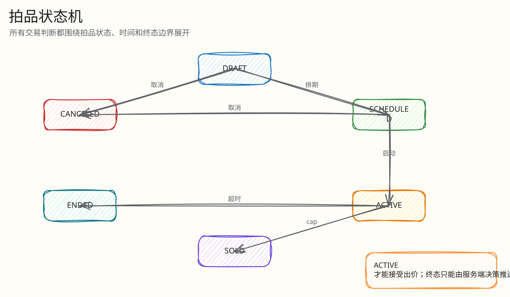
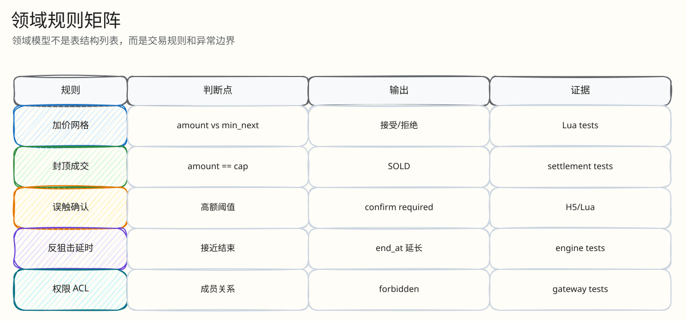

# 领域模型与竞拍规则

父文档：[文档库入口](../README.md)
相关文档：[产品范围](../00-project/01-product-scope.md)、[热出价闭环](../03-backend/01-bid-decision-closed-loop.md)

## 核心实体

| 实体 | 表/代码 | 说明 |
|---|---|---|
| User | `users`, `auth_sessions` | mock auth 用户、主播/买家角色 |
| Room | `rooms`, `room_memberships` | 直播间与成员 ACL |
| Item | `items` | 商品标题、图片、描述 |
| Auction | `auctions`, `auction_rules` | 拍品状态、价格、赢家、规则 |
| Bid | `bids` | 已结算的接受/拒绝决策 |
| Redis settlement | `redis_engine_settlements` | Redis/Kafka 决策落 PG 的审计行 |
| Order | `orders`, `payment_events` | SOLD 后订单和 mock 支付 |
| Event / Outbox | `auction_events`, `outbox_events`, `outbox_delivery` | 公共事件和投递 |
| AI Job | `ai_generation_jobs`, `auction_system_messages`, `auction_risk_alerts` | AI 运营能力 |

## 拍品状态机

<!-- excalidraw-generated:start -->

  <a href="../assets/excalidraw/02-domain-00-domain-model-and-rules-01.excalidraw">打开可编辑 Excalidraw 源文件</a>
   
  

<!-- excalidraw-generated:end -->

## 规则字段

| 规则 | 含义 | 当前约束 |
|---|---|---|
| `start_price_cents` | 起拍价，可为 0 | 首个有效价为 `start + increment` |
| `increment_cents` | 加价幅度 | 必须 > 0；出价必须落在网格 |
| `cap_price_cents` | 封顶价 | 可为空/0；若设置必须可由 start+N*increment 到达 |
| `extend_window_seconds` | 末段延时窗口 | 10-30s 范围 |
| `extend_by_seconds` | 每次延时时长 | 10-30s 范围 |
| `max_extend_count` | 最大延时次数 | 避免无限延时 |
| `absolute_end_ms` | Redis 热态硬顶 | 原 end + max_extend_count * extend_by |
| `fat_finger_threshold_cents` | 误触阈值 | 超大跳价先返回确认 token |

## 出价分类

<!-- excalidraw-generated:start -->

  <a href="../assets/excalidraw/02-domain-00-domain-model-and-rules-02.excalidraw">打开可编辑 Excalidraw 源文件</a>
   
  

<!-- excalidraw-generated:end -->

## Go 规则与 Lua 规则的边界

当前有两套相关实现：

| 实现 | 用途 | 风险 |
|---|---|---|
| `auction/rules.go` 的 `ValidateRule`, `ClassifyBidAmount`, `CalculateExtension` | 建拍校验、PG legacy、max bid intent 活路径校验 | 与 Lua 规则可能漂移 |
| `redisengine/engine.go` 内 Lua | 默认热出价真路径 | 代码长、需要测试守护 |

6 月 10 日附录已指出：核心价格分类等价，但延时公式存在差异，PG legacy `CalculateExtension` 是 `now + extendBy`，线上 Lua 是 `end_at + extend_by` 并受 `absolute_end_ms` 硬顶约束。新答辩口径：**线上以 Lua 为准；Go 规则用于建拍和辅助校验；后续应补 parity/property test。**

## 最小闭环：误触确认

1. 用户出一个超过阈值的大额价格。
2. Lua 不直接接受，而是写 pending confirm key，返回 `FAT_FINGER_CONFIRM_REQUIRED`、`confirm_token`、`expires_in_ms=30000`。
3. H5 展示二次确认。
4. 用户确认后调用 `/bids/confirm`。
5. Confirm Lua 重新读取当前 Redis state，重新校验 ACTIVE、时间、自我领先、cap、低价、网格。
6. 若期间别人已经抬价导致金额不合法，则确认请求被拒绝；不会无脑放行旧状态。

## 评委拷问

| 问题 | 回答 |
|---|---|
| 0 元起拍是不是允许 0 元成交？ | 不是。起拍可为 0，但首个有效价是 `start + increment`，即至少一个加价幅度。 |
| 封顶价不对齐怎么办？ | 建拍校验 `ValidateRule` 拦截不可达 cap，避免永远无法触发 SOLD。 |
| 为什么拒绝也记 engine_seq？ | 为了证明“没有被吃掉的决策”。S1 校验可以断言 1..N 无空洞。 |
| 延时为什么有 absolute_end？ | 防止机器人每次在窗口内出价无限续命，保证有限时间内落槌。 |
