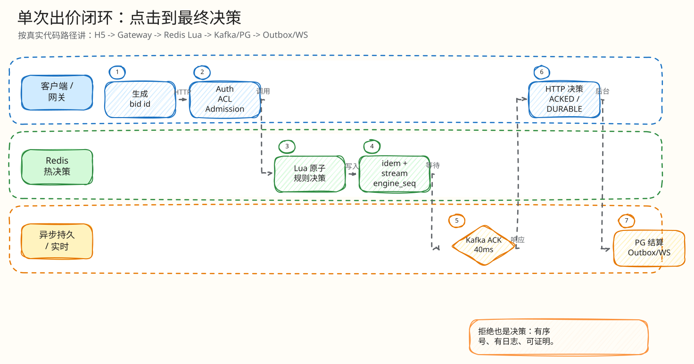
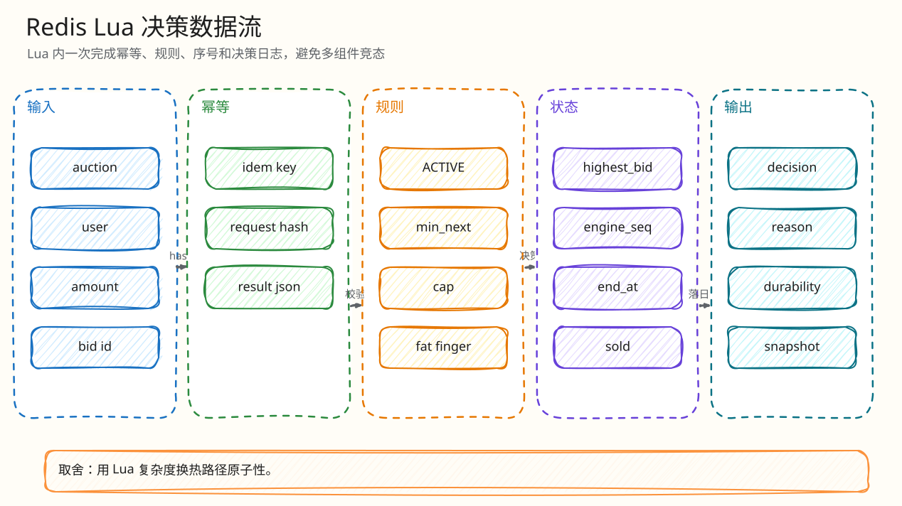
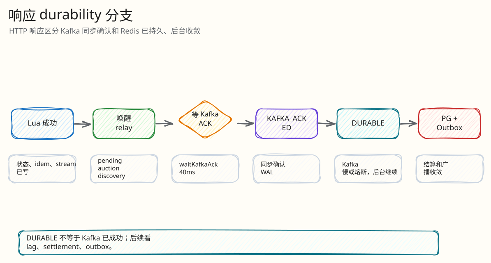

# 后端闭环：单次出价从点击到决策

父文档：[系统架构](../01-architecture/00-system-architecture.md)
子文档：[出价热路径 L4 索引](auction-bid/00-index.md)、[Kafka 结算闭环](02-kafka-settlement-closed-loop.md)、[Redis 丢失恢复](03-redis-loss-recovery.md)、[工程难点与解决方案](05-engineering-difficulties.md)
关键代码：`gateway/auction_handlers.go:PlaceBid`, `redisengine/engine.go:placeBidWithSource`, `placeBidWithSnapshot`, Lua `ledgerRunner`

## 闭环目标

回答评委最常问的问题：一个买家点击“出价”后，系统如何保证：

- 不接受无权限用户；
- 不因为重试扣两次；
- 不因为价格变化误判；
- 不因为 Redis/Kafka/PG 中间态给假成功；
- 所有客户端最终看到同一结果。

## 图 3-1-1：单次出价时序图

<!-- excalidraw-generated:start -->

  <a href="../assets/excalidraw/03-backend-01-bid-decision-closed-loop-01.excalidraw">打开可编辑 Excalidraw 源文件</a>
   
  

<!-- excalidraw-generated:end -->

## 网关阶段

`AuctionHandler.PlaceBid` 的阶段：

| 阶段 | 代码行为 | 失败输出 |
|---|---|---|
| `bid.auth` | `currentUser(r)` | 401 |
| `bid.decode` | JSON -> `auction.BidInput` | 400 |
| `bid.admission` | 限流/队列/幂等 replay 快捷路径 | replay 或错误 |
| `bid.acl` | `requireActiveMembershipForAuction` 预热 ACL | 403 |
| `bid.redis_engine` | `Engine.PlaceBid(..., ACLMembershipKey)` | 引擎结果或错误 |
| `maybeCreateAutoCommentary` | 接受/终态后触发 AI 解说 | best-effort，不影响交易 |

网关不会走 PG legacy 热路径；`h.Engine == nil` 时直接返回 engine paused。

## 图 3-1-2：Redis Lua 决策数据流

<!-- excalidraw-generated:start -->

  <a href="../assets/excalidraw/03-backend-01-bid-decision-closed-loop-02.excalidraw">打开可编辑 Excalidraw 源文件</a>
   
  

<!-- excalidraw-generated:end -->

## 幂等细节

| 场景 | 结果 |
|---|---|
| 同用户同 `client_bid_id` 同金额重试 | Lua 从 `idem_key` 回放 `result_json` |
| 同 key 改金额 | `IDEMPOTENCY_KEY_REUSED_WITH_DIFFERENT_REQUEST` |
| 跨用户拿别人 key 重放 | request hash 含 userID，冲突 |
| H5 超时后重试 | 当前 H5 已有 `fetchWithTimeout`，重试同 key 安全 |

`placeBidWithSource` 还在进入 Lua 前强制 `Idempotency-Key == client_bid_id`，这能避免客户端随意把 header/key 作为两个不一致身份。

## 价格和终态细节

| 分支 | 处理 |
|---|---|
| Redis state 缺失 | 返回 RECONCILING；Go 冷启动路径尝试安全 snapshot，失败则暂停 |
| 非 ACTIVE | 按拒绝决策写入日志 |
| ACL 缺失 | 返回 `ACL_FORBIDDEN`，但状态缺失优先恢复语义，避免误报权限 |
| 超时 | `AUCTION_ENDED` |
| 自我领先 | `REJECTED_SELF_LEADING` |
| 高于 cap | `BID_ABOVE_CAP` |
| 低于最小价 | `BID_TOO_LOW` |
| 不在加价网格 | `BID_INCREMENT_MISMATCH` |
| 误触 | `FAT_FINGER_CONFIRM_REQUIRED`，不消耗 engine_seq，不写决策流 |
| 等于 cap | `ENGINE_SOLD` |
| 有效普通出价 | `ENGINE_ACCEPTED`，窗口内按 `end_at + extend_by` 延时并 clamp 到 absolute end |

## 图 3-1-3：响应 durability 分支

`placeBidWithSnapshot` 在 Lua 成功后：

1. `SAdd` 一次性加入 pending auction discovery。
2. `triggerRelayForAuction` 唤醒 relay。
3. `waitKafkaAck(..., 40ms)`。
4. ACK 到达则响应 `KAFKA_ACKED`。
5. 超时/熔断则响应 `ENGINE_DURABLE`，因为 Redis decision 已经落入 idem + stream。

<!-- excalidraw-generated:start -->

  <a href="../assets/excalidraw/03-backend-01-bid-decision-closed-loop-03.excalidraw">打开可编辑 Excalidraw 源文件</a>
   
  

<!-- excalidraw-generated:end -->

图 3-1-3 展示 `placeBidWithSnapshot` 的响应语义：`KAFKA_ACKED` 表示 Kafka ACK 已同步确认；`ENGINE_DURABLE` 表示 Redis 决策已写入本地 durable 状态，但 Kafka/PG 仍需后台收敛。

## 最小异常闭环：Kafka append 慢

| 步骤 | 系统行为 |
|---|---|
| Lua 已接受出价 | Redis state、idem、pending、stream 已写 |
| Relay 没在 40ms 内 ACK | HTTP 返回 `ENGINE_DURABLE` |
| 后台 relay 继续处理 | Kafka 最终 append |
| Settlement worker 消费 | PG 写 bid/settlement/outbox |
| 校验器判断 | 不能只看 HTTP，必须看 Kafka lag、pending、settlement、outbox |

答辩时不要说 “ENGINE_DURABLE 等于 Kafka 成功”，要说 “用户拿到最终决策，但分布式 WAL ACK 尚未同步确认；后续用收敛证据证明”。

## 代码阅读顺序

1. `backend/internal/gateway/auction_handlers.go` 的 `PlaceBid`。
2. `backend/internal/gateway/bid_admission.go`。
3. `backend/internal/redisengine/engine.go` 的 `placeBidWithSource`。
4. `engine.go` 顶部 `ledgerRunner` Lua。
5. `placeBidWithSnapshot` 的 Kafka ACK 等待和降级。
6. `tests/pts/verify-l4b-pts-correctness.sh` 的门禁。

## 继续下钻到 L4

| 追问 | L4 文档 |
|---|---|
| 重试/同 key 改金额 | [出价幂等键最小闭环](auction-bid/01-idempotency-key-closed-loop.md) |
| 最小价/加价网格 | [Lua 价格规则最小闭环](auction-bid/02-lua-price-rule-closed-loop.md) |
| 误触二次确认 | [高额误触确认最小闭环](auction-bid/03-fat-finger-confirm-closed-loop.md) |
| 一口价成交和订单 | [cap sold/order 最小闭环](auction-bid/04-cap-sold-order-closed-loop.md) |
| Kafka ACK 与 `ENGINE_DURABLE` | [Kafka ACK 持久性最小闭环](auction-bid/05-kafka-ack-durability-closed-loop.md) |

## 评委拷问

| 问题 | 30 秒回答 | 追问展开 |
|---|---|---|
| 怎么防重复扣款？ | 三层幂等：HTTP key、Redis request hash、PG 唯一约束/CAS。 | 同 key 改金额和跨用户重放都会 hash 冲突；Kafka 重放由 PG 吸收。 |
| 拒绝为什么也写日志？ | 拒绝也是决策，必须可审计、可证明没丢。 | `engine_seq_complete` 用 1..N 证明所有决策都有结算记录。 |
| Kafka 超时为何还能返回成功？ | 返回的是 `ENGINE_DURABLE` 而非 `KAFKA_ACKED`。 | Redis AOF/Stream 已有决策；后续 Kafka/PG/outbox 必须收敛才能引用正确性。 |
| Redis Lua 这么长怎么维护？ | 这是承认的技术债，换来一次原子决策。 | 后续拆 Lua 模板/测试向量/property parity，不改变行为。 |
