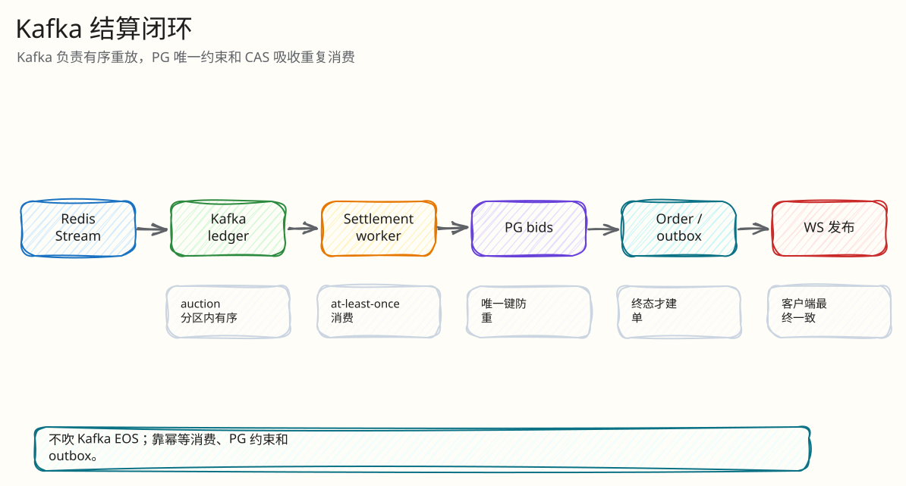

# 后端闭环：Kafka 结算与订单

父文档：[热出价闭环](01-bid-decision-closed-loop.md)
子文档：[结算 L4 索引](settlement/00-index.md)
相关文档：[数据一致性](../01-architecture/01-data-consistency.md)、[证据映射](../07-performance-and-evidence/00-evidence-map.md)

## 闭环目标

Redis Lua 只负责“决策”。真正的审计、订单、支付入口要落到 PostgreSQL。Kafka 结算闭环回答：

- Redis 决策如何变成 PG bid/settlement；
- Kafka 重复投递是否会产生重复业务效果；
- SOLD 如何建单；
- 公共事件如何进入 outbox/WS。

## 数据流

<!-- excalidraw-generated:start -->

  <a href="../assets/excalidraw/03-backend-02-kafka-settlement-closed-loop-01.excalidraw">打开可编辑 Excalidraw 源文件</a>
   
  

<!-- excalidraw-generated:end -->

## Worker 边界

`cmd/server/main.go` 默认打开 Kafka ledger 并启动：

- 主 worker：`redisengine.NewWorker(...).Run(ctx, 200*time.Millisecond)`；
- 额外 worker：按 `RedisEngineSettlementWorkers` 启动 `RunKafkaSettlement(ctx, 10*time.Millisecond)`。

这说明 settlement 是实际运行组件，不是文档设想。

## 幂等落库

| 重复来源 | 防重机制 |
|---|---|
| Kafka 同一消息重投 | `redis_engine_settlements UNIQUE (auction_id, engine_epoch, engine_seq)` |
| 同一 bid 重放 | `bids UNIQUE(auction_id,user_id,client_bid_id)` |
| engine seq 乱序 | `WHERE id=$1 AND engine_epoch=$... AND engine_seq=$previous` CAS |
| SOLD 多次建单 | `orders.auction_id UNIQUE` |
| outbox 重复 | `ux_outbox_event_seq` 和 delivery 状态 |

## Settlement 状态

| 状态 | 含义 |
|---|---|
| `PENDING` | Redis 已决策，待 Kafka/PG |
| `SETTLED` | PG 业务效果完成 |
| `DLQ` / retry | 多次失败后进入死信或异常路径 |

## 为什么不直接在 Lua 后同步写 PG

| 方案 | 问题 |
|---|---|
| Lua 后同步写 PG | 热路径仍受 PG 事务/锁/网络尾延迟影响 |
| Lua 内只改 Redis | Redis 丢失后无法审计和恢复 |
| Redis Stream -> Kafka -> PG | 热路径快，且有持久日志和重放闭环 |

## 评委拷问

| 问题 | 回答 |
|---|---|
| “PG 是真相，为什么接受时不马上写 PG？” | 因为最后一秒热点不能让 PG 行锁进入热路径；接受是 Redis 原子决策，PG 是异步结算真相。 |
| “异步结算是不是用户会看到假状态？” | H5 看到的是服务端决策状态和 settlement pending；SOLD 后订单需 settlement 创建，UI 按状态展示，不伪造真实支付。 |
| “Kafka 重复会不会双订单？” | 不会。订单 `auction_id` 唯一，settlement 和 bids 都有唯一/CAS。risk simulator 有 cap-sold-payment-double-click 场景。 |

## 继续下钻到 L4

| 追问 | L4 文档 |
|---|---|
| Kafka 重复投递 | [Kafka redelivery 幂等](settlement/01-kafka-redelivery-idempotency.md) |
| SOLD 订单 exactly-once | [订单创建 exactly-once](settlement/02-order-creation-exactly-once.md) |
| Outbox publish 失败 | [Outbox publish retry](settlement/03-outbox-publish-retry.md) |
