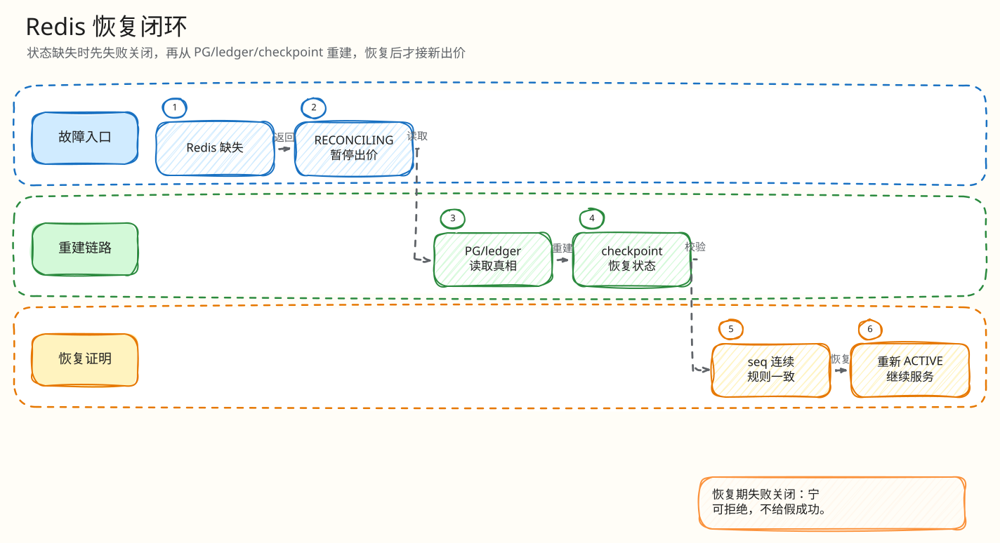

# 后端闭环：Redis 丢失与失败关闭恢复

父文档：[数据一致性](../01-architecture/01-data-consistency.md)
子文档：[Redis 恢复 L4 索引](recovery/00-index.md)
相关文档：[热出价闭环](01-bid-decision-closed-loop.md)、[风险测试](../08-tests-and-risk/00-risk-and-abuse-matrix.md)

## 问题定义

Redis 是热态决策层，但它不是最终业务真相。Redis 重启、`FLUSHALL`、AOF 损坏、错误配置导致数据缺失时，最危险的不是“服务不可用”，而是继续接受出价并给用户假成功。

本项目的原则：**状态不完整时 fail closed。**

## 恢复路径

<!-- excalidraw-generated:start -->

  <a href="../assets/excalidraw/03-backend-03-redis-loss-recovery-01.excalidraw">打开可编辑 Excalidraw 源文件</a>
   
  

<!-- excalidraw-generated:end -->

## 关键机制

| 机制 | 作用 | 代码 |
|---|---|---|
| Lua state missing -> `RECONCILING` | Redis 不猜测旧状态 | `ledgerRunner` |
| `coldStartGroup` | 同一拍品只允许一个 goroutine 做冷启动 | `placeBidWithSnapshot` |
| checkpoint | 记录 engine epoch/seq/state hash/snapshot | `auction_engine_checkpoints` |
| `engine_epoch` | 隔离旧决策与重建后决策 | migrations + settlement CAS |
| reconciler report | 比对 Redis/PG/settlement | `redisEngineResumeReport` 相关函数 |
| H5 危险操作禁用 | 用户不会在恢复中继续出价 | `isDangerousActionDisabled` |

## 用户可见语义

| 后端状态 | 前端表现 |
|---|---|
| `RECONCILING` | 恢复中，不能出价 |
| `ENGINE_PAUSED` | 系统保护，提示稍后重试 |
| snapshot stale/unavailable | 快照恢复中或显示不确定态 |
| 恢复完成 | 重新获取服务器快照，继续按 seq 接事件 |

## 评委拷问

| 问题 | 30 秒回答 |
|---|---|
| Redis 丢了，为什么不直接从 PG 读 current_price 继续？ | 因为 Redis 中可能有已决策未结算的 Kafka/pending 状态；只读 PG 会回退价格并造成幽灵/重复决策。 |
| 重建怎么防旧消息污染？ | 使用 `engine_epoch` 和 `engine_seq` CAS，旧 epoch/seq 不能越过新状态。 |
| 恢复期间用户体验怎么办？ | 明确显示恢复中，禁用危险出价。宁可短暂不可用，也不展示假领先/假成交。 |

## 继续下钻到 L4

| 追问 | L4 文档 |
|---|---|
| Lua 发现 state missing 后怎么处理 | [RECONCILING 最小闭环](recovery/01-redis-state-missing-reconciling.md) |
| checkpoint 如何重建热态 | [Checkpoint rebuild 最小闭环](recovery/02-checkpoint-rebuild.md) |
