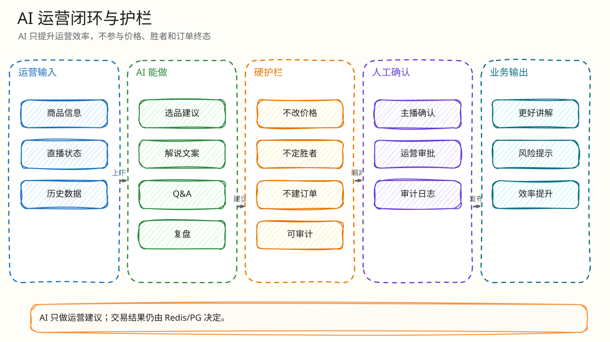

# 后端闭环：AI 运营助手

父文档：[产品范围](../00-project/01-product-scope.md)
相关文档：[PC 控制台](../05-frontend/02-pc-console-closed-loop.md)

## AI 红线

AI 永远不参与：

- 出价金额决策；
- 当前价/赢家/终态判断；
- 自动封禁用户；
- 真实支付状态。

AI 只做运营辅助：选品草稿、解说、商品 Q&A、哨兵解释、复盘高光。

## Provider 结构

<!-- excalidraw-generated:start -->

  <a href="../assets/excalidraw/03-backend-04-ai-ops-closed-loop-01.excalidraw">打开可编辑 Excalidraw 源文件</a>
   
  

<!-- excalidraw-generated:end -->

## 关键代码

| 能力 | 文件 |
|---|---|
| schema 调用 | `backend/internal/ai/chat_provider.go` |
| listing draft 归一化 | `NormalizeListingDraft` |
| 商品 Q&A 安全回退 | `NormalizeProductQAAnswer` |
| job 审计 | `backend/internal/ai/repository.go` |
| 路由装配 | `gateway/router.go:BuildAIGenerator` |

## 安全设计

| 风险 | 防线 |
|---|---|
| AI 编造保真/升值 | unsafe claims 检测，Q&A 不安全词 fallback |
| AI 直接发布商品 | `human_review_required`, `no_auto_publish` |
| Provider 不可用 | deterministic fallback，job status/error 记录 |
| 商品图片隐私 | data URL 存储时脱敏为 `local_image_data_url` |
| 风险告警误伤用户 | sentinel 只给 recommended action，不自动封禁 |

## 评委拷问

| 问题 | 回答 |
|---|---|
| AI 模型出错会不会影响交易？ | 不会。AI 不在 bid path；provider 失败只影响运营文案并走 fallback。 |
| Q&A 问“是不是保真”怎么办？ | 归一化检测“保真/升值/稳赚/隐藏”等词，返回白名单事实或 fallback，不提供承诺。 |
| 为什么 AI 不是核心决策？ | 电商交易系统里 AI 应提高信息密度，不能污染钱、胜者、终态这些强一致对象。 |
