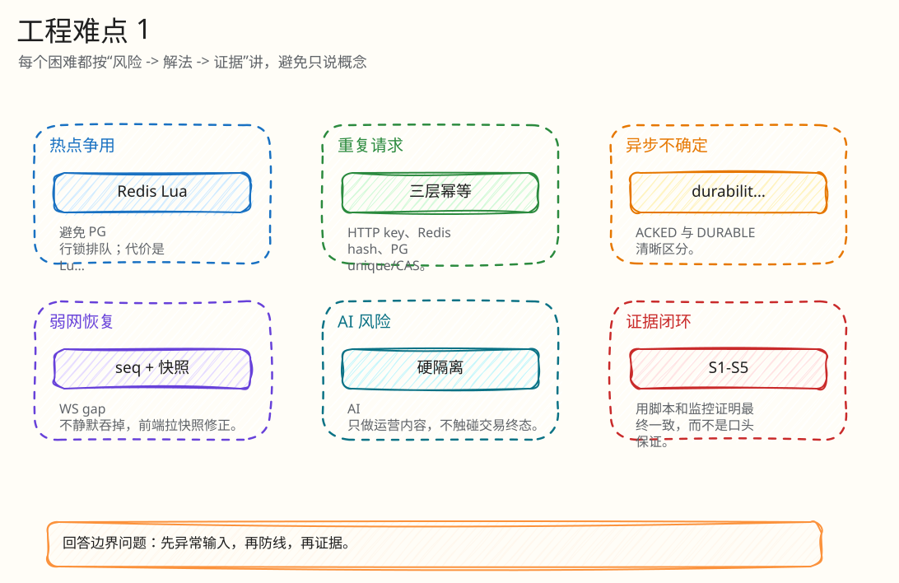
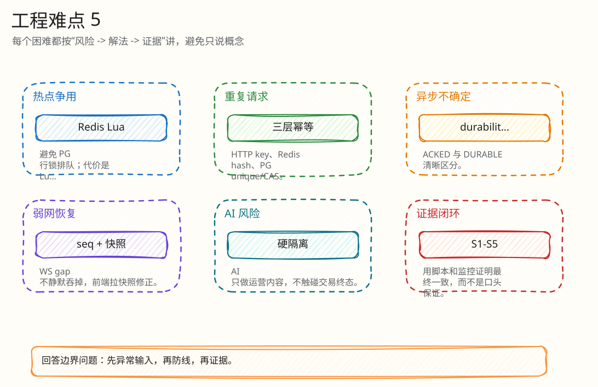

# 工程难点与解决方案

父文档：[单次出价闭环](01-bid-decision-closed-loop.md)
相关文档：[技术选型与工业对标](../01-architecture/02-technology-selection-and-benchmark.md)、[风险矩阵](../08-tests-and-risk/00-risk-and-abuse-matrix.md)、[答辩索引](../09-judge-defense/00-defense-index.md)

本文集中回答“你遇到过什么真实困难，怎么定位、怎么解决、怎么验证”。这些困难都来自当前代码或最终提交材料中的真实边界，不把未完成能力包装成已生产化。

## 图 3-5-1：难点分布图

<!-- excalidraw-generated:start -->

  <a href="../assets/excalidraw/03-backend-05-engineering-difficulties-01.excalidraw">打开可编辑 Excalidraw 源文件</a>
   
  

<!-- excalidraw-generated:end -->

这张图展示本项目的工程难点不是 UI 复杂，而是“钱、赢家、顺序、恢复、弱网、AI 边界”这些容易被资深评委追问的地方。

## 表 3-5-1：困难 1 - PostgreSQL 热行锁与高争用尾延迟

| 项 | 内容 |
|---|---|
| 现象 | 同一拍品最后一秒大量出价，如果每次都在 PG 更新拍品当前价，会集中竞争同一行。 |
| 根因 | PG 行锁在冲突时需要等待；热点拍品天然要求全序，排队会放大 p99。 |
| 尝试/备选 | PG `SELECT FOR UPDATE`、乐观锁重试、应用层锁、Redis Lua。 |
| 最终方案 | 默认热路径使用 Redis Lua 单写者，PG 退出热决策路径，负责结算/审计真相。 |
| 代价 | Lua 脚本复杂，单拍品吞吐受 Redis 单线程和脚本执行时间约束。 |
| 验证 | Redis engine tests、PTS verifier、`engine_seq` 连续性、PG settlement 对账。 |
| 代码 | `backend/internal/redisengine/engine.go:64`, `:954`, `:1346`；PG legacy 仅作对照。 |

### 图 3-5-2：热路径取舍

<!-- excalidraw-generated:start -->

  <a href="../assets/excalidraw/03-backend-05-engineering-difficulties-02.excalidraw">打开可编辑 Excalidraw 源文件</a>
   
  

<!-- excalidraw-generated:end -->

答辩时重点不是“Redis 一定比 PG 快”，而是“同一拍品最后一秒要求全序，PG 行锁会把全序和事务落库绑在一起；Redis Lua 把决策全序和审计落库解耦”。

## 表 3-5-2：困难 2 - Redis 已决策但 Kafka/PG 未同步完成

| 项 | 内容 |
|---|---|
| 现象 | Lua 已经接受出价并写 Redis Stream，但 Kafka append 或 PG settlement 可能慢于 HTTP 响应。 |
| 根因 | 分布式系统没有一个免费原子事务能同时覆盖 Redis、Kafka、PG、WS。 |
| 尝试/备选 | 同步等待 PG、宣称 Kafka EOS、拆分响应 durability。 |
| 最终方案 | HTTP 响应区分 `KAFKA_ACKED` 和 `ENGINE_DURABLE`；后台 relay/worker 继续结算，PG unique/CAS 吸收重放。 |
| 代价 | 用户/评委需要理解“最终决策”和“Kafka ACK”不是同一个概念。 |
| 验证 | settlement 表唯一约束、Kafka lag、outbox drained、S1-S5 verifier。 |
| 代码 | `placeBidWithSnapshot` 等待 40ms ACK；`redis_engine_settlements UNIQUE(auction_id, engine_epoch, engine_seq)`。 |

### 图 3-5-3：durability 状态闭环

<!-- excalidraw-generated:start -->

  <a href="../assets/excalidraw/03-backend-05-engineering-difficulties-03.excalidraw">打开可编辑 Excalidraw 源文件</a>
   
  

<!-- excalidraw-generated:end -->

如果被问“Kafka 挂了还算成功吗”，不能回答“算完全成功”。正确回答是：用户拿到 Redis 权威决策，但 `durability` 会暴露 Kafka ACK 状态；系统必须用 pending/lag/settlement/outbox 证明后续收敛。

## 表 3-5-3：困难 3 - Redis 丢失后不能从 PG 猜测热态

| 项 | 内容 |
|---|---|
| 现象 | Redis `FLUSHALL` 或重启后，热态 key 缺失。 |
| 根因 | PG 可能还没包含 Redis 已决策但未结算的 pending 决策；直接用 PG current price 恢复可能回退价格。 |
| 尝试/备选 | 直接从 PG 快照恢复、继续接受出价、fail-closed 后重建。 |
| 最终方案 | Lua 返回 `RECONCILING`，Go 冷启动 singleflight 检查 checkpoint/Kafka/PG，不能证明安全就 `ENGINE_PAUSED`。 |
| 代价 | 故障期间牺牲可用性。 |
| 验证 | S4 故障、恢复监控、`redisEngineResumeReport`、front-end dangerous action disabled。 |
| 代码 | `ledgerRunner` state missing 分支，`rebuildRedisFromCheckpoint`，`isDangerousActionDisabled`。 |

### 图 3-5-4：fail-closed 恢复闭环

<!-- excalidraw-generated:start -->

  <a href="../assets/excalidraw/03-backend-05-engineering-difficulties-04.excalidraw">打开可编辑 Excalidraw 源文件</a>
   
  

<!-- excalidraw-generated:end -->

这里要主动承认：当前本地 Redis 不是生产 HA。项目证明的是“状态不完整时不造假成功”和“可恢复机制”，不是证明多 AZ Redis 容灾。

## 表 3-5-4：困难 4 - H5 弱网下不能永久 pending，也不能重复出价

| 项 | 内容 |
|---|---|
| 现象 | 2026-06-10 评审材料指出旧版本 H5 出价 `fetch` 没有超时，弱网可能一直卡在确认中。 |
| 根因 | HTTP 请求发出后响应丢失，前端不知道服务端是否已执行。 |
| 尝试/备选 | 直接让用户重新生成 bid id、无限等待、超时进入 uncertain 并复用同 key。 |
| 最终方案 | 当前代码加 `BID_REQUEST_TIMEOUT_MS = 8000`、`AbortController`、`pendingBidRef` 复用 `client_bid_id`。 |
| 代价 | UI 需要表达“不确定”而不是简单失败。 |
| 验证 | H5 代码审查、幂等链路、风险场景。 |
| 代码 | `frontend/mobile-h5/src/main.tsx:55`, `:57`, `:1720`, `:1724`。 |

### 图 3-5-5：弱网出价闭环

<!-- excalidraw-generated:start -->

  <a href="../assets/excalidraw/03-backend-05-engineering-difficulties-05.excalidraw">打开可编辑 Excalidraw 源文件</a>
   
  

<!-- excalidraw-generated:end -->

这个问题很适合展示工程演进能力：被评审指出弱点后，不是在前端简单提示“失败”，而是利用后端幂等把弱网重试做成闭环。

## 表 3-5-5：困难 5 - Go 规则与 Lua 规则可能漂移

| 项 | 内容 |
|---|---|
| 现象 | 项目同时有 Go 领域规则和 Lua 热路径规则，长期维护可能出现公式差异。 |
| 根因 | 为了性能和原子性，热路径规则下沉到 Lua；Go 仍用于校验、测试、legacy 或辅助逻辑。 |
| 最终口径 | 线上热决策以 Lua 为准；Go/Lua 不一致是已知技术债，不应伪装成完全闭合。 |
| 缓解 | 增加 parity/property test，用同一批输入向量验证 Go 规则和 Lua 输出一致。 |
| 代码 | `backend/internal/auction/rules.go`, `backend/internal/redisengine/engine.go`。 |

## 表 3-5-6：困难 6 - AI 能提升运营，但不能污染交易真相

| 项 | 内容 |
|---|---|
| 现象 | AI 选品、解说、Q&A、哨兵很容易被误解为“AI 决定价格/赢家”。 |
| 根因 | AI 输出是概率文本，不能作为钱、胜者、终态的权威源。 |
| 最终方案 | AI 只走运营辅助链路；schema、normalization、fallback、人审标记；交易链路不依赖 AI。 |
| 代价 | AI 不能成为核心交易自动化，只能提升主播效率和解释能力。 |
| 验证 | AI repository/provider tests；答辩时展示 AI 与交易链路隔离。 |
| 代码 | `backend/internal/ai/*`, `backend/internal/gateway/ai_handlers.go`, `backend/internal/gateway/auction_handlers.go:maybeCreateAutoCommentary`。 |

## 表 3-5-7：困难与验证总表

| 困难 | 最终方案 | 证明方式 | 仍需承认的边界 |
|---|---|---|---|
| PG 热行锁 | Redis Lua 单写者 | engine tests + S1/S2 verifier | 单拍品仍受 Redis 单线程上限 |
| Kafka/PG 中间态 | `ENGINE_DURABLE`/`KAFKA_ACKED` 区分 | lag/pending/settlement/outbox | 本地 Kafka RF=1 不是生产容灾 |
| Redis 丢失 | fail-closed + rebuild | S4/recovery monitor | HA/Cluster 需生产化补强 |
| H5 弱网 | 8s timeout + 同 key 重试 | 当前 TS 代码 + 幂等链路 | 还需弱网自动化覆盖更多机型 |
| Go/Lua 漂移 | 线上以 Lua 为准 + parity plan | 代码审查 + 后续 property test | 当前应主动承认为技术债 |
| AI 幻觉 | 运营辅助 + fallback | AI tests + safety flags | 不宣传 AI 自动定价/成交 |

## 评委拷问

| 问题 | 30 秒回答 | 3 分钟展开 |
|---|---|---|
| 你最大的技术债是什么？ | Redis Lua 很长、Go/Lua 规则可能漂移，这是为了热路径原子性付出的维护成本。 | 我会用脚本模板化、property test、可观测字段和 staged rollout 降低风险，而不是把规则拆回应用层导致原子性丢失。 |
| 你牺牲了什么？ | 故障时牺牲短时可用性，换交易正确性。 | Redis 状态不完整时 fail-closed；直播竞拍里假成功比短暂不可用更严重。 |
| 如果业务 10 倍增长哪里先崩？ | 单拍品先看 Redis Lua 执行和 Kafka append，多拍品看 Redis/Kafka/WS 分片和连接资源。 | 扩展路径是按 auction 分片、Kafka partition、WS room route、生产 Kafka RF=3，并重跑 S1-S5。 |
| 这个项目最能体现工程能力的地方？ | 不是页面多，而是把失败中间态显式建模：幂等、durability、RECONCILING、outbox、verifier。 | 评委可以从任意一层打断，我都能回到“谁是权威、写了什么状态、怎么恢复、怎么证明”。 |
