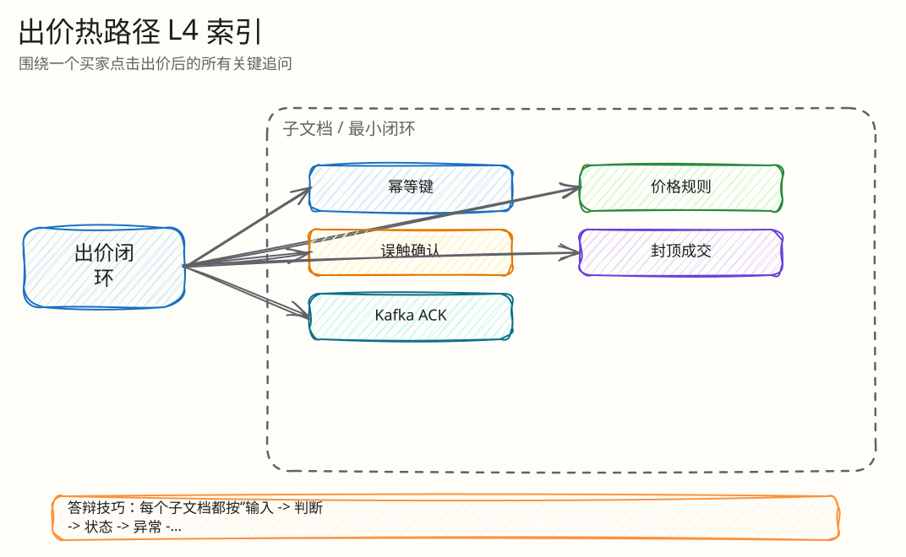

# L4：出价热路径最小闭环索引

父文档：[单次出价闭环](../01-bid-decision-closed-loop.md)
相关文档：[领域模型与竞拍规则](../../02-domain/00-domain-model-and-rules.md)、[工程难点](../05-engineering-difficulties.md)

本目录把一期的“单次出价闭环”拆成可被逐个追问的最小闭环。每篇只讲一个具体问题，包含输入、代码入口、状态变化、异常分支、验证方式和评委追问。

## 图 3-A-0-1：出价 L4 文档树

<!-- excalidraw-generated:start -->

  <a href="../../assets/excalidraw/03-backend-auction-bid-00-index-01.excalidraw">打开可编辑 Excalidraw 源文件</a>
   
  

<!-- excalidraw-generated:end -->

## 阅读顺序

| 顺序 | 文档 | 答辩时解决的问题 |
|---|---|---|
| 1 | [幂等键闭环](01-idempotency-key-closed-loop.md) | 重试、同 key 改金额、跨用户重放怎么处理 |
| 2 | [价格规则闭环](02-lua-price-rule-closed-loop.md) | 最小价、网格、cap、自我领先、过期怎么判 |
| 3 | [误触确认闭环](03-fat-finger-confirm-closed-loop.md) | 大额出价为什么不直接成交，确认期间价格变了怎么办 |
| 4 | [封顶成交建单闭环](04-cap-sold-order-closed-loop.md) | `ENGINE_SOLD` 如何变成唯一订单 |
| 5 | [Kafka ACK 与 durability 闭环](05-kafka-ack-durability-closed-loop.md) | `ENGINE_DURABLE` 和 `KAFKA_ACKED` 到底差在哪里 |

## 代码锚点

| 主题 | 代码 |
|---|---|
| Lua 主脚本 | `backend/internal/redisengine/engine.go:64` `ledgerRunner` |
| Go 入口 | `backend/internal/redisengine/engine.go:954` `placeBidWithSource` |
| Lua 执行和 ACK | `backend/internal/redisengine/engine.go:1346` `placeBidWithSnapshot` |
| 误触确认脚本 | `backend/internal/redisengine/engine.go:418` `confirmLedgerRunner` |
| 网关入口 | `backend/internal/gateway/auction_handlers.go` `PlaceBid` |
