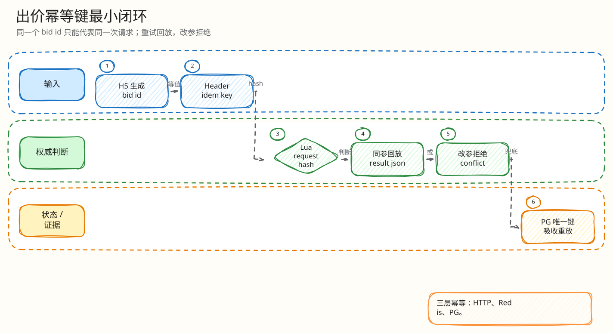

# L4：出价幂等键最小闭环

父文档：[出价热路径 L4 索引](00-index.md)
上层文档：[单次出价闭环](../01-bid-decision-closed-loop.md)
相关文档：[H5 出价超时不确定态](../../05-frontend/mobile-h5/01-bid-timeout-uncertain-retry.md)、[Kafka 重投幂等](../settlement/01-kafka-redelivery-idempotency.md)

## 闭环问题

评委会问：“用户弱网重复点击、浏览器重发、恶意用户同 key 改金额，系统怎么保证不会重复出价或重复扣款？”

本项目的最小闭环是：

```text
H5 client_bid_id
  = HTTP Idempotency-Key
  -> Go 入口强校验
  -> Lua request_hash 绑定 auction/user/client_bid_id/amount
  -> Redis idem_key 回放或拒绝
  -> PG 唯一约束吸收后续重放
```

## 图 3-A-1-1：幂等键闭环


<!-- excalidraw-generated:start -->
<div class="excalidraw-diagram" style="overflow-x: auto; width: 100%; margin: 12px 0 18px 0; padding: 12px 12px 14px 12px; border: 1px solid #e2e8f0; border-radius: 8px; background: #fffdf7;">
  <a href="../../assets/excalidraw/03-backend-auction-bid-01-idempotency-key-closed-loop-01.excalidraw">打开可编辑 Excalidraw 源文件</a>
  <br />
  
</div>
<!-- excalidraw-generated:end -->

## 输入与代码入口

| 输入 | 来源 | 代码 |
|---|---|---|
| `client_bid_id` | H5 `createClientBidID()` | `frontend/mobile-h5/src/main.tsx:1716` |
| `Idempotency-Key` | H5 fetch header | `frontend/mobile-h5/src/main.tsx:1728` |
| bid body | H5 POST JSON | `frontend/mobile-h5/src/main.tsx:1731` |
| Go 强校验 | Redis engine 入口 | `backend/internal/redisengine/engine.go:954` `placeBidWithSource` |
| Lua 幂等 | `ledgerRunner` | `backend/internal/redisengine/engine.go:64` |
| PG 防重 | migration | `bids UNIQUE (auction_id, user_id, client_bid_id)` |

## 状态变化

| 阶段 | 写入/读取 | 结果 |
|---|---|---|
| 首次请求 | Lua 读取 idem key 不存在 | 继续规则校验 |
| 首次成功/拒绝 | Lua 写 `result_json` 和 `request_hash` | 后续可回放 |
| 同 key 同请求重试 | Lua 命中相同 `request_hash` | 返回旧 `result_json` |
| 同 key 改金额 | Lua 命中不同 `request_hash` | 返回 `IDEMPOTENCY_KEY_REUSED_WITH_DIFFERENT_REQUEST` |
| Kafka/PG 重放 | PG unique/CAS | 不产生第二次业务效果 |

## 最小异常闭环：同 key 改金额


<!-- excalidraw-generated:start -->
<div class="excalidraw-diagram" style="overflow-x: auto; width: 100%; margin: 12px 0 18px 0; padding: 12px 12px 14px 12px; border: 1px solid #e2e8f0; border-radius: 8px; background: #fffdf7;">
  <a href="../../assets/excalidraw/03-backend-auction-bid-01-idempotency-key-closed-loop-02.excalidraw">打开可编辑 Excalidraw 源文件</a>
  <br />
  
</div>
<!-- excalidraw-generated:end -->

## 为什么不能只靠 PG 唯一约束

PG 唯一约束只能在 settlement 阶段防止重复业务效果。如果 H5 超时后立刻重试，第二个请求可能还没等到 PG 结算。Redis hot path 必须在决策层先吸收同 key 重试，否则会出现两个 Redis 决策序号，后续再靠 PG 拦会让用户体验和审计都变复杂。

## 验证方式

| 验证 | 看什么 |
|---|---|
| Lua/Redis engine tests | 同 key replay、同 key 改金额拒绝 |
| P4 risk simulator | 弱网/重试/支付双击类风险 |
| PG 约束 | `bids UNIQUE (auction_id,user_id,client_bid_id)` |
| H5 代码 | 超时后复用 `pendingBidRef.clientBidID` |

## 评委拷问

| 问题 | 答法 |
|---|---|
| 跨用户拿到别人 `client_bid_id` 呢？ | `request_hash` 绑定 userID；跨用户即使 key 文本相同，hash 也不同，会冲突。 |
| 同 key 同金额但 header/body 不一致呢？ | Go 入口要求 `Idempotency-Key == client_bid_id`，不一致直接拒绝。 |
| Redis idem 过期怎么办？ | 正常竞拍窗口内 idem TTL 覆盖重试；最终 PG 唯一约束仍是业务防线。生产化要按订单保留期调整 TTL。 |
| 为什么拒绝也要幂等？ | 拒绝也是用户可见决策，同一次错误请求重试应得到同一拒绝原因，便于审计。 |
