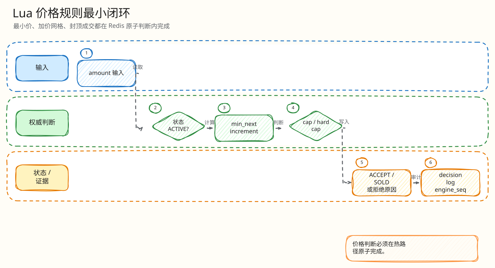

# L4：Redis Lua 价格规则最小闭环

父文档：[出价热路径 L4 索引](00-index.md)
上层文档：[领域模型与竞拍规则](../../02-domain/00-domain-model-and-rules.md)
相关文档：[误触确认闭环](03-fat-finger-confirm-closed-loop.md)、[封顶成交建单闭环](04-cap-sold-order-closed-loop.md)

## 闭环问题

评委会问：“两个用户同时出价，一个低价、一个高价、一个刚好 cap、一个自己已经领先，Lua 到底按什么顺序判？”

本项目把价格规则放在 `ledgerRunner` 里一次原子执行。核心原则是：**同一拍品只由 Redis Lua 给出一个全序决策，客户端和 PG legacy 都不是热路径权威。**

## 图 3-A-2-1：价格规则判定顺序

<!-- excalidraw-generated:start -->

  <a href="../../assets/excalidraw/03-backend-auction-bid-02-lua-price-rule-closed-loop-01.excalidraw">打开可编辑 Excalidraw 源文件</a>
   
  

<!-- excalidraw-generated:end -->

## 关键代码锚点

| 规则 | 代码位置 |
|---|---|
| state missing / incomplete | `engine.go:97`, `:166` |
| `RECONCILING` / paused | `engine.go:241` |
| cap 上限 | `engine.go:275` |
| fat-finger | `engine.go:303` |
| cap sold | `engine.go:349` |
| confirm 二次校验 | `engine.go:550` |
| Go 建拍规则 | `backend/internal/auction/rules.go` |

## 状态变化

| 分支 | 是否消耗 `engine_seq` | 是否写决策流 | 说明 |
|---|---:|---:|---|
| state missing / engine paused | 否 | 否 | 保护性错误，不制造业务决策 |
| 低价/错网格/自我领先/过期 | 是 | 是 | 拒绝也是审计决策 |
| fat-finger required | 否 | 否 | 等用户二次确认，不进入决策流 |
| accepted | 是 | 是 | 更新当前价/赢家/延时 |
| sold | 是 | 是 | 更新终态，后续 settlement 建单 |

## 最小正常闭环：有效普通出价

<!-- excalidraw-generated:start -->

  <a href="../../assets/excalidraw/03-backend-auction-bid-02-lua-price-rule-closed-loop-02.excalidraw">打开可编辑 Excalidraw 源文件</a>
   
  

<!-- excalidraw-generated:end -->

## 最小异常闭环：off-grid

如果 `start=0`、`increment=100`、当前价 `200`，下一个有效价是 `300`，用户出 `250`：

| 步骤 | 行为 |
|---|---|
| Lua 计算 minimum | `current + increment` |
| 检查网格 | `(amount - start) % increment != 0` |
| 生成拒绝 | `BID_INCREMENT_MISMATCH` |
| 写入审计 | 拒绝消耗 `engine_seq` 并写决策流 |
| H5 展示 | 只展示服务端拒绝原因，不本地纠正成成功 |

## 和 Go 规则的关系

`auction/rules.go` 仍用于建拍校验、PG legacy 对照和部分辅助逻辑；默认热路径以 Lua 为准。当前文档必须诚实说明：Go/Lua 规则长期存在漂移风险，二期文档把这点单独暴露出来，后续最好补 parity/property test。

## 评委拷问

| 问题 | 答法 |
|---|---|
| 为什么拒绝也消耗 `engine_seq`？ | 为了证明 1..N 决策无空洞。否则评委无法区分“没请求”和“请求被吞”。 |
| fat-finger 为什么不消耗 seq？ | 它还不是最终决策，只是要求用户二次确认；确认时会重新校验当前状态。 |
| 手机本地算出来的 next bid 不准怎么办？ | 无所谓。H5 只是建议价，服务端 Lua 是唯一权威。 |
| cap 不可达怎么办？ | 建拍规则约束 cap 必须满足 `(cap-start)%increment=0`，迁移里也有 `ck_auctions_cap_reachable`。 |
