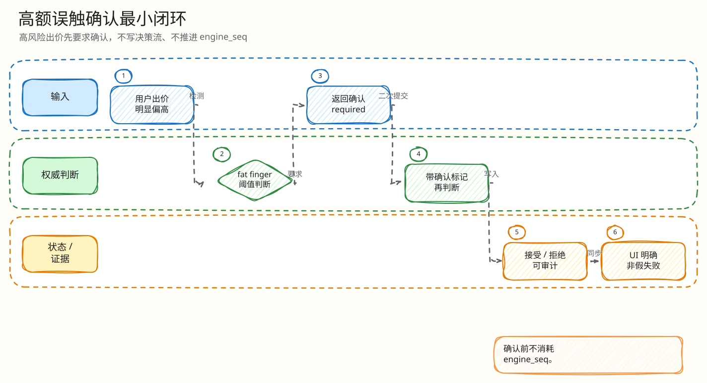

# L4：误触二次确认最小闭环

父文档：[出价热路径 L4 索引](00-index.md)
相关文档：[价格规则闭环](02-lua-price-rule-closed-loop.md)、[H5 出价超时不确定态](../../05-frontend/mobile-h5/01-bid-timeout-uncertain-retry.md)

## 闭环问题

评委会问：“用户手滑出了一个很大的价格，系统是直接成交、直接拒绝，还是让用户确认？确认期间别人抬价了怎么办？”

当前实现是：大额跳价触发 `FAT_FINGER_CONFIRM_REQUIRED`，写入 pending confirm key，H5 展示二次确认；用户确认时走 `confirmLedgerRunner`，**重新读取当前 Redis state 并重跑所有规则**。

## 图 3-A-3-1：误触确认闭环

<!-- excalidraw-generated:start -->

  <a href="../../assets/excalidraw/03-backend-auction-bid-03-fat-finger-confirm-closed-loop-01.excalidraw">打开可编辑 Excalidraw 源文件</a>
   
  

<!-- excalidraw-generated:end -->

## 关键代码锚点

| 能力 | 代码 |
|---|---|
| fat-finger 检测 | `backend/internal/redisengine/engine.go:303` |
| pending confirm key | `engine.go:308` |
| 返回 confirm token | `engine.go:319`, `:336` |
| confirm Lua | `engine.go:418` `confirmLedgerRunner` |
| confirm token 校验 | `engine.go:446` |
| confirm 重新校验规则 | `engine.go:550` |
| confirm 后删除 pending key | `engine.go:608` |
| Go confirm 入口 | `engine.go:998` `ConfirmBid` |

## 状态变化

| 阶段 | Redis/响应 | 是否最终决策 |
|---|---|---|
| 初次大额出价 | 写 pending confirm key，返回 token | 否 |
| token 错误 | `CONFIRM_TOKEN_INVALID` | 否 |
| token 过期 | `CONFIRM_TOKEN_EXPIRED` | 否 |
| 确认时价格已变化 | 重算 min/grid/cap/self leading | 可能拒绝 |
| 确认通过 | 写 state/idem/pending/stream，删除 pending confirm | 是 |

## 最小异常闭环：确认期间别人抬价

<!-- excalidraw-generated:start -->

  <a href="../../assets/excalidraw/03-backend-auction-bid-03-fat-finger-confirm-closed-loop-02.excalidraw">打开可编辑 Excalidraw 源文件</a>
   
  

<!-- excalidraw-generated:end -->

关键点：confirm 不是“绕过规则的后门”。它只是把用户意图保存 30s，最终是否接受仍由确认时的当前热态决定。

## H5 应展示什么

| 后端结果 | H5 行为 |
|---|---|
| `FAT_FINGER_CONFIRM_REQUIRED` | 进入 `confirm_required`，展示确认金额和 token |
| confirm 成功 | 展示 accepted/sold/pending settlement |
| confirm token invalid/expired | 清理确认态，允许用户重新出价 |
| confirm 被价格变化拒绝 | 展示服务端拒绝原因，不复用旧价格假成功 |

## 评委拷问

| 问题 | 答法 |
|---|---|
| 为什么不直接拒绝大额出价？ | 高价可能是用户真实意图，直接拒绝损害成交；二次确认兼顾转化和误触保护。 |
| pending confirm 是否写入决策流？ | 不写。它不是最终决策，不消耗 `engine_seq`。 |
| confirm token 被盗用呢？ | token 绑定 pending key、user、auction、client_bid_id；确认还要走鉴权和 idem。 |
| 30 秒内状态变化怎么办？ | confirm Lua 重新读取 current state 并重跑所有 guard，不按旧快照放行。 |
