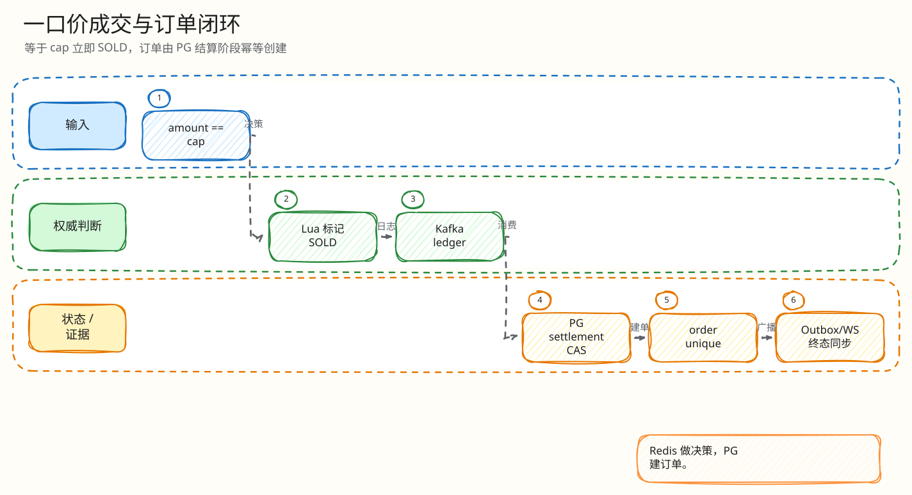

# L4：封顶成交与唯一订单最小闭环

父文档：[出价热路径 L4 索引](00-index.md)
相关文档：[SOLD 唯一订单闭环](../settlement/02-order-creation-exactly-once.md)、[Kafka 结算闭环](../02-kafka-settlement-closed-loop.md)

## 闭环问题

评委会问：“用户出价刚好到封顶价，什么时候算成交？会不会两个 worker 都建订单？”

热路径只负责给出 `ENGINE_SOLD` 决策；订单创建发生在 Kafka settlement 落 PostgreSQL 时。防重边界是 `orders.auction_id UNIQUE` 和 settlement 的 `auction_id + engine_epoch + engine_seq` 唯一约束。

## 图 3-A-4-1：封顶成交到订单

<!-- excalidraw-generated:start -->

  <a href="../../assets/excalidraw/03-backend-auction-bid-04-cap-sold-order-closed-loop-01.excalidraw">打开可编辑 Excalidraw 源文件</a>
   
  

<!-- excalidraw-generated:end -->

## 关键代码锚点

| 能力 | 代码 |
|---|---|
| cap 判断 | `backend/internal/redisengine/engine.go:349` |
| confirm cap sold | `engine.go:578` |
| settlement worker | `engine.go:2315` `RunKafkaSettlement` |
| outbox insert | `engine.go:3530`, `:3540` |
| 订单唯一约束 | `orders.auction_id UNIQUE` |
| settlement 唯一约束 | `redis_engine_settlements UNIQUE (auction_id, engine_epoch, engine_seq)` |

## 状态变化

| 阶段 | 状态 |
|---|---|
| Lua 决策 | Redis state 进入 SOLD，写 `ENGINE_SOLD` 决策 |
| HTTP 返回 | 用户看到 SOLD/pending settlement 语义 |
| Kafka settlement | 写 settlement、bid、auction 终态、order |
| PG 约束 | 同一 auction 只能有一张订单 |
| Outbox | 广播 SOLD/订单相关事件 |

## 最小异常闭环：Kafka 重复投递 SOLD

<!-- excalidraw-generated:start -->

  <a href="../../assets/excalidraw/03-backend-auction-bid-04-cap-sold-order-closed-loop-02.excalidraw">打开可编辑 Excalidraw 源文件</a>
   
  

<!-- excalidraw-generated:end -->

## 为什么 HTTP 不直接建订单

| 方案 | 风险 |
|---|---|
| Lua 后同步写 PG 建单 | 把 PG 事务和订单创建放回热路径，增加尾延迟 |
| HTTP handler 单独建单 | 需要处理 Redis/Kafka/PG 跨系统双写，失败边界复杂 |
| Kafka settlement 建单 | 决策先落 WAL，再由幂等 worker 落 PG，防重清晰 |

## 评委拷问

| 问题 | 答法 |
|---|---|
| 用户看到 SOLD 时订单一定存在吗？ | 不一定同步存在；SOLD 是 Redis 权威决策，订单由 settlement worker 幂等创建。UI 应展示 pending/settling。 |
| 重投会不会双订单？ | `orders.auction_id UNIQUE`，同拍品只能一张订单；settlement 也按 engine seq 唯一。 |
| 两个用户同时出 cap 呢？ | Redis Lua 单线程全序，先执行的决策 sold，后续请求看到非 ACTIVE/已终态会拒绝。 |
| cap 不设置怎么办？ | 没有 cap 就不会走 `ENGINE_SOLD` 分支，只能按时间结束；产品风险见风险矩阵。 |
