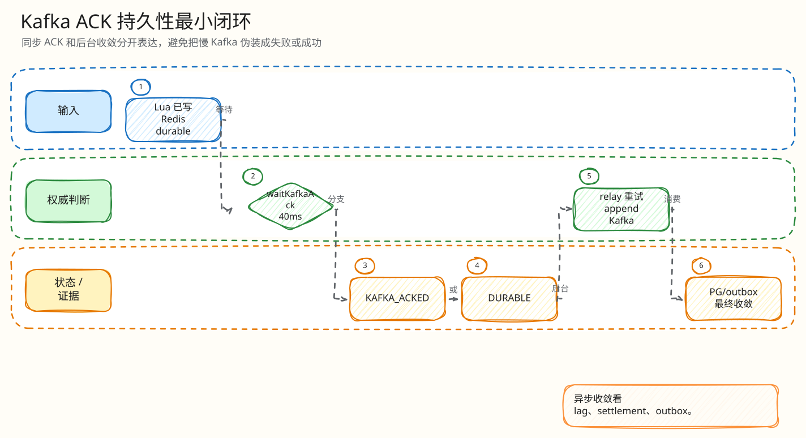

# L4：Kafka ACK 与 durability 最小闭环

父文档：[出价热路径 L4 索引](00-index.md)
相关文档：[Kafka 结算闭环](../02-kafka-settlement-closed-loop.md)、[工程难点](../05-engineering-difficulties.md)

## 闭环问题

评委会问：“你说返回成功，但 Kafka 还没 ACK，这到底算什么成功？如果 Kafka 挂了，用户是不是拿到假成功？”

当前实现把响应 durability 拆成两个概念：

| 状态 | 含义 |
|---|---|
| `KAFKA_ACKED` | Lua 决策已写 Redis，relay 已确认 Kafka append |
| `ENGINE_DURABLE` | Lua 决策已写 Redis state/idem/stream，但 HTTP 等待 Kafka ACK 超时或熔断 |

## 图 3-A-5-1：ACK 等待闭环

<!-- excalidraw-generated:start -->

  <a href="../../assets/excalidraw/03-backend-auction-bid-05-kafka-ack-durability-closed-loop-01.excalidraw">打开可编辑 Excalidraw 源文件</a>
   
  

<!-- excalidraw-generated:end -->

## 关键代码锚点

| 能力 | 代码 |
|---|---|
| ACK latch 说明 | `backend/internal/redisengine/engine.go:661` |
| `waitKafkaAck` | `engine.go:873` |
| 主出价等待 40ms | `engine.go:1472` |
| confirm 等待 40ms | `engine.go:1097` |
| relay 唤醒等待者 | `engine.go:2275`, `:2583` |
| circuit breaker 降级 | `engine.go:2533` |

## 状态变化

| 阶段 | Redis | Kafka | HTTP |
|---|---|---|---|
| Lua 成功 | state/idem/stream 已写 | 未必已写 | 尚未返回 |
| 40ms 内 ACK | idem 标记 acked | append 成功 | `KAFKA_ACKED` |
| 等待超时 | Redis 仍保留决策 | 后台继续尝试 | `ENGINE_DURABLE` |
| Kafka 熔断 | Redis 仍保留决策 | 暂不可确认 | 立即 `ENGINE_DURABLE` |
| 后续恢复 | relay/worker 继续 | 落 Kafka/PG | 由监控/verifier 证明收敛 |

## 不能说错的话

| 错误说法 | 正确说法 |
|---|---|
| `ENGINE_DURABLE` 等于 Kafka 成功 | 它只表示 Redis 决策 durable，Kafka ACK 未同步确认 |
| Kafka 挂了也完全成功 | 用户拿到权威决策，但 settlement/outbox 需要恢复收敛 |
| Kafka EOS 保证 exactly-once | 当前不宣传 Kafka EOS；业务幂等在 PG unique/CAS |
| HTTP 200 就证明正确 | 必须看 settlement、lag、outbox、verifier |

## 评委拷问

| 问题 | 答法 |
|---|---|
| 为什么只等 40ms？ | 热路径不能无限等 Kafka；40ms 是响应边界，超时暴露为 `ENGINE_DURABLE`，由后台收敛。 |
| Redis 也会丢怎么办？ | 这进入 Redis 恢复闭环；状态缺失时 fail-closed，不从 PG 猜热态继续。 |
| 用户如何理解 `ENGINE_DURABLE`？ | UI 不应说“订单已完成”，只能说出价决策已收到/处理中，终态看后续事件或快照。 |
| 怎么证明后来收敛了？ | Kafka lag、pending、settlement SETTLED、outbox drained、S1-S5 verifier。 |
