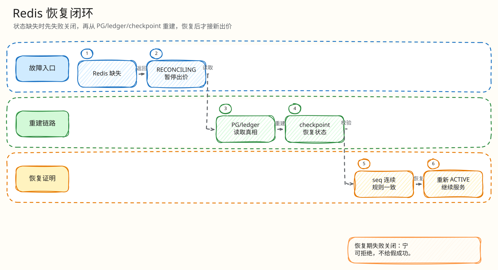

# L4：Redis 恢复最小闭环索引

父文档：[Redis 丢失恢复](../03-redis-loss-recovery.md)
相关文档：[数据与一致性](../../01-architecture/01-data-consistency.md)、[风险矩阵](../../08-tests-and-risk/00-risk-and-abuse-matrix.md)

本目录把“Redis 丢了怎么办”拆成两个最小闭环：出价时发现热态缺失如何失败关闭，以及如何从 checkpoint 重建并恢复。

## 图 3-R-0-1：恢复 L4 文档树

<!-- excalidraw-generated:start -->

  <a href="../../assets/excalidraw/03-backend-recovery-00-index-01.excalidraw">打开可编辑 Excalidraw 源文件</a>
   
  

<!-- excalidraw-generated:end -->

## 阅读顺序

| 顺序 | 文档 | 答辩时解决的问题 |
|---|---|---|
| 1 | [Redis state missing 闭环](01-redis-state-missing-reconciling.md) | 为什么不直接从 PG 猜当前价继续 |
| 2 | [Checkpoint rebuild 闭环](02-checkpoint-rebuild.md) | 如何恢复 Redis，怎么防旧 epoch 消息污染 |
