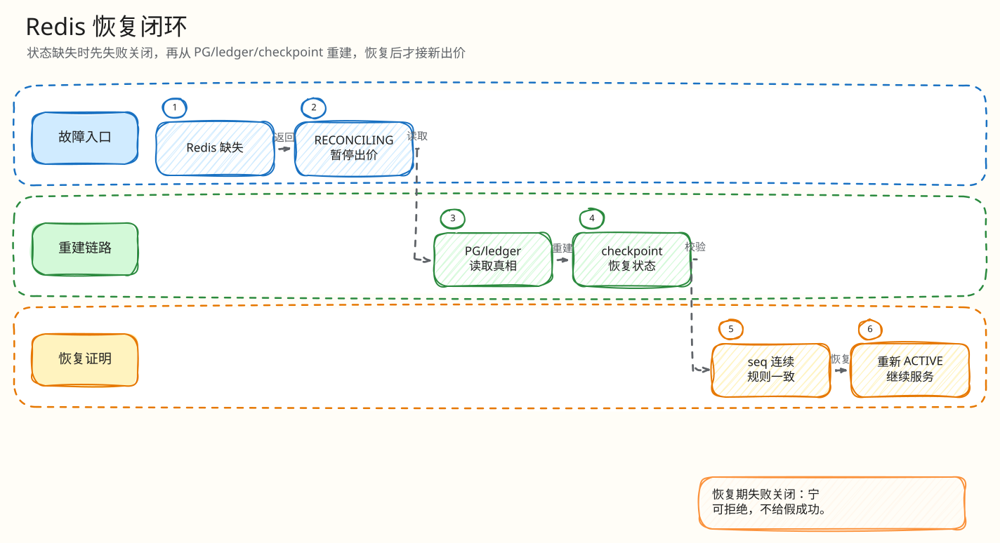

# L4：Redis state missing 与 RECONCILING 最小闭环

父文档：[Redis 恢复 L4 索引](00-index.md)
上层文档：[Redis 丢失恢复](../03-redis-loss-recovery.md)

## 闭环问题

评委会问：“Redis 热态没了，为什么不直接用 PostgreSQL 当前价继续接出价？”

因为 PG 可能缺少“Redis 已决策但尚未 settlement”的 pending 决策。直接读 PG 会回退当前价，造成幽灵出价或重复赢家。当前实现选择 fail-closed：Lua 返回 `RECONCILING`，Go 进入冷启动/恢复逻辑，无法证明安全就 `ENGINE_PAUSED`。

## 图 3-R-1-1：state missing 闭环

<!-- excalidraw-generated:start -->

  <a href="../../assets/excalidraw/03-backend-recovery-01-redis-state-missing-reconciling-01.excalidraw">打开可编辑 Excalidraw 源文件</a>
   
  

<!-- excalidraw-generated:end -->

## 关键代码锚点

| 能力 | 代码 |
|---|---|
| Lua state missing | `backend/internal/redisengine/engine.go:97`, `:166` |
| Go 处理 RECONCILING | `engine.go:1381`, `:1666` |
| snapshot 读取 | `engine.go:1861` 附近 |
| checkpoint rebuild | `engine.go:3830` |
| H5 dangerous disable | `frontend/mobile-h5/src/domain.ts:1048` |

## 状态语义

| 后端返回 | 语义 | H5 行为 |
|---|---|---|
| `RECONCILING` | 热态缺失或不完整，正在恢复 | 禁用出价，提示恢复 |
| `ENGINE_PAUSED` | 不能证明恢复安全 | 禁用危险操作 |
| 恢复后正常决策 | snapshot/epoch/seq 校验通过 | 重新按服务端状态出价 |

## 评委拷问

| 问题 | 答法 |
|---|---|
| fail-closed 会影响可用性吗？ | 会，但直播竞拍里假成功比短暂不可用更严重。 |
| 如果 PG 当前价比 Redis 旧价新呢？ | 不能只看 PG；要同时考虑 Kafka/pending/checkpoint，否则仍可能遗漏未结算决策。 |
| 可以手工解除 pause 吗？ | 不建议。必须有 checkpoint/rebuild/reconciler 证据后恢复。 |
| 用户看到什么？ | 恢复中/不确定态，不能看到假领先或假成交。 |
