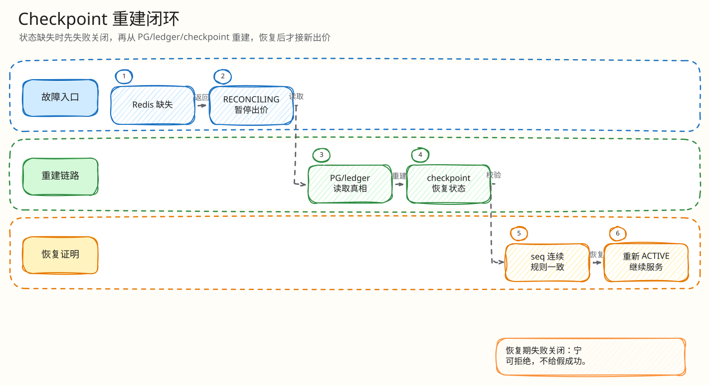

# L4：Checkpoint rebuild 最小闭环

父文档：[Redis 恢复 L4 索引](00-index.md)
相关文档：[Redis state missing 闭环](01-redis-state-missing-reconciling.md)

## 闭环问题

评委会问：“你说能从 checkpoint 恢复 Redis，checkpoint 里有什么？怎么防老消息污染新状态？”

checkpoint 表记录 `engine_epoch`、`engine_seq`、Kafka 决策位点、`state_hash` 和 snapshot。重建时写入新的 Redis snapshot，并依靠 `engine_epoch` 隔离旧决策。

## 图 3-R-2-1：Checkpoint rebuild 闭环

<!-- excalidraw-generated:start -->

  <a href="../../assets/excalidraw/03-backend-recovery-02-checkpoint-rebuild-01.excalidraw">打开可编辑 Excalidraw 源文件</a>
   
  

<!-- excalidraw-generated:end -->

## 表结构

| 字段 | 作用 |
|---|---|
| `auction_id` | 拍品唯一 |
| `engine_epoch` | 恢复代际 fence |
| `engine_seq` | 已恢复到的引擎序号 |
| `decision_topic/partition/next_decision_offset` | Kafka 位置 |
| `state_hash` | snapshot 身份校验 |
| `snapshot_json` | Redis 热态快照 |

## 关键代码锚点

| 能力 | 代码 |
|---|---|
| checkpoint 表 | `backend/migrations/202605300002_redis_engine_checkpoints.sql` |
| rebuild 函数 | `backend/internal/redisengine/engine.go:3830` |
| epoch 注释 | `202605280001_redis_ledger_engine.sql` |
| old entry handling | `engine.go:4028` |

## 评委拷问

| 问题 | 答法 |
|---|---|
| checkpoint 不是最新怎么办？ | 不能盲目 resume；需要结合 Kafka offset 和 settlement/reconciler 判断。 |
| 旧 epoch 的消息来了怎么办？ | settlement CAS/epoch fence 阻止旧代际越过新状态。 |
| 重建期间继续出价怎么办？ | 返回 `RECONCILING` 或 `ENGINE_PAUSED`，不接受新业务决策。 |
| 生产还差什么？ | Redis HA、跨实例 fencing、RTO/RPO 自动记录和演练证据。 |
