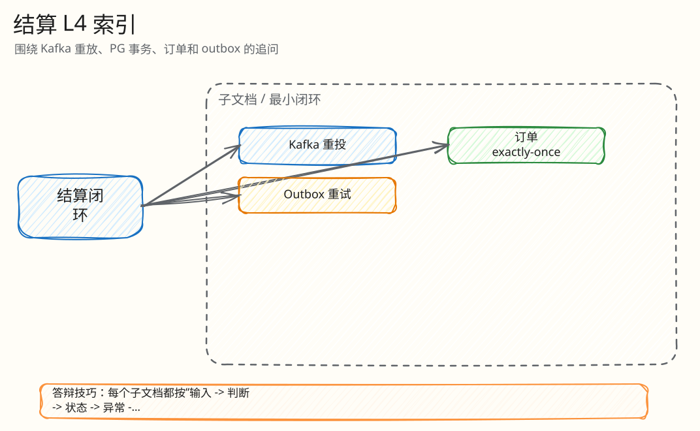

# L4：结算、Outbox 与订单最小闭环索引

父文档：[Kafka 结算闭环](../02-kafka-settlement-closed-loop.md)
相关文档：[数据与一致性](../../01-architecture/01-data-consistency.md)、[证据映射](../../07-performance-and-evidence/00-evidence-map.md)

本目录解释 Redis 已决策之后，Kafka、PostgreSQL、订单、Outbox 如何收敛成可审计业务真相。

## 图 3-S-0-1：结算 L4 文档树

<!-- excalidraw-generated:start -->

  <a href="../../assets/excalidraw/03-backend-settlement-00-index-01.excalidraw">打开可编辑 Excalidraw 源文件</a>
   
  

<!-- excalidraw-generated:end -->

## 阅读顺序

| 顺序 | 文档 | 答辩时解决的问题 |
|---|---|---|
| 1 | [Kafka 重投幂等闭环](01-kafka-redelivery-idempotency.md) | worker 崩溃/消息重放会不会双写 |
| 2 | [SOLD 唯一订单闭环](02-order-creation-exactly-once.md) | 封顶成交后如何确保只有一张订单 |
| 3 | [Outbox 发布重试闭环](03-outbox-publish-retry.md) | 客户端没收到事件时怎么重试、怎么变 DEAD |
