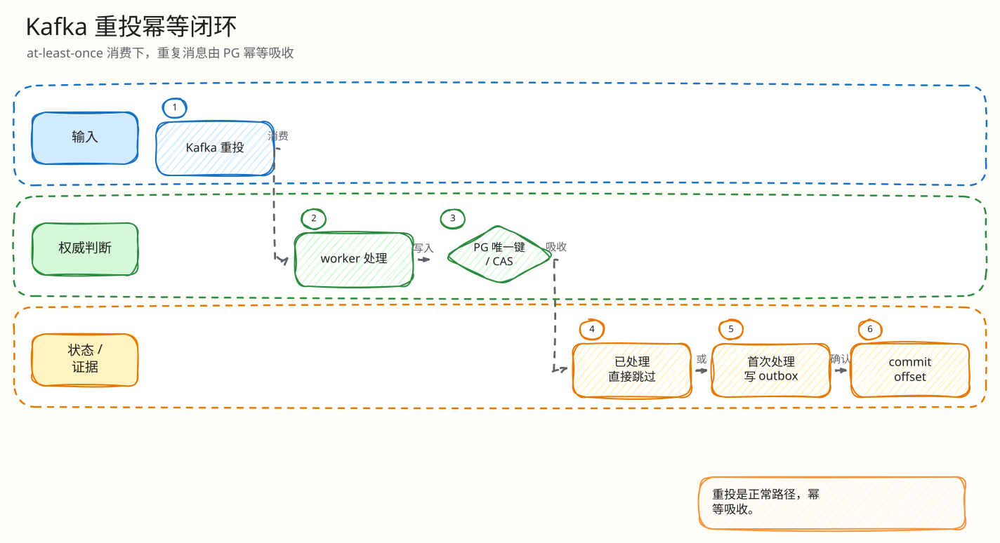

# L4：Kafka 重投幂等最小闭环

父文档：[结算 L4 索引](00-index.md)
上层文档：[Kafka 结算闭环](../02-kafka-settlement-closed-loop.md)
相关文档：[出价幂等键闭环](../auction-bid/01-idempotency-key-closed-loop.md)

## 闭环问题

评委会问：“settlement worker 写 PG 后崩溃，Kafka offset 没提交，同一消息再次消费，会不会重复写 bid、重复建订单、重复 outbox？”

当前防线是多层唯一约束和业务 CAS：

```text
Kafka message
  -> redis_engine_settlements(auction_id, engine_epoch, engine_seq) unique
  -> bids engine seq / client_bid_id unique
  -> orders.auction_id unique
  -> outbox event seq unique
```

## 图 3-S-1-1：Kafka 重投幂等闭环


<!-- excalidraw-generated:start -->
<div class="excalidraw-diagram" style="overflow-x: auto; width: 100%; margin: 12px 0 18px 0; padding: 12px 12px 14px 12px; border: 1px solid #e2e8f0; border-radius: 8px; background: #fffdf7;">
  <a href="../../assets/excalidraw/03-backend-settlement-01-kafka-redelivery-idempotency-01.excalidraw">打开可编辑 Excalidraw 源文件</a>
  <br />
  
</div>
<!-- excalidraw-generated:end -->

## 关键代码和表约束

| 防线 | 代码/迁移 |
|---|---|
| settlement worker | `backend/internal/redisengine/engine.go:2315` `RunKafkaSettlement` |
| retry/DLQ | `engine.go:3593` `retryOrDLQ` |
| settlement unique | `202605280001_redis_ledger_engine.sql` |
| Kafka offset unique | `202605290001_kafka_bid_ledger.sql` |
| bids unique | `202605220001_init_core.sql` + `ux_bids_engine_seq` |
| orders unique | `orders.auction_id UNIQUE` |

## 状态变化

| 场景 | 第一次处理 | 重投处理 |
|---|---|---|
| accepted bid | insert settlement + bid + auction update | unique/CAS 吸收 |
| rejected bid | insert settlement + rejected bid/event | 同 seq 不重复 |
| sold | 创建订单 + outbox | `orders.auction_id UNIQUE` 防双单 |
| worker 崩溃 | 可能部分 PG 已提交 | 重投走幂等路径 |
| 多次失败 | 记录 attempts，进入 retry/DLQ | 不提交假成功 |

## 评委拷问

| 问题 | 答法 |
|---|---|
| Kafka exactly-once 吗？ | 不宣传 Kafka 层 EOS。Kafka 可以重投，PG 幂等吸收重投。 |
| offset unique 有什么用？ | 防同一 Kafka offset 被重复记录成多个 settlement，也便于 lag/审计。 |
| 如果 payload 同 epoch/seq 但内容不同？ | 这是严重 identity conflict，应进入错误/告警路径，不能静默覆盖。 |
| 重试多久？ | 当前有 retry/DLQ 机制；生产需要把最大尝试、DLQ 运维和告警 runbook 固化。 |
