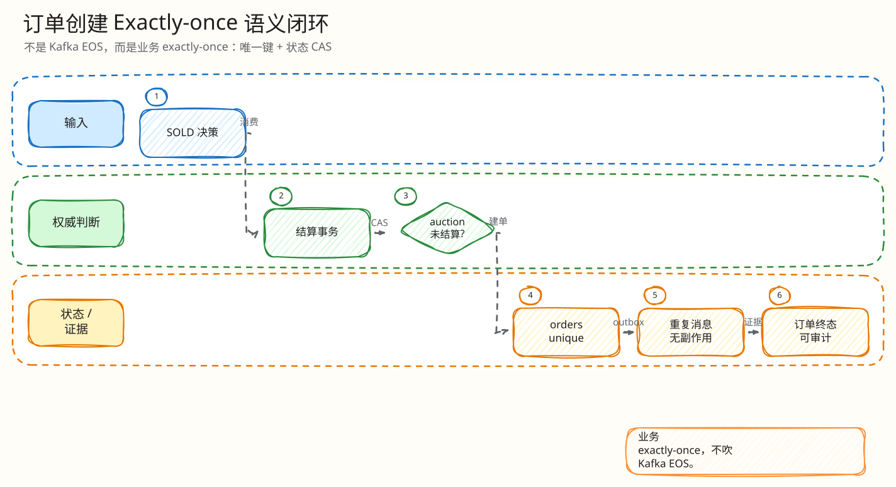

# L4：SOLD 唯一订单最小闭环

父文档：[结算 L4 索引](00-index.md)
相关文档：[封顶成交与唯一订单](../auction-bid/04-cap-sold-order-closed-loop.md)

## 闭环问题

评委会问：“SOLD 决策到了 PG 结算层，订单和支付入口怎么保证只创建一次？”

订单不在 Redis Lua 中创建，而在 settlement worker 落 PG 时创建。`orders.auction_id UNIQUE` 是最终防线。

## 图 3-S-2-1：SOLD 建单闭环

<!-- excalidraw-generated:start -->

  <a href="../../assets/excalidraw/03-backend-settlement-02-order-creation-exactly-once-01.excalidraw">打开可编辑 Excalidraw 源文件</a>
   
  

<!-- excalidraw-generated:end -->

## 状态变化

| 表 | 写入/更新 | 防重 |
|---|---|---|
| `redis_engine_settlements` | `ENGINE_SOLD` 对应 settlement | `(auction_id, engine_epoch, engine_seq)` unique |
| `bids` | sold 出价对应 accepted bid | `ux_bids_engine_seq` |
| `auctions` | 终态 SOLD、赢家、价格 | CAS/状态机 |
| `orders` | winner、amount、expire_at | `auction_id UNIQUE` |
| `outbox_events` | 广播终态/订单事件 | `ux_outbox_event_seq` |

## 最小异常闭环：两个 worker 竞争同一 SOLD

<!-- excalidraw-generated:start -->

  <a href="../../assets/excalidraw/03-backend-settlement-02-order-creation-exactly-once-02.excalidraw">打开可编辑 Excalidraw 源文件</a>
   
  

<!-- excalidraw-generated:end -->

## 评委拷问

| 问题 | 答法 |
|---|---|
| SOLD 后订单延迟创建，用户体验怎么办？ | H5 展示 settling/pending，不伪造真实支付完成。 |
| 订单已建但 outbox 失败怎么办？ | outbox delivery 有 retry/DEAD/monitor，不影响订单真相。 |
| 支付双击怎么办？ | 支付有 provider payment id 和 payment idempotency，属于支付闭环，不把 SOLD 建单重复。 |
| 订单过期呢？ | scheduler/order expiry 是后续生命周期闭环；本篇只讲 SOLD 建单一次性。 |
