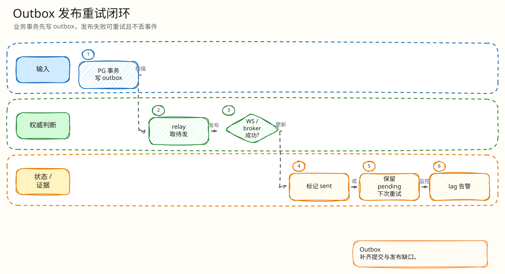

# L4：Outbox 发布重试最小闭环

父文档：[结算 L4 索引](00-index.md)
相关文档：[WebSocket last_seq 恢复](../../04-realtime/websocket/02-last-seq-recovery.md)、[观测运维](../../06-observability/00-ops-observability.md)

## 闭环问题

评委会问：“PG 已经写了 outbox，但 WebSocket 发布失败，客户端会不会永远收不到？怎么重试？什么时候 DEAD？”

Outbox 的最小闭环是：PG 事务内写 `outbox_events/outbox_delivery`，relay claim 待投递记录，发布到 Redis/Hub 后标记 `PUBLISHED`；失败则增加 attempts，超过上限进入 `DEAD`，可通过 control signal `retry_dead_outbox` 重试。

## 图 3-S-3-1：Outbox 发布闭环

<!-- excalidraw-generated:start -->

  <a href="../../assets/excalidraw/03-backend-settlement-03-outbox-publish-retry-01.excalidraw">打开可编辑 Excalidraw 源文件</a>
   
  

<!-- excalidraw-generated:end -->

## 关键代码锚点

| 能力 | 代码 |
|---|---|
| signal 类型 | `backend/internal/outbox/relay.go:47` |
| LISTEN outbox | `relay.go:135` |
| claim delivery | `relay.go:278` |
| mark published | `relay.go:516` |
| retry/dead | `relay.go:556`, `:573`, `:606` |
| retry_dead_outbox | `relay.go:957` |
| outbox 表 | `202605220001_init_core.sql` |

## 状态变化

| 状态 | 含义 |
|---|---|
| `PENDING` | 待投递 |
| `PUBLISHING` | relay 已 claim |
| `PUBLISHED` | 已发布并更新 watermark |
| `FAILED` | 本次失败，等待下一次 |
| `DEAD` | 超过最大尝试，需要人工/控制信号处理 |

## 评委拷问

| 问题 | 答法 |
|---|---|
| outbox 失败会不会影响订单真相？ | 不影响 PG 真相，但影响客户端实时可见性；通过 retry/monitor/快照恢复补偿。 |
| 客户端漏了事件怎么办？ | WS last_seq 恢复或 snapshot recovery；outbox 不是唯一恢复源。 |
| DEAD 怎么处理？ | `/api/monitor/outbox` 发现，control signal `retry_dead_outbox` 重置为可重试。 |
| 为什么要 outbox，不直接 worker 发 WS？ | PG 事务和外部投递解耦，避免事务成功但事件丢失不可追踪。 |
