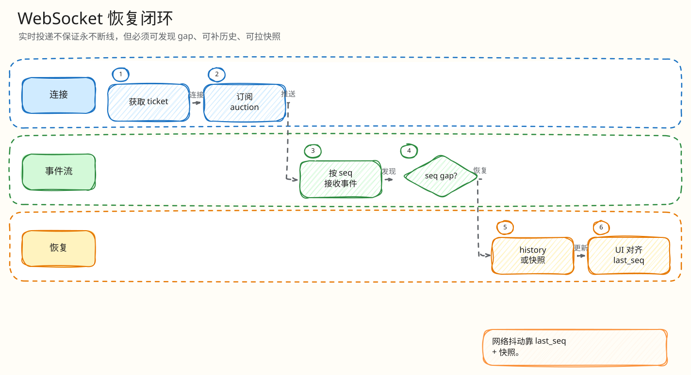

# 实时闭环：WebSocket 连接、恢复与慢消费者

父文档：[系统架构](../01-architecture/00-system-architecture.md)
子文档：[WebSocket 恢复与背压 L4 索引](websocket/00-index.md)
相关文档：[H5 竞拍闭环](../05-frontend/01-mobile-h5-closed-loop.md)、[证据映射](../07-performance-and-evidence/00-evidence-map.md)

## 闭环目标

实时层要保证：连接进来的是有权限用户；断线后能从 `last_seq` 恢复；恢复失败能降级快照；慢消费者不能拖垮房间广播。

## 连接时序

<!-- excalidraw-generated:start -->

  <a href="../assets/excalidraw/04-realtime-01-websocket-recovery-closed-loop-01.excalidraw">打开可编辑 Excalidraw 源文件</a>
   
  

<!-- excalidraw-generated:end -->

## `ServeWS` 关键阶段

| 阶段 | 处理 |
|---|---|
| connect admission | 限制同时连接建立，失败写 retry |
| ticket consume | 一次性票据，缺失/无效 401 |
| scope validate | ticket 的 room/auction 必须与 URL 一致 |
| room/access validate | 后端确认房间/拍品和成员关系 |
| subscribe | Hub 按 auction 订阅 |
| recovery | 根据 `last_seq` 返回 history/db/snapshot/stale |
| live loop | 从 subscriber queue 写 WS；慢消费者断开 |

## 慢消费者策略

MDN 文档指出传统 `WebSocket` API 不自动提供流式背压；`WebSocketStream` 才能使用 Streams API 自动调节背压，但浏览器兼容仍有限。因此服务端必须自己做背压。

本项目做法：

- Hub subscriber 有消息数/字节上限；
- 写消息有 5s timeout；
- 队列关闭或 slow callback 触发时，服务端以 policy violation 断开；
- 记录 `auction_ws_slow_consumer_disconnect_total` 和用户活动事件；
- H5 重连后走 `last_seq` 恢复。

## 恢复来源

| 来源 | 含义 |
|---|---|
| history | Redis/事件历史可覆盖 gap |
| db | 从 PG 快照重建 |
| redis_stale | 快照过期/不可信，前端展示 stale/recovering |
| snapshot_unavailable | 恢复资源饱和或不可用，前端保守处理 |

## 前端恢复触发

H5 在以下情况调用 `recoverFromSnapshot`：

- WS 收到 gap/outbox gap；
- 连接断开/重连；
- 服务端返回 stale snapshot；
- 用户手动刷新；
- 出价后状态不确定。

## 评委拷问

| 问题 | 回答 |
|---|---|
| 1000 人同时在线，慢用户会拖住广播吗？ | 不会无限拖。Hub 有界队列和字节上限，写超时或 backpressure 会断开慢连接。 |
| 客户端 `last_seq` 伪造很大怎么办？ | 服务器仍会根据可用历史/快照返回恢复结果；客户端不能据此制造价格或赢家。 |
| WS ticket 被偷用怎么办？ | ticket scope 绑定 room/auction/user，且 consume 后失效。 |

## 继续下钻到 L4

| 追问 | L4 文档 |
|---|---|
| ticket 被偷、复用、跨房间 | [Ticket scope 与一次性消费](websocket/01-ticket-scope-consume.md) |
| 断线后 last_seq 怎么补 | [last_seq 恢复](websocket/02-last-seq-recovery.md) |
| 慢消费者会不会拖垮房间 | [慢消费者断开](websocket/03-slow-consumer-disconnect.md) |
