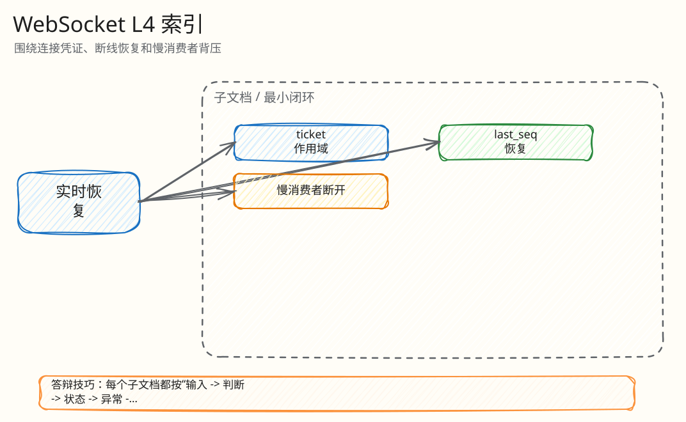

# L4：WebSocket 恢复与背压最小闭环索引

父文档：[WebSocket 恢复闭环](../01-websocket-recovery-closed-loop.md)
相关文档：[H5 竞拍闭环](../../05-frontend/01-mobile-h5-closed-loop.md)

本目录把实时链路拆成三个最小闭环：ticket scope、last_seq 恢复、慢消费者断开。

## 图 4-W-0-1：WebSocket L4 文档树

<!-- excalidraw-generated:start -->

  <a href="../../assets/excalidraw/04-realtime-websocket-00-index-01.excalidraw">打开可编辑 Excalidraw 源文件</a>
   
  

<!-- excalidraw-generated:end -->

## 阅读顺序

| 顺序 | 文档 | 答辩时解决的问题 |
|---|---|---|
| 1 | [Ticket scope 闭环](01-ticket-scope-consume.md) | ticket 被偷/复用/跨房间能不能连 |
| 2 | [last_seq 恢复闭环](02-last-seq-recovery.md) | 断线后怎么补历史，补不了怎么降级快照 |
| 3 | [慢消费者断开闭环](03-slow-consumer-disconnect.md) | 一个弱网用户会不会拖垮全房间 |
