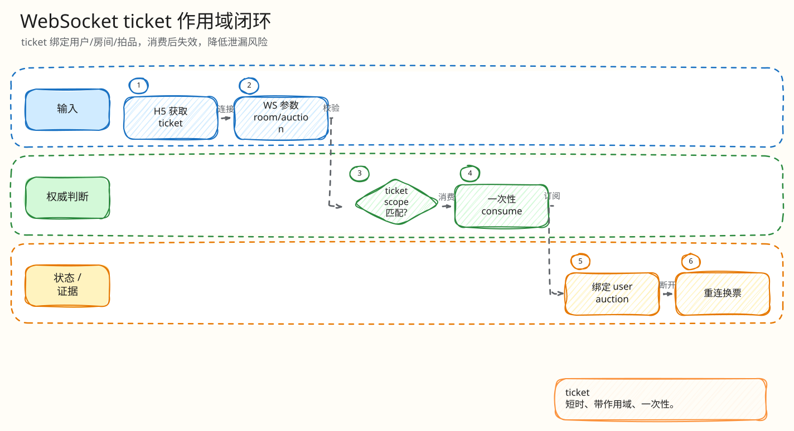

# L4：WebSocket Ticket Scope 与一次性消费闭环

父文档：[WebSocket L4 索引](00-index.md)
上层文档：[WebSocket 恢复闭环](../01-websocket-recovery-closed-loop.md)
相关文档：[H5 seq gap 快照恢复](../../05-frontend/mobile-h5/03-seq-gap-snapshot-recovery.md)、[代码地图](../../10-appendix/code-map.md)

## 闭环问题

评委会问：“用户拿到一个 WebSocket ticket 后，能不能复用、转给别人、换 room/auction 连接，或者会员资格撤销后继续看？”

当前实现的最小闭环是：

```text
POST /api/auth/ws-ticket
  -> 服务端签发 Redis ticket，TTL 60s
  -> 浏览器用 protocol/header 带 ticket 建 WS
  -> ServeWS 用 Lua GET+DEL 一次性 consume
  -> 校验 ticket.room/auction 与 query 一致
  -> 再查 room/auction 与 membership
  -> 才 accept/subscribe/recover
```

## 图 4-W-1-1：Ticket 一次性连接闭环


<!-- excalidraw-generated:start -->
<div class="excalidraw-diagram" style="overflow-x: auto; width: 100%; margin: 12px 0 18px 0; padding: 12px 12px 14px 12px; border: 1px solid #e2e8f0; border-radius: 8px; background: #fffdf7;">
  <a href="../../assets/excalidraw/04-realtime-websocket-01-ticket-scope-consume-01.excalidraw">打开可编辑 Excalidraw 源文件</a>
  <br />
  
</div>
<!-- excalidraw-generated:end -->

这张图的核心是：ticket 不是“登录态”，只是一次连接凭证；真正准入还要过 scope 与 room access。

## 代码锚点

| 能力 | 代码 |
|---|---|
| ticket 申请路由 | `backend/internal/gateway/router.go:161` `POST /api/auth/ws-ticket` |
| ticket 签发 | `backend/internal/gateway/auction_handlers.go:1427` `CreateWSTicket` |
| ticket payload | `backend/internal/realtime/ticket.go:29` `Ticket{UserID,Role,RoomID,AuctionID}` |
| TTL | `backend/internal/realtime/ticket.go:17` `TicketTTL = 60 * time.Second` |
| 一次性消费 Lua | `backend/internal/realtime/ticket.go:19` `GET` 后 `DEL` |
| WS 入口 | `backend/internal/realtime/server.go:236` `ServeWS` |
| scope 校验 | `backend/internal/realtime/server.go:269` |
| 房间/拍品校验 | `backend/internal/realtime/server.go:278` |
| 成员权限复查 | `backend/internal/realtime/server.go:285` |
| H5 请求 ticket | `frontend/mobile-h5/src/main.tsx:1623` |

## 正常路径

| 阶段 | 状态 | 结果 |
|---|---|---|
| H5 申请 ticket | Gateway 根据当前用户、room、auction 签发 | Redis 写入 `ws_ticket:{token}` |
| H5 建连 | query 带 `room_id`,`auction_id`,`last_seq`，协议或 header 带 ticket | 进入 `ServeWS` |
| consume | Lua 原子 `GET` 后 `DEL` | 同一个 token 第二次必然 missing |
| scope validate | ticket 内 room/auction 必须等于 URL | 防止拿 A 房 ticket 连 B 房 |
| access validate | 查 room/auction 与用户成员关系 | 防止撤权后继续连 |
| accept | `websocket.Accept` + `Subscribe(auctionID)` | 后续恢复和实时事件 |

## 异常路径

| 场景 | 后端行为 | 答辩重点 |
|---|---|---|
| 没带 ticket | 401 `missing ticket` | WS 不是裸连 |
| ticket 过期/复用 | 401 `invalid ticket` | Lua consume 原子删除 |
| ticket scope 与 URL 不一致 | 403 `ticket scope mismatch` | 防跨房间/跨拍品 |
| room/auction 不匹配 | 403 `forbidden room` | 防构造 URL |
| 成员关系撤销 | 403，并记录 `ws_ticket_access_revoked` | 权限不是只在签发时检查 |

## 为什么不只靠 Cookie/登录态

| 只靠登录态的问题 | 当前做法 |
|---|---|
| WebSocket 握手难以像 REST 一样逐请求做业务 scope | ticket payload 绑定 room/auction/user |
| token 被浏览器/代理重放时难发现 | 一次性 consume |
| 用户拿到 ticket 后换 query | scope validate |
| 连接前成员资格已变更 | `ValidateTicketRoomAccess` 复查 |

## 验证方式

| 验证 | 位置 |
|---|---|
| ticket issue/consume one-time | `backend/internal/realtime/ticket_test.go` |
| protocol/header 解析 | `backend/internal/realtime/ticket_test.go` |
| browser ticket auth and reuse | `backend/internal/realtime/server_integration_test.go:25` |
| forged room 拒绝 | `backend/internal/realtime/server_integration_test.go:50` |
| membership revoked 拒绝 | `backend/internal/realtime/server_integration_test.go:71` |
| ACL REST 侧防线 | `backend/internal/gateway/acl_integration_test.go` |

## 评委拷问

| 问题 | 答法 |
|---|---|
| ticket 被别人拿到了怎么办？ | ticket 只能消费一次，且 payload 绑定 user/room/auction；真正生产还应配合 HTTPS、短 TTL、Origin 校验和更强会话绑定。 |
| 为什么要 consume 后再 scope validate？ | 因为无效使用也要让 token 失效，减少反复试探窗口；当前实现是先原子取出，再做 scope/ACL。 |
| 用户被踢出房间但 ticket 还没过期？ | `ValidateTicketRoomAccess` 会在建连时复查 membership，拒绝并记录活动事件。 |
| 已经建立的连接被撤权怎么办？ | 当前闭环覆盖建连准入；生产扩展应加入在线连接踢出、membership 变更广播和定期 access recheck。 |

## 扩展方案

| 方向 | 做法 |
|---|---|
| Origin/CSRF 防护 | WebSocket accept 前校验 `Origin` 与允许域名 |
| 更强绑定 | ticket payload 加 session id、UA/device hash、IP 风险信号 |
| 主动踢人 | membership 变更时向 hub 发 revoke 控制消息，关闭对应 conn |
| 多实例一致性 | ticket 仍放 Redis；WS presence 用 Redis key + TTL 维持跨实例可见 |
