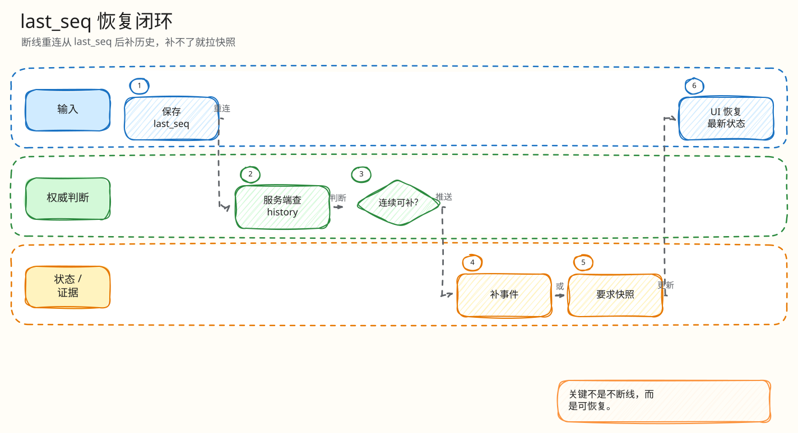

# L4：WebSocket last_seq 恢复最小闭环

父文档：[WebSocket L4 索引](00-index.md)
上层文档：[WebSocket 恢复闭环](../01-websocket-recovery-closed-loop.md)
相关文档：[H5 seq gap 快照恢复](../../05-frontend/mobile-h5/03-seq-gap-snapshot-recovery.md)、[证据映射](../../07-performance-and-evidence/00-evidence-map.md)

## 闭环问题

评委会给场景：“手机弱网断了 3 秒，重连时客户端说 last_seq=120。服务端怎么补 121 之后的事件？如果历史不连续怎么办？”

当前实现的最小闭环是：

```text
H5 reconnect with last_seq
  -> ServeWS recoveryMessages
  -> Redis events LRange tail
  -> seq 必须 last_seq+1 连续递增
  -> 连续则发 history
  -> 不连续/无历史则发 snapshot
  -> snapshot 可来自 Redis、DB rebuild、stale Redis、unavailable guard
```

## 图 4-W-2-1：last_seq 恢复分支


<!-- excalidraw-generated:start -->
<div class="excalidraw-diagram" style="overflow-x: auto; width: 100%; margin: 12px 0 18px 0; padding: 12px 12px 14px 12px; border: 1px solid #e2e8f0; border-radius: 8px; background: #fffdf7;">
  <a href="../../assets/excalidraw/04-realtime-websocket-02-last-seq-recovery-01.excalidraw">打开可编辑 Excalidraw 源文件</a>
  <br />
  
</div>
<!-- excalidraw-generated:end -->

这张图展示“补历史优先，无法证明连续就降级快照”的策略。服务端不会让客户端自行跳过 gap。

## 代码锚点

| 能力 | 代码 |
|---|---|
| 读取 `last_seq` | `backend/internal/realtime/server.go:240` |
| 进入恢复 | `backend/internal/realtime/server.go:332` |
| 恢复函数 | `backend/internal/realtime/server.go:480` `recoveryMessages` |
| Redis history | `LRange("auction:"+auctionID+":events", -RecoveryMaxEvents, -1)` |
| gap 检测 | `seq != next` 时回退 snapshot |
| Redis snapshot | `backend/internal/realtime/server.go:509` `snapshotMessage` |
| DB rebuild 限流 | `backend/internal/realtime/server.go:531` `rebuildSnapshotBounded` |
| DB snapshot 内容 | `backend/internal/realtime/server.go:541` `rebuildSnapshotFromDB` |
| stale snapshot | `backend/internal/realtime/server.go:584` |
| H5 gap 处理 | `frontend/mobile-h5/src/main.tsx:1307` 左右 `handleRealtimeEvent` |

## 正常路径

| 步骤 | 行为 | 输出 |
|---|---|---|
| 客户端重连 | 带 `last_seq` | 服务端知道客户端最后已处理序号 |
| 服务端读 Redis events tail | 只取最近 `RecoveryMaxEvents` | 控制恢复成本 |
| 连续性检查 | 从 `last_seq + 1` 开始逐个验证 | 不连续则不发半截历史 |
| 发 history | 把缺失事件按顺序写回 WS | H5 按 seq 合并 |
| 记录观测 | `auction_ws_recover_total`、`auction_snapshot_source_total` | SRE 可看恢复来源 |

## 快照降级路径

| 来源 | 触发 | 用户语义 |
|---|---|---|
| Redis snapshot | `auction:{id}:snapshot` 存在且合法 | 快速恢复 |
| DB snapshot | Redis snapshot 缺失，且 rebuild semaphore 可用 | 从 PG 真相重建 |
| Redis stale | DB rebuild 饱和/失败，但 Redis 有旧快照 | 前端显示状态较旧继续刷新 |
| snapshot_unavailable | 无可用快照 | 前端保守处理，不能危险操作 |

## 为什么 gap 不直接跳过

如果客户端 last_seq=120，Redis tail 里只有 122、123，服务端不能只发 122、123。因为 121 可能是 `auction_sold`、`auction_cancelled`、`price_accepted` 等关键事件。跳过会让前端显示不一致。当前代码遇到 `seq != next` 直接走 snapshot。

## 验证方式

| 验证 | 位置 |
|---|---|
| 首连返回 snapshot | `backend/internal/realtime/server_integration_test.go` |
| history gap fallback snapshot | `backend/internal/realtime/server_integration_test.go` |
| snapshot rebuild 饱和 | `backend/internal/realtime/server_integration_test.go` |
| stale/snapshot_unavailable 分类 | `backend/internal/realtime/server_integration_test.go` |
| S5 reconnect | `tests/pts/MANIFEST.md`、`tests/load/s5-reconnect-recovery.js`、`tests/pts/run-s5-reconnect.sh` |
| H5 gap 触发 snapshot | `frontend/mobile-h5/src/main.tsx` `handleRealtimeEvent` |

## 评委拷问

| 问题 | 答法 |
|---|---|
| 客户端伪造很大的 `last_seq` 怎么办？ | 服务端只把它当恢复游标；补不了连续 history 就发 snapshot。客户端不能用 last_seq 改价格/赢家。 |
| Redis events 超出窗口怎么办？ | 超出 `RecoveryMaxEvents` 后无法证明连续，就走 snapshot。这是成本和恢复能力的取舍。 |
| DB rebuild 会不会被重连风暴打爆？ | `snapshotGroup` 做同 auction singleflight，`snapshotSemaphore` 限全局并发；饱和时返回 stale 或 unavailable。 |
| snapshot stale 会不会误导用户？ | H5 对 stale/recovering 禁用危险操作，并继续刷新；最终仍以服务端 seq/快照收敛。 |

## 扩展方案

| 方向 | 做法 |
|---|---|
| 更长历史 | 把 event history 从 Redis list 扩为分段日志或 Kafka compact projection |
| 多区域恢复 | snapshot 带 `stream_epoch`，跨区域切换时强制快照校准 |
| 用户级恢复 | 按 user 补私有事件，公共 history 与私有 order/payment 分开 |
| 恢复 SLO | 基于 `auction_ws_recover_total{result}` 和 S5 TTCS 建报警阈值 |
