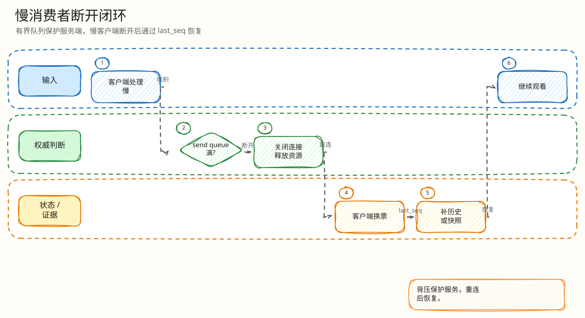

# L4：慢消费者断开与广播背压最小闭环

父文档：[WebSocket L4 索引](00-index.md)
上层文档：[WebSocket 恢复闭环](../01-websocket-recovery-closed-loop.md)
相关文档：[观测与运维](../../06-observability/00-ops-observability.md)、[H5 seq gap 快照恢复](../../05-frontend/mobile-h5/03-seq-gap-snapshot-recovery.md)

## 闭环问题

评委会问：“一个弱网用户或恶意客户端不读 WebSocket，会不会让整个房间广播阻塞？”

当前实现的最小闭环是：

```text
Hub Publish
  -> 对每个 subscriber 非阻塞入队
  -> 队列消息数/字节数超过上限即 closeSlow
  -> ServeWS 收到 slow 信号或写超时
  -> 以 policy violation 关闭该连接
  -> 记录 metrics/user_activity
  -> 客户端重连后走 last_seq/snapshot 恢复
```

## 图 4-W-3-1：慢消费者隔离闭环


<!-- excalidraw-generated:start -->
<div class="excalidraw-diagram" style="overflow-x: auto; width: 100%; margin: 12px 0 18px 0; padding: 12px 12px 14px 12px; border: 1px solid #e2e8f0; border-radius: 8px; background: #fffdf7;">
  <a href="../../assets/excalidraw/04-realtime-websocket-03-slow-consumer-disconnect-01.excalidraw">打开可编辑 Excalidraw 源文件</a>
  <br />
  
</div>
<!-- excalidraw-generated:end -->

这张图强调隔离对象是“慢连接”，不是整个 auction hub。快连接继续收消息。

## 代码锚点

| 能力 | 代码 |
|---|---|
| subscriber 有界队列 | `backend/internal/realtime/hub.go:76` `make(chan queuedMessage, h.queueMessages)` |
| Publish 复制 payload | `backend/internal/realtime/hub.go:100` |
| 字节上限 | `backend/internal/realtime/hub.go:165` |
| 非阻塞发送 | `backend/internal/realtime/hub.go:175` `select case/default` |
| closeSlow | `backend/internal/realtime/hub.go:191` |
| ServeWS slow channel | `backend/internal/realtime/server.go:314` |
| recovery first write 10s | `backend/internal/realtime/server.go:328` |
| live write 5s | `backend/internal/realtime/server.go:370` |
| policy violation close | `backend/internal/realtime/server.go:397` |
| slow metrics | `auction_ws_slow_consumer_disconnect_total` |
| fanout metrics | `backend/internal/realtime/leaderboard.go:208` |

## 正常路径

| 阶段 | 行为 |
|---|---|
| publish | Hub 拿到当前 auction 的 subscriber 列表 |
| enqueue | 每个 subscriber 拷贝 payload 后非阻塞入队 |
| write | `ServeWS` 从队列取消息，5s 内写到连接 |
| ack | 写完调用 `sub.Ack` 释放 queued bytes |
| observe | 记录 payload bytes、queue depth、connection gauge |

## 慢消费者路径

| 场景 | 触发 | 结果 |
|---|---|---|
| 队列消息数满 | channel default 分支 | `Reason=pending_messages`，关闭该 sub |
| 队列字节数超限 | `queuedBytes + size > maxBytes` | `Reason=pending_bytes`，关闭该 sub |
| recovery 首包写不出去 | 10s timeout | policy violation |
| live 消息写不出去 | 5s timeout | policy violation |
| hub 主动 close slow | slow channel 通知 `ServeWS` | 记录 reason/depth/bytes |

## 为什么服务端必须自己做背压

浏览器传统 `WebSocket` API 不提供应用层自动背压；如果服务端无限缓存，慢客户端会把内存拖垮。项目选择“有界队列 + 超限断开 + 可恢复重连”，把成本限制在单连接级别。`WebSocketStream` 能借 Streams API 处理背压，但浏览器兼容和工程成熟度不适合作为当前实现基础。

## 验证方式

| 验证 | 位置 |
|---|---|
| Hub 队列/字节逻辑 | `backend/internal/realtime/hub.go` 单元覆盖可继续补强 |
| P3 slow consumer pressure | `tests/load/p3-slow-consumer-pressure.js` |
| 慢消费者 metrics | `auction_ws_slow_consumer_disconnect_total` |
| Grafana 面板 | `infra/grafana/dashboards/live-auction-overview.json` |
| Prometheus 告警 | `infra/prometheus/rules/live-auction-alerts.yml` |
| S5 恢复 | `tests/load/s5-reconnect-recovery.js` |

## 评委拷问

| 问题 | 答法 |
|---|---|
| 断开慢用户会不会让他错过成交？ | 会丢实时连接，但重连后走 `last_seq`/snapshot；成交真相在服务端，不在客户端本地缓存。 |
| 为什么不无限扩大队列？ | 队列越大越容易把单个弱网用户的成本扩散成服务端内存风险；直播房间需要隔离慢消费者。 |
| publish 循环会不会被一个 sub 卡住？ | `trySend` 是非阻塞 channel send，满了直接返回 slow，不等待该用户读。 |
| 断开是否可观测？ | 有 `auction_ws_slow_consumer_disconnect_total`、queue depth/bytes、user activity，可用于 SRE 复盘。 |

## 扩展方案

| 方向 | 做法 |
|---|---|
| 分层消息 | 价格/成交走高优先级队列，氛围/榜单 delta 可合并或丢弃 |
| 写聚合 | 对 leaderboard_delta 做 server-side coalescing，减少 burst |
| 客户端自适应 | H5 检测弱网后降低非关键动画和非核心订阅 |
| 多实例广播 | Hub 替换为 Redis/Kafka/NATS fanout，慢消费者策略仍保留在边缘 WS 实例 |
