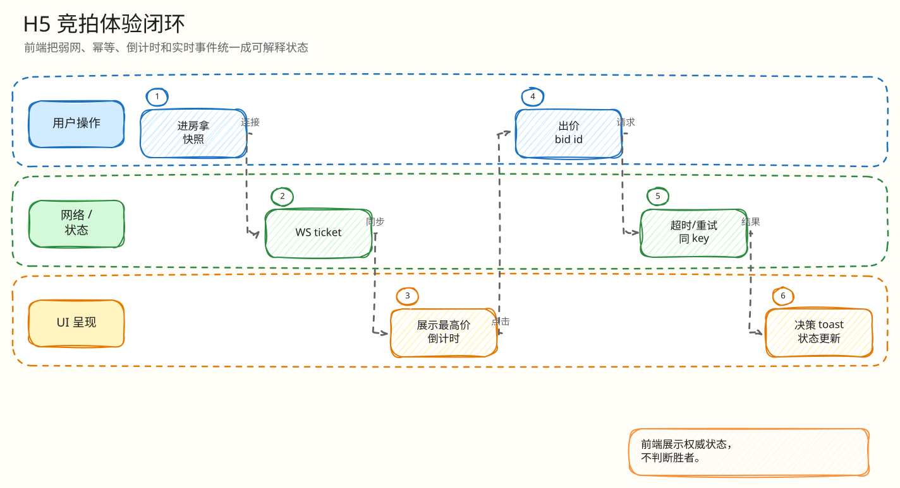

# 前端闭环：Mobile H5 竞拍体验

父文档：[产品范围](../00-project/01-product-scope.md)
子文档：[Mobile H5 弱网与状态 L4 索引](mobile-h5/00-index.md)
相关文档：[WebSocket 恢复](../04-realtime/01-websocket-recovery-closed-loop.md)、[热出价闭环](../03-backend/01-bid-decision-closed-loop.md)

## H5 的核心原则

1. 客户端不决定成功、失败、赢家、终态。
2. 倒计时只是显示，落槌/结束来自服务端事件或快照。
3. 断连、恢复中、快照 stale 时禁用危险操作。
4. 出价请求有超时，超时后进入不确定态并允许幂等重试。

## 单次出价 UI 闭环


<!-- excalidraw-generated:start -->
<div class="excalidraw-diagram" style="overflow-x: auto; width: 100%; margin: 12px 0 18px 0; padding: 12px 12px 14px 12px; border: 1px solid #e2e8f0; border-radius: 8px; background: #fffdf7;">
  <a href="../assets/excalidraw/05-frontend-01-mobile-h5-closed-loop-01.excalidraw">打开可编辑 Excalidraw 源文件</a>
  <br />
  
</div>
<!-- excalidraw-generated:end -->

## 当前代码中的关键实现

| 能力 | 代码 |
|---|---|
| 出价 8s 超时 | `frontend/mobile-h5/src/main.tsx` 的 `fetchWithTimeout` |
| 幂等重试 | `pendingBidRef` 复用 `clientBidID` |
| 服务器时间倒计时 | `deriveCountdown(endAt, serverTimeMS, nowMS, serverTimeSyncedAt, ...)` |
| 危险操作禁用 | `isDangerousActionDisabled` |
| WS 连接 | `new WebSocket(..., ['auction.v1', 'ticket.xxx'])` |
| 快照恢复 | `recoverFromSnapshot` |
| 排行榜合帧 | `pendingLeaderboardDeltaRef` + RAF burst |
| 氛围引擎 | `atmosphere.ts`, `loadAuctionSoundPack`, `playLayeredCue`, `vibratePattern` |

## 倒计时为什么不信客户端时钟

`deriveCountdown` 的公式：

```text
remaining = end_at_ms - server_time_ms - (local_now_ms - server_time_synced_at)
```

它只使用“上次同步后的本地经过时间”，不把客户端绝对时间当真。手机时钟跳变不会让客户端自行宣布结束。

## 已修复的历史问题

6 月 10 日评审指出 H5 出价请求没有超时，弱网可能永久“确认中”。当前代码已加入：

- `BID_REQUEST_TIMEOUT_MS = 8000`;
- `AbortController`;
- 注释明确说明超时会进入 existing catch -> uncertain 分支；
- 同 `client_bid_id` 重试由引擎幂等兜底。

答辩时可以把它讲成工程演进：评审发现真实体验漏洞，后续用幂等能力补上弱网闭环。

## 评委拷问

| 问题 | 回答 |
|---|---|
| 两个客户端会看到不同排名吗？ | 到达时间可能不同，但最终状态由同一服务端 seq/快照收敛；seq gap 会恢复。 |
| 客户端倒计时到 0 能否自行宣布成交？ | 不行。倒计时到 0 进入 settling/syncing，终态必须由服务端事件或快照给出。 |
| 网络超时后用户重复点会不会重复扣款？ | H5 复用同 `client_bid_id`，服务端 request hash 幂等，安全重试。 |

## 继续下钻到 L4

| 追问 | L4 文档 |
|---|---|
| 请求发出但响应丢了 | [出价超时、不确定态与幂等重试](mobile-h5/01-bid-timeout-uncertain-retry.md) |
| 手机时间不准/倒计时边界 | [服务端时间锚定倒计时](mobile-h5/02-countdown-server-time-anchor.md) |
| WS 事件跳号/乱序 | [seq gap 与快照恢复](mobile-h5/03-seq-gap-snapshot-recovery.md) |
