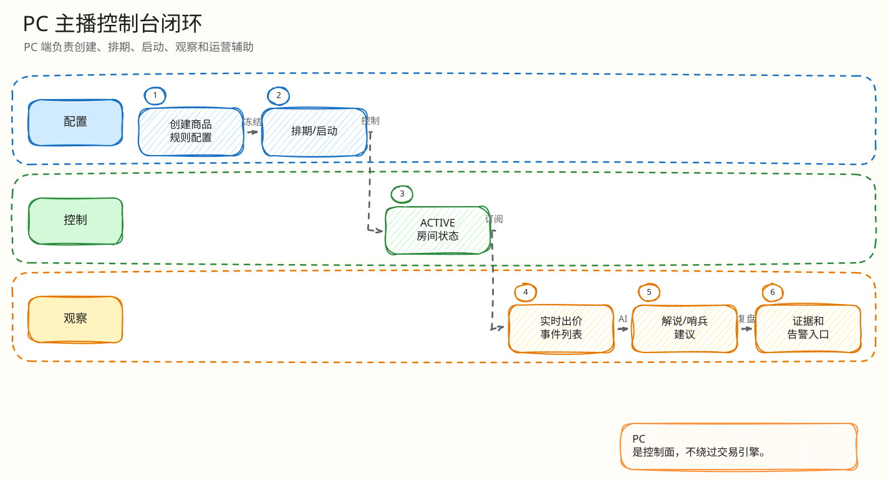
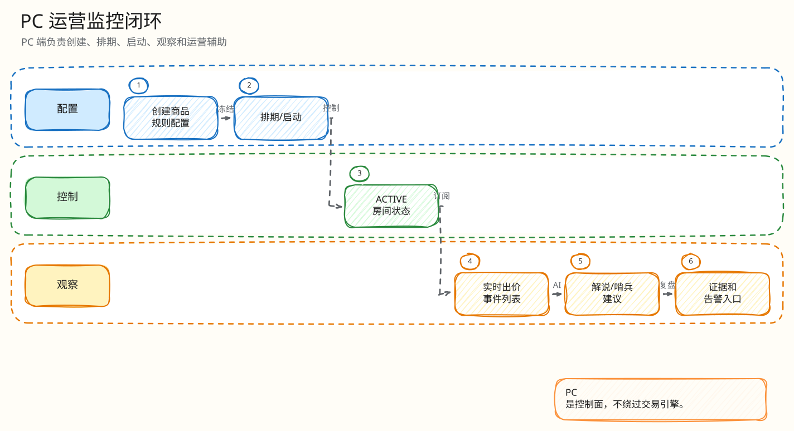

# 前端闭环：PC 主播控制台

父文档：[产品范围](../00-project/01-product-scope.md)
相关文档：[AI 与运营](../03-backend/04-ai-ops-closed-loop.md)、[监控运维](../06-observability/00-ops-observability.md)

## PC 控制台职责

PC 端不是营销页，而是主播/商家的作业台：

- 商品上传与 AI 选品草稿；
- 拍品创建、规则配置、排期、启动、取消；
- 活跃拍品队列、订单和支付状态；
- AI 解说、热度摘要、哨兵告警、复盘；
- 飞行记录器和监控面板。

## 图 5-2-1：主播工作台闭环

<!-- excalidraw-generated:start -->

  <a href="../assets/excalidraw/05-frontend-02-pc-console-closed-loop-01.excalidraw">打开可编辑 Excalidraw 源文件</a>
   
  

<!-- excalidraw-generated:end -->

这张图展示 PC 端不是“后台 CRUD”，而是从上架、排期、启动、监控、AI 辅助到诊断复盘的主播作业闭环。交易权威仍在后端，PC 端只发起操作和展示后端结果。

## API 闭环

| 工作流 | 路由 |
|---|---|
| 商品上传 | `/api/items/upload-url`, `/api/items/upload`, `/api/items` |
| 拍品配置 | `/api/auctions`, `/api/auctions/{id}/rules`, `/schedule`, `/start`, `/cancel` |
| AI 选品 | `/api/host/ai/listing-drafts`, `/apply` |
| AI 解说 | `/api/host/auctions/{id}/commentary` |
| 风险与复盘 | `/sentinel-alerts`, `/sentinel-evaluate`, `/recap` |
| 监控 | `/api/monitor/auctions`, `/flight-recorder`, `/outbox`, `/scheduler`, `/redis-engine` |

## 图 5-2-2：PC 到后端的数据流

<!-- excalidraw-generated:start -->

  <a href="../assets/excalidraw/05-frontend-02-pc-console-closed-loop-02.excalidraw">打开可编辑 Excalidraw 源文件</a>
   
  

<!-- excalidraw-generated:end -->

## 评委拷问

| 问题 | 回答 |
|---|---|
| 主播改规则会不会影响正在竞拍用户？ | 排期/启动后规则冻结，热路径使用服务端规则；PC 端错误会展示后端权威拒绝。 |
| 诊断面板是不是静态假数据？ | 监控路由来自 `MonitorHandler` 查询 PG/Redis/outbox/scheduler，不是纯前端 mock。 |
| AI 选品会不会直接发布假信息？ | listing draft 要 host apply，且 `human_review_required/no_auto_publish` 写入 safety。 |
