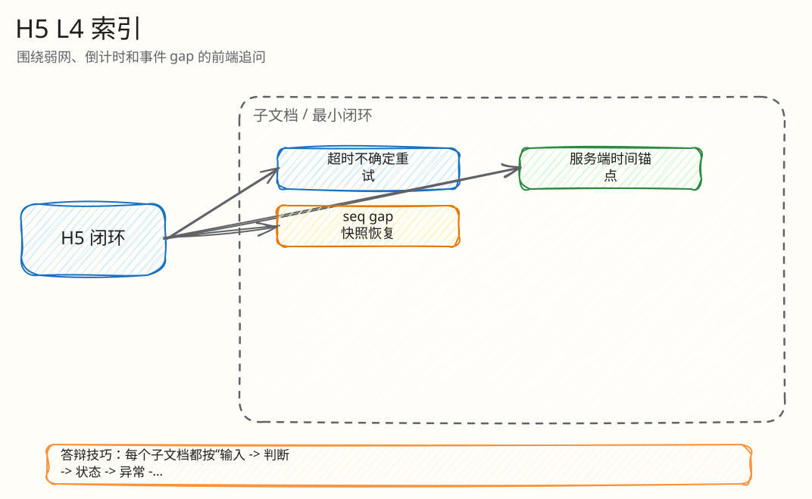

# L4：Mobile H5 弱网与状态最小闭环索引

父文档：[H5 竞拍闭环](../01-mobile-h5-closed-loop.md)
相关文档：[出价热路径 L4](../../03-backend/auction-bid/00-index.md)、[WebSocket L4](../../04-realtime/websocket/00-index.md)

本目录把 H5 端最容易被追问的体验和状态逻辑拆成三个最小闭环。

## 图 5-H-0-1：H5 L4 文档树

<!-- excalidraw-generated:start -->

  <a href="../../assets/excalidraw/05-frontend-mobile-h5-00-index-01.excalidraw">打开可编辑 Excalidraw 源文件</a>
   
  

<!-- excalidraw-generated:end -->

## 阅读顺序

| 顺序 | 文档 | 答辩时解决的问题 |
|---|---|---|
| 1 | [出价超时不确定态闭环](01-bid-timeout-uncertain-retry.md) | 请求发出但响应丢了，用户重试是否安全 |
| 2 | [服务端时间倒计时闭环](02-countdown-server-time-anchor.md) | 手机时间不准会不会提前落槌 |
| 3 | [seq gap 快照恢复闭环](03-seq-gap-snapshot-recovery.md) | WS 事件断档后 UI 怎么恢复 |
