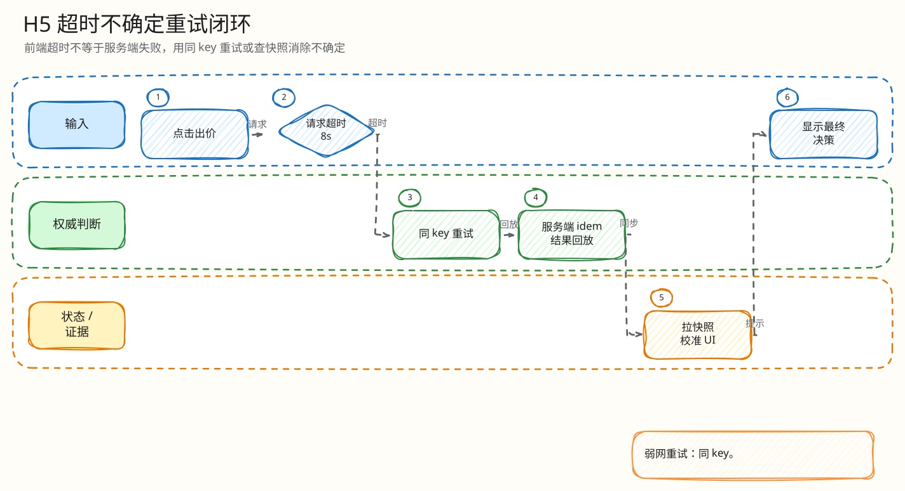

# L4：H5 出价超时、不确定态与幂等重试闭环

父文档：[Mobile H5 L4 索引](00-index.md)
上层文档：[H5 竞拍闭环](../01-mobile-h5-closed-loop.md)
相关文档：[出价幂等键闭环](../../03-backend/auction-bid/01-idempotency-key-closed-loop.md)、[Kafka ACK 持久性闭环](../../03-backend/auction-bid/05-kafka-ack-durability-closed-loop.md)

## 闭环问题

评委会问：“用户点了出价，请求已经发出去，但弱网导致响应丢了。前端一直卡住怎么办？重试会不会重复出价？”

当前实现的最小闭环是：

```text
点击出价
  -> 生成 pendingBidRef(client_bid_id, amount, client_seen_seq)
  -> fetchWithTimeout 8s
  -> 响应成功则清 pending 或进入确认态
  -> 超时/网络异常进入 uncertain
  -> 用户重试复用同 client_bid_id
  -> 服务端 request_hash 幂等回放/拒绝
```

## 图 5-H-1-1：出价不确定态闭环


<!-- excalidraw-generated:start -->
<div class="excalidraw-diagram" style="overflow-x: auto; width: 100%; margin: 12px 0 18px 0; padding: 12px 12px 14px 12px; border: 1px solid #e2e8f0; border-radius: 8px; background: #fffdf7;">
  <a href="../../assets/excalidraw/05-frontend-mobile-h5-01-bid-timeout-uncertain-retry-01.excalidraw">打开可编辑 Excalidraw 源文件</a>
  <br />
  
</div>
<!-- excalidraw-generated:end -->

这张图说明“超时不是失败”，而是不知道服务端是否已处理，因此只能用同一幂等请求确认结果。

## 代码锚点

| 能力 | 代码 |
|---|---|
| 8s 超时常量 | `frontend/mobile-h5/src/main.tsx:55` `BID_REQUEST_TIMEOUT_MS = 8000` |
| AbortController | `frontend/mobile-h5/src/main.tsx:57` `fetchWithTimeout` |
| pending 请求对象 | `frontend/mobile-h5/src/main.tsx:150` `pendingBidRef` |
| 允许重试条件 | `frontend/mobile-h5/src/main.tsx:1701` |
| 生成/复用 clientBidID | `frontend/mobile-h5/src/main.tsx:1711` |
| POST `/bids` | `frontend/mobile-h5/src/main.tsx:1724` |
| `Idempotency-Key` header | `frontend/mobile-h5/src/main.tsx:1728` |
| body `client_bid_id` | `frontend/mobile-h5/src/main.tsx:1731` |
| catch -> uncertain | `frontend/mobile-h5/src/main.tsx:1776` |
| 服务端 idem | `backend/internal/redisengine/engine.go` `placeBidWithSource` + `ledgerRunner` |

## 状态机

| 前端状态 | 进入条件 | 是否保留 pendingBidRef | 下一步 |
|---|---|---:|---|
| `pending` | 点击后请求发出 | 是 | 等响应或超时 |
| `confirm_required` | 服务端返回误触确认 token | 否，改由 confirm token/key 管理 | 用户二次确认 |
| `rejected` | 明确业务拒绝 | 通常否；`PROCESSING_RETRY_LATER` 保留 | 修正价格或稍后重试 |
| `uncertain` | catch/timeout | 是 | 同 key 重试 |
| accepted/sold | 明确接受/成交 | 否 | 应用服务端结果，等 WS/快照收敛 |

## 为什么 catch 不直接清空 pending

如果请求已经到达服务端并被 Redis Lua 接受，只是响应丢失，清空 pending 后重新生成 `client_bid_id` 会变成第二次独立出价。保留 pending 并复用 key，才能让服务端返回同一决策或拒绝同 key 改请求。

## 与服务端的配合

| H5 行为 | 服务端防线 |
|---|---|
| header/body 使用同一 `client_bid_id` | Go 入口要求 `Idempotency-Key == client_bid_id` |
| 超时后同 key 重试 | Redis `idem_key` 回放相同 `request_hash` |
| 用户改金额但复用 key | Lua 返回 `IDEMPOTENCY_KEY_REUSED_WITH_DIFFERENT_REQUEST` |
| Kafka ACK 未及时返回 | 响应可为 `ENGINE_DURABLE`，后续 settlement/WS 收敛 |

## 验证方式

| 验证 | 位置 |
|---|---|
| H5 timeout 代码 | `frontend/mobile-h5/src/main.tsx` |
| 幂等重试后端测试 | `backend/internal/redisengine/*_test.go` |
| 风险模拟：弱网/重复点击 | `tests/risk/run-p4-risk-simulator.mjs` |
| E2E H5 出价流程 | `tests/e2e/mobile-h5-live.spec.ts` |
| S1/S5 证据 | `tests/pts/MANIFEST.md` |

## 评委拷问

| 问题 | 答法 |
|---|---|
| 为什么设置 8 秒，不是 1 秒？ | 8 秒是体验兜底，不是性能目标；正常请求应远低于它，弱网下给服务端/网络一次完成机会。生产会按移动网络分位数和重试成本调参。 |
| 超时后按钮还能点，会不会双出价？ | 只有 `uncertain/engine_pending/PROCESSING_RETRY_LATER` 允许复用 pending；服务端同 key 幂等，不能变成独立第二单。 |
| 用户刷新页面 pending 丢了怎么办？ | 当前闭环覆盖单页面会话；生产扩展可把 pending key 短期写入 sessionStorage，并用 `/my-bids` 或 snapshot 校准。 |
| AbortController abort 了请求，服务端一定没处理吗？ | 不一定。abort 只是前端停止等待，所以 UI 必须进入 uncertain，而不是当成失败。 |

## 扩展方案

| 方向 | 做法 |
|---|---|
| 页面刷新恢复 | sessionStorage 保存 pending bid，带过期时间和 auctionID |
| 更细 UI | 区分 `network_timeout`、`processing_retry_later`、`kafka_pending` |
| 离线队列 | 只允许查询/确认，不做离线出价排队，避免过期价格提交 |
| 可观测 | 上报 timeout/uncertain/retry 事件，和服务端 idempotency replay 关联 |
