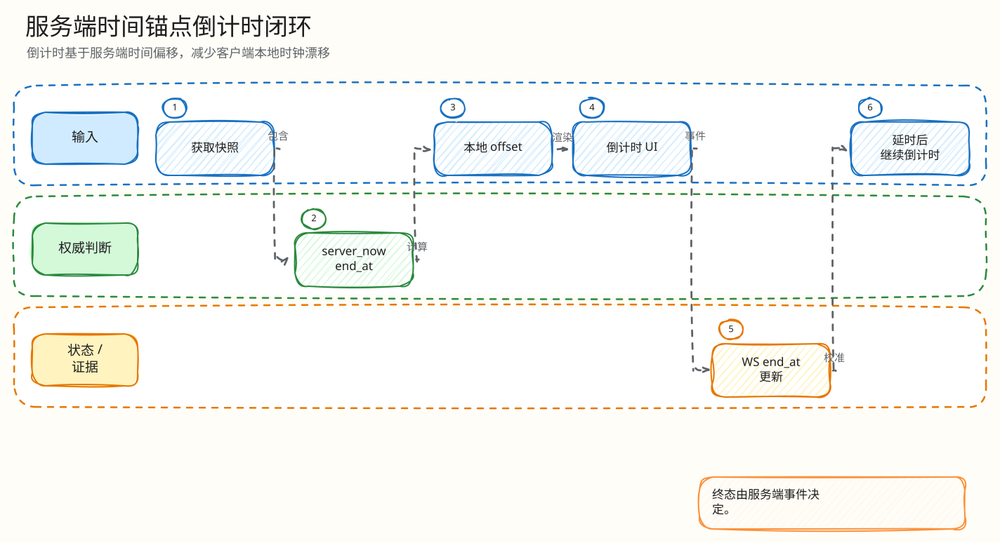

# L4：H5 服务端时间锚定倒计时闭环

父文档：[Mobile H5 L4 索引](00-index.md)
上层文档：[H5 竞拍闭环](../01-mobile-h5-closed-loop.md)
相关文档：[领域模型](../../02-domain/00-domain-model-and-rules.md)、[风险矩阵](../../08-tests-and-risk/00-risk-and-abuse-matrix.md)

## 闭环问题

评委会问：“用户手机时间不准、手动改时间、页面后台恢复后本地时钟跳变，会不会导致客户端提前宣布成交或还能继续出价？”

当前实现的最小闭环是：

```text
服务端事件/快照携带 server_time_ms + end_at
  -> H5 记录同步时刻 serverTimeSyncedAt
  -> 倒计时 = end_at - server_time_ms - 本地经过时间
  -> 到 0 只进入 settling/syncing
  -> 终态必须来自服务端 event/snapshot
  -> 最后 1.2s bid close guard 禁用新出价并拉快照
```

## 图 5-H-2-1：服务端时间锚定


<!-- excalidraw-generated:start -->
<div class="excalidraw-diagram" style="overflow-x: auto; width: 100%; margin: 12px 0 18px 0; padding: 12px 12px 14px 12px; border: 1px solid #e2e8f0; border-radius: 8px; background: #fffdf7;">
  <a href="../../assets/excalidraw/05-frontend-mobile-h5-02-countdown-server-time-anchor-01.excalidraw">打开可编辑 Excalidraw 源文件</a>
  <br />
  
</div>
<!-- excalidraw-generated:end -->

这张图的关键是：本地时间只用作“同步后的经过时间”，不是权威时间。

## 代码锚点

| 能力 | 代码 |
|---|---|
| 倒计时函数 | `frontend/mobile-h5/src/domain.ts:431` `deriveCountdown` |
| remaining 计算 | `frontend/mobile-h5/src/domain.ts:446` `remainingCountdownMS` |
| 阶段派生 | `frontend/mobile-h5/src/domain.ts:454` `deriveCountdownPhase` |
| 最后一跳保护 | `frontend/mobile-h5/src/domain.ts:420` `BID_CLOSE_GUARD_MS = 1_200` |
| 是否到期 | `frontend/mobile-h5/src/domain.ts:501` `isCountdownExpired` |
| guard 判断 | `frontend/mobile-h5/src/domain.ts:506` `isBidCloseGuardActive` |
| 过期拉快照 | `frontend/mobile-h5/src/main.tsx:1298` 附近 `useEffect(countdownExpired)` |
| 出价前 guard | `frontend/mobile-h5/src/main.tsx:1703` 附近 |
| 服务端 end_at/seq | `backend/internal/redisengine/engine.go` Lua 决策写入 |

## 公式拆解

| 字段 | 来源 | 可信度 |
|---|---|---|
| `end_at` | 服务端快照/事件 | 权威 |
| `server_time_ms` | 服务端快照/事件或响应 header | 权威锚点 |
| `serverTimeSyncedAt` | 收到服务端时间时的本地 `Date.now()` | 只表示本地经过时间起点 |
| `nowMS` | 当前本地时间 | 只用于经过时间，不作为服务器 epoch |

公式：

```text
remaining = end_at_ms - server_time_ms - max(0, nowMS - serverTimeSyncedAt)
```

## UI 阶段

| 阶段 | 条件 | UI 语义 |
|---|---|---|
| `normal` | 剩余较多 | 正常展示 |
| `hot` | <= 15s | 提醒接近尾声 |
| `critical` | <= 10s | 最后窗口 |
| `hammer` | <= 6s | 三次落槌节奏展示 |
| `syncing` | remaining <= 0 | 正在确认结果，不自行成交 |
| `stale` | 无服务端时间/恢复中 | 倒计时不可信，危险操作禁用 |
| `terminal` | 服务端终态 | 已结束 |

## 为什么倒计时到 0 不能本地 SOLD

直播竞拍存在延时规则、Kafka/PG 异步结算、Redis 恢复、服务端保护窗口。客户端如果本地宣布 SOLD，会在最后一秒出价、服务端延时、网络乱序时显示错误赢家。当前实现只把倒计时到 0 视为“需要同步”，通过 `recoverFromSnapshot` 等服务端结果。

## 验证方式

| 验证 | 位置 |
|---|---|
| 倒计时工具函数 | `frontend/mobile-h5/src/domain.ts` |
| H5 E2E | `tests/e2e/mobile-h5-live.spec.ts` |
| 视觉状态矩阵 | `tests/e2e/visual-regression.spec.ts` |
| 最后一秒规则门禁 | `tests/pts/MANIFEST.md` S1 |
| 风险矩阵 | `tests/risk/run-p4-risk-simulator.mjs` |

## 评委拷问

| 问题 | 答法 |
|---|---|
| 用户把手机时间改到明天会怎样？ | 绝对本地时间不作为权威；只使用同步后经过时间。终态仍等服务端。 |
| 页面后台挂起 30 秒回来呢？ | remaining 可能变成 <=0，但 UI 进入 syncing 并拉 snapshot，不自行落槌。 |
| 为什么最后 1.2 秒禁用出价？ | 这是前端保护，避免在服务端落槌边界提交明显危险操作；真正规则仍在 Redis Lua 判断。 |
| 如果服务端时间缺失？ | `deriveCountdown` 返回“等待服务端时间/剩余时间确认中”，危险操作按 stale/recovering 禁用。 |

## 扩展方案

| 方向 | 做法 |
|---|---|
| 单调时钟 | 浏览器可用时用 `performance.now()` 记录 elapsed，减少系统时间跳变影响 |
| NTP 偏差展示 | 记录 server-client offset，用于诊断弱网/设备异常 |
| 多端一致性 | WS event 每次携带 server_time_ms，客户端持续校准 |
| 自动化测试 | 增加 fake timer 覆盖 clock skew、background resume、close guard |
