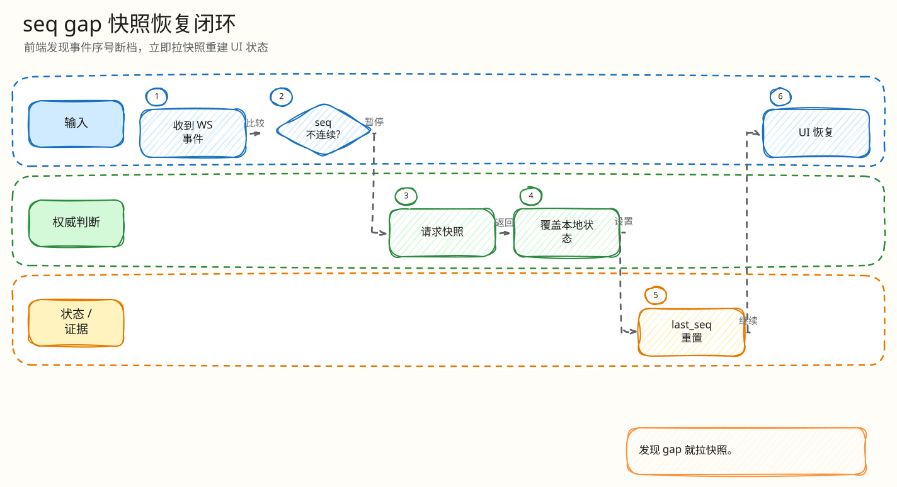

# L4：H5 seq gap 与快照恢复最小闭环

父文档：[Mobile H5 L4 索引](00-index.md)
上层文档：[H5 竞拍闭环](../01-mobile-h5-closed-loop.md)
相关文档：[WebSocket last_seq 恢复](../../04-realtime/websocket/02-last-seq-recovery.md)、[慢消费者断开](../../04-realtime/websocket/03-slow-consumer-disconnect.md)

## 闭环问题

评委会问：“WS 事件乱序、丢包、客户端断线重连、慢消费者被断开后，H5 怎么避免显示一个缺了中间事件的错误状态？”

当前实现的最小闭环是：

```text
H5 维护 lastSeq
  -> 收到 event
  -> 如果 event.seq <= lastSeq 丢弃
  -> 如果 event.seq > lastSeq + 1 或 outbox_gap_notice
       -> recoverFromSnapshot
       -> snapshot stale 则继续刷新并禁用危险操作
  -> 连续事件才合并到 UI
```

## 图 5-H-3-1：H5 seq gap 恢复闭环


<!-- excalidraw-generated:start -->
<div class="excalidraw-diagram" style="overflow-x: auto; width: 100%; margin: 12px 0 18px 0; padding: 12px 12px 14px 12px; border: 1px solid #e2e8f0; border-radius: 8px; background: #fffdf7;">
  <a href="../../assets/excalidraw/05-frontend-mobile-h5-03-seq-gap-snapshot-recovery-01.excalidraw">打开可编辑 Excalidraw 源文件</a>
  <br />
  
</div>
<!-- excalidraw-generated:end -->

这张图说明前端只接受“连续 seq 或新快照”，不接受缺口后的局部事件。

## 代码锚点

| 能力 | 代码 |
|---|---|
| 快照恢复函数 | `frontend/mobile-h5/src/main.tsx:1277` `recoverFromSnapshot` |
| recovery in-flight 防重 | `recoveryInFlightRef` |
| stale 处理 | `frontend/mobile-h5/src/main.tsx:1288` |
| applySnapshot | `frontend/mobile-h5/src/main.tsx` `applySnapshot` |
| 事件入口 | `frontend/mobile-h5/src/main.tsx:1303` `handleRealtimeEvent` |
| `outbox_gap_notice` | `frontend/mobile-h5/src/main.tsx:1311` |
| seq gap 检测 | `detail.seq > currentSeq + 1` |
| old seq 丢弃 | `detail.seq <= currentSeq` |
| 危险操作禁用 | `frontend/mobile-h5/src/domain.ts:1048` `isDangerousActionDisabled` |
| 服务端恢复 | `backend/internal/realtime/server.go:480` `recoveryMessages` |

## 正常连续事件路径

| 条件 | 行为 |
|---|---|
| auction_id 匹配 | 进入处理 |
| `detail.seq == lastSeq + 1` | 合并价格、最小下一口价、end_at、leader、server_time |
| 发生延时 | 展示延时 notice/atmosphere |
| SOLD/ENDED/CANCELLED | 切换终态场景 |
| 更新 `lastSeq` | 后续事件以此为基准 |

## gap/stale 路径

| 场景 | 行为 |
|---|---|
| 服务端发 `outbox_gap_notice` | 立即 `recoverFromSnapshot` |
| 客户端发现 seq 跳号 | 不合并该事件，拉快照 |
| snapshot stale | 提示“状态较旧，正在继续刷新” |
| fetch 失败 | 保持 recovering/uncertain，继续确认 |
| 倒计时到 0 | 拉快照确认终态 |
| connection recovering/disconnected | `isDangerousActionDisabled` 禁用危险操作 |

## 为什么不直接套用 gap 后的新事件

假设 lastSeq=10，收到 seq=12 的 `bid_accepted`。缺失的 seq=11 可能是 `auction_cancelled`、`auction_sold`、`redis_engine_paused` 或另一条影响 end_at 的事件。直接应用 seq=12 会让 UI 建立在错误前提上。因此当前代码遇到 gap 先快照恢复。

## 与 WebSocket 服务端的配合

| 前端动作 | 服务端能力 |
|---|---|
| 重连携带 `last_seq` | `ServeWS` 用 `recoveryMessages` 补 history |
| history 不连续 | 服务端发 snapshot |
| snapshot 重建压力大 | 服务端限流，返回 stale/unavailable |
| 慢消费者断开 | H5 重连后走同一恢复路径 |

## 验证方式

| 验证 | 位置 |
|---|---|
| H5 live E2E | `tests/e2e/mobile-h5-live.spec.ts` |
| visual recovery 状态 | `tests/e2e/visual-regression.spec.ts` |
| S5 reconnect | `tests/load/s5-reconnect-recovery.js` |
| 服务端 recovery tests | `backend/internal/realtime/server_integration_test.go` |
| slow consumer 压测 | `tests/load/p3-slow-consumer-pressure.js` |

## 评委拷问

| 问题 | 答法 |
|---|---|
| 如果收到旧事件会不会价格回退？ | 不会，`seq <= currentSeq` 直接忽略。 |
| 如果 gap 后 snapshot 也 stale？ | UI 显示恢复中/状态较旧，危险操作禁用，并继续刷新；不把局部事件当真相。 |
| leaderboard_delta 没 seq 怎么办？ | 排行榜 delta 是投影优化，不决定价格/赢家；核心拍品事件仍按 seq/快照收敛。 |
| 多标签页同时打开会不会乱？ | 每个页面独立 lastSeq；服务端真相一致。生产扩展可用 BroadcastChannel 同步 active tab/pending bid。 |

## 扩展方案

| 方向 | 做法 |
|---|---|
| 本地事件缓冲 | 短暂缓存 gap 后事件，snapshot 后按 seq 严格重放可确认部分 |
| 私有事件恢复 | 出价结果、订单、支付状态走私有 seq/channel |
| UI 降级层级 | 区分 price stale、leaderboard stale、payment stale |
| 自动化断网 | Playwright + mock WS 注入 gap/out-of-order/duplicate 事件 |
