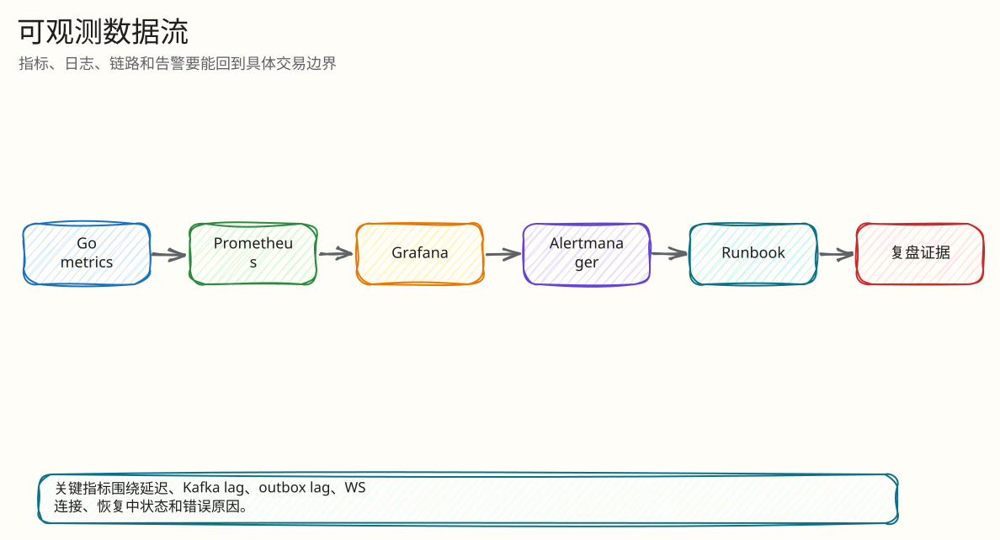
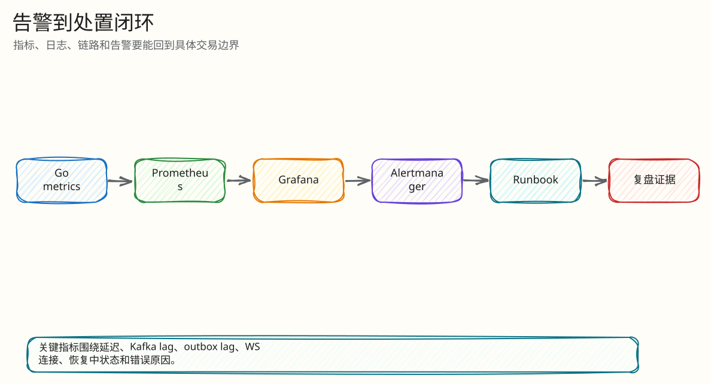

# 可观测性与运维

父文档：[文档库入口](../README.md)
相关文档：[证据映射](../07-performance-and-evidence/00-evidence-map.md)、[风险矩阵](../08-tests-and-risk/00-risk-and-abuse-matrix.md)

## 观测栈

| 组件 | 配置 | 作用 |
|---|---|---|
| Prometheus | `infra/prometheus/prometheus.yml` | 抓 `/metrics` |
| Alertmanager | `infra/alertmanager/alertmanager.yml` | 告警 webhook |
| Grafana | `infra/grafana/dashboards/*.json` | 总览和瓶颈看板 |
| OpenTelemetry Collector | `infra/otel/collector.yml` | trace 转发 |
| Tempo | `infra/tempo/tempo.yml` | trace 存储 |
| Pyroscope | `infra/docker-compose.yml` | profile |

Prometheus 官方 alerting rules 和 Alertmanager 是工业界常用告警组合；OpenTelemetry 官方定义了 traces/metrics/logs 的统一观测模型。本项目本地环境把这些组件串起来，支撑演示和故障定位。

## API 观测入口

| 路由 | 用途 |
|---|---|
| `/metrics` | Prometheus 指标 |
| `/api/monitor/auctions` | 拍品状态 |
| `/api/monitor/auctions/{id}/flight-recorder` | 飞行记录器 |
| `/api/monitor/anomalies` | 异常 |
| `/api/monitor/outbox` | outbox backlog/dead |
| `/api/monitor/scheduler` | scheduler 状态 |
| `/api/monitor/rejects` | 拒绝分布 |
| `/api/monitor/recovery` | 恢复事件 |
| `/api/monitor/redis-engine` | Redis engine 状态 |

## 图 6-0-1：观测数据流

<!-- excalidraw-generated:start -->

  <a href="../assets/excalidraw/06-observability-00-ops-observability-01.excalidraw">打开可编辑 Excalidraw 源文件</a>
   
  

<!-- excalidraw-generated:end -->

这张图展示运维不是只看基础设施指标。Prometheus/Grafana 用于趋势和告警，Monitor API/flight recorder 用于回答“某个拍品为什么这样”的业务审计问题。

## 关键告警面

| 告警/指标 | 事故含义 |
|---|---|
| outbox lag/dead | 客户端可能收不到事件 |
| scheduler drift | 终态转换可能延迟 |
| reconnect spike | 弱网/服务端不稳 |
| snapshot rebuild pressure | 恢复路径承压 |
| slow consumer disconnect | WS 客户端或网络背压 |
| Redis/PG/Kafka lag | 决策、结算、真相可能不收敛 |

## 凌晨 3 点事故回答模板

1. 先看 `/readyz` 和 `/metrics`，判断依赖是否健康。
2. Grafana 看 bid p99、Kafka lag、outbox lag、WS slow consumer、reconnect。
3. 若出现 engine pause/reconciling，看 `/api/monitor/redis-engine` 和 recovery。
4. 若用户说“我赢了但没订单”，查 flight recorder：bid decision -> settlement -> order -> outbox。
5. 若 outbox dead，走 control signal retry dead outbox。
6. 若 Redis 丢失，保持 fail-closed，不手工解除暂停；等待 checkpoint/rebuild 校验通过。

## 图 6-0-2：凌晨事故定位时序

<!-- excalidraw-generated:start -->

  <a href="../assets/excalidraw/06-observability-00-ops-observability-02.excalidraw">打开可编辑 Excalidraw 源文件</a>
   
  

<!-- excalidraw-generated:end -->

## 边界

当前观测栈是本地/演示/证据环境，不是生产多集群平台。生产还需要：

- 告警路由和值班策略；
- dashboard 版本管理；
- SLO error budget；
- trace sampling 策略；
- 日志脱敏和长期存储；
- 多实例标签和租户维度。
