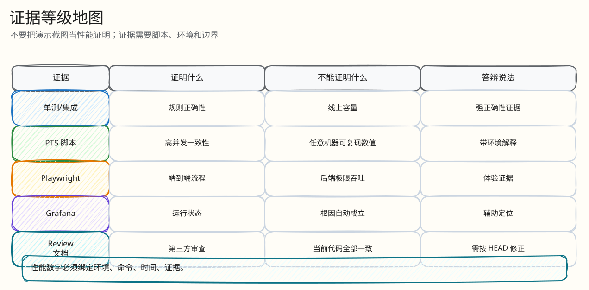
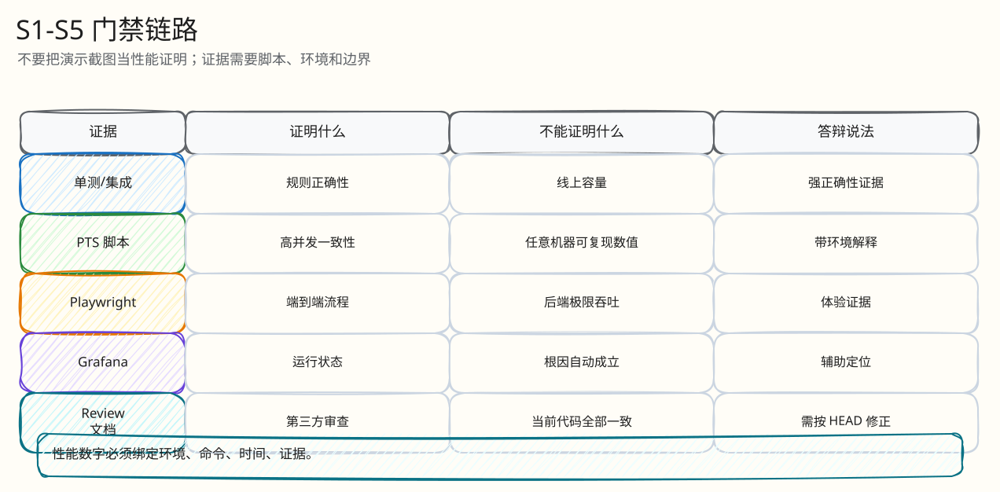

# 性能与证据映射

父文档：[文档库入口](../README.md)
相关文档：[风险矩阵](../08-tests-and-risk/00-risk-and-abuse-matrix.md)、[答辩索引](../09-judge-defense/00-defense-index.md)
关键资产：`tests/pts/MANIFEST.md`, `tests/load/README.md`, `tests/risk/README.md`

## 证据分级

| 等级 | 可用来证明 | 示例 |
|---|---|---|
| 代码可证 | 不变量、边界、同步/异步逻辑是否存在 | Lua 幂等、PG 唯一约束、WS ticket scope |
| 自动化测试可证 | 某类场景下行为正确 | Go integration、Playwright、risk simulator |
| 当前可复跑脚本 | 本地/云环境可重跑，但结果依赖环境 | k6、PTS shell、S1-S5 |
| 历史性能数字 | 只能作为“曾经在某环境跑出” | submission 中 S1/S3 数字 |
| 设计扩展 | 不能当作已验证 | RF=3、多 AZ、10k WS |

## 图 7-0-1：证据可信度阶梯

<!-- excalidraw-generated:start -->

  <a href="../assets/excalidraw/07-performance-and-evidence-00-evidence-map-01.excalidraw">打开可编辑 Excalidraw 源文件</a>
   
  

<!-- excalidraw-generated:end -->

这张图用于防止答辩过度宣传。能讲成结论的只有代码、自动化测试和当前可复跑脚本；历史性能数字必须说明环境，设计扩展只能讲路线。

## S1-S5 映射

| 场景 | 业务故事 | 资产 | 证明什么 | 不能证明什么 |
|---|---|---|---|---|
| S1 final-second contention | 1000 人最后一秒抢同一拍品 | `s1-final-second-contention-1000vu.jmx`, `verify-l4b-pts-correctness.sh` | 决策延迟、赢家正确、seq 无空洞、拒绝有据 | 多 AZ、RF=3、任意机器容量 |
| S2 steady/soak | 30-60min 稳态出价 | `s2-steady-soak.js` | 长时间无泄漏、结算收敛 | 峰值 fanout |
| S2 read interference | 读流量压出价 | `s2-read-interference.js` | 读路径索引与 bid p99 互扰 | WS 扇出 |
| S3 fanout | 大量观众在线看价格 | `s3-fanout-soak.js`, S3 JMX | WS 连接/广播延迟 | 真正 10k 生产 HA |
| S4 fault | Redis/Kafka/PG 故障 | `run-s4-fault.sh`, chaos scripts | fail-closed、无假成功、无重复结算 | 完整灾备 RTO/RPO |
| S5 reconnect | 弱网断连重连 | `s5-reconnect-recovery.js` | TTCS、seq gap、snapshot recovery | 所有移动网络组合 |
| P4 risk simulator | 产品风险小闭环 | `tests/risk/run-p4-risk-simulator.mjs` | 幂等、ACL、支付双击、flight recorder | 容量 |

## 图 7-0-2：性能场景到正确性校验

<!-- excalidraw-generated:start -->

  <a href="../assets/excalidraw/07-performance-and-evidence-00-evidence-map-02.excalidraw">打开可编辑 Excalidraw 源文件</a>
   
  

<!-- excalidraw-generated:end -->

性能压测只有和 verifier 绑定才有答辩价值；否则只能说明 HTTP 请求返回了，不能说明赢家、订单、拒绝原因和 outbox 都正确。

## 35 门禁的意义

6 月 10 日最终附录将门禁归为：

- 正确性核心：winner==highest、seq complete、reject justified、cap terminal；
- Redis/Kafka/PG/outbox 收敛；
- ordering/dedup；
- 状态机/订单；
- 基础设施持久性：Redis noeviction、DLQ empty、Kafka lag zero 等。

新文档建议答辩口径：**门禁证明的是“跑完后真相一致”，不是单看 HTTP 200。**

## 关键命令

| 目的 | 命令 |
|---|---|
| 后端单元/集成 | `go test ./...` in `backend` |
| 前端/e2e | `pnpm exec playwright test` 或项目 npm/pnpm scripts |
| P4 风险 | `pnpm exec node tests/risk/run-p4-risk-simulator.mjs` |
| PTS 资产索引 | 读 `tests/pts/MANIFEST.md` |
| k6 压测说明 | 读 `tests/load/README.md` |

## 答辩时怎么讲性能数字

| 被问 | 回答 |
|---|---|
| “p99 多少？” | 说历史 S1/S3 数字前先说明运行环境和证据来源；当前代码正确性可证，性能需按目标环境重跑。 |
| “为什么文档里曾有 50ms/60ms？” | 统一按当前合同建议 ≤60ms；50ms 是更激进目标/旧口径，不能混用。 |
| “S3 没 10k 原始数据怎么办？” | 主动承认：当前证明 3000-4500 级别和机制，10k 是扩展目标，需要独立证据。 |
