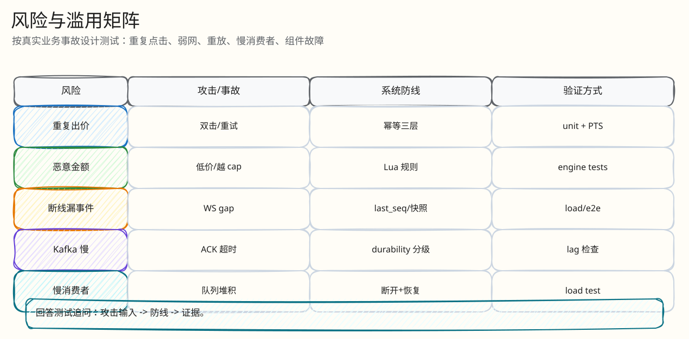
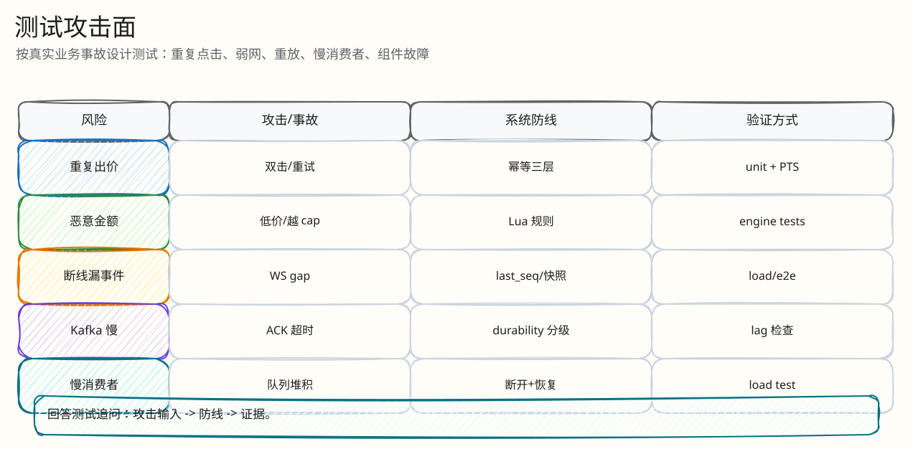

# 风险、攻击与测试矩阵

父文档：[文档库入口](../README.md)
相关文档：[证据映射](../07-performance-and-evidence/00-evidence-map.md)、[热出价闭环](../03-backend/01-bid-decision-closed-loop.md)

## 高风险场景矩阵

| 场景 | 风险 | 当前防线 | 证据 |
|---|---|---|---|
| 同 key 重放 | 重复扣款/重复出价 | request hash + idem replay | Go tests, P4 simulator |
| 同 key 改金额 | 恶意绕幂等 | hash mismatch 拒绝 | Lua + integration |
| 跨用户重放 | 盗用他人 bid id | hash 含 userID | Lua |
| 低价/错网格 | 错误接受 | Lua min/grid | S1/S2 门禁 |
| 自我领先狂点 | 产生大量 rejected | Lua 拒绝并记 seq | 正确但有资源浪费，后续可网关短路 |
| 天价无 cap | 用户误触/攻击 | fat finger threshold；若未配置仍有边界缺口 | 已知边界 |
| Redis FLUSHALL | 假成功 | RECONCILING/fail-closed/rebuild | S4 |
| Kafka 重投 | 双订单/双 bid | PG unique/CAS | settlement tests |
| Outbox dead | 客户端不更新 | monitor + retry | outbox tests/monitor |
| WS slow consumer | 房间广播拖慢 | queue byte/message limit + disconnect | S3/S5 |
| 规则排期后修改 | 用户规则被暗改 | rule freeze | repository tests |
| 支付双击 | 重复支付效果 | payment idempotency | bid integration/P4 |
| AI 编造 | 虚假承诺/合规风险 | schema + normalization + fallback | ai tests |

## 图 8-0-1：攻击面分布

<!-- excalidraw-generated:start -->

  <a href="../assets/excalidraw/08-tests-and-risk-00-risk-and-abuse-matrix-01.excalidraw">打开可编辑 Excalidraw 源文件</a>
   
  

<!-- excalidraw-generated:end -->

这张图用于测试评委追问“你覆盖了哪些攻击面”。每个风险入口都能回到表格里的防线和证据。

## 事故故事

### 事故 1：用户弱网点出价，HTTP 请求发出但响应丢失

期望：H5 8s 超时进入 uncertain，保留同 `client_bid_id`，用户重试后服务端回放同一决策或返回最终状态。

代码：`fetchWithTimeout`、`pendingBidRef`、Redis idem key。

### 事故 2：Kafka worker 写 PG 后崩溃，消息重新投递

期望：重复投递不会产生第二条业务效果；settlement/bid/order 唯一约束吸收。

代码：`redis_engine_settlements UNIQUE`, `bids UNIQUE`, `orders.auction_id UNIQUE`。

### 事故 3：Redis 数据被清空

期望：新出价不被接受，拍品进入恢复/暂停，从 checkpoint/PG/Kafka 重建后再恢复。

代码：Lua state missing -> `RECONCILING`，`rebuildRedisFromCheckpoint`。

## 图 8-0-2：风险测试闭环

<!-- excalidraw-generated:start -->

  <a href="../assets/excalidraw/08-tests-and-risk-00-risk-and-abuse-matrix-02.excalidraw">打开可编辑 Excalidraw 源文件</a>
   
  

<!-- excalidraw-generated:end -->

风险测试不是为了证明所有请求都成功，而是证明故障或恶意输入下不会产生假成功、双订单、无依据拒绝或不可解释状态。

## 未完全闭合的风险

| 风险 | 当前状态 | 建议 |
|---|---|---|
| 规则 Go/Lua 双实现漂移 | 已知延时公式差异，线上以 Lua 为准 | 加 parity/property test |
| 无 cap 且无 fat finger 的极大金额 | 可接受但产品风险 | admission 层加绝对/相对上限 |
| RF=1 Kafka | 本地功能证据 | 生产 RF=3/minISR=2 并重跑 |
| `engine.go` 过大 | 维护风险 | 拆分 worker/relay/lua/recovery |
| 全量 RTO 数字 | 部分历史材料有描述，但当前标准化不足 | 故障脚本记录 RTO/RPO 指标 |
