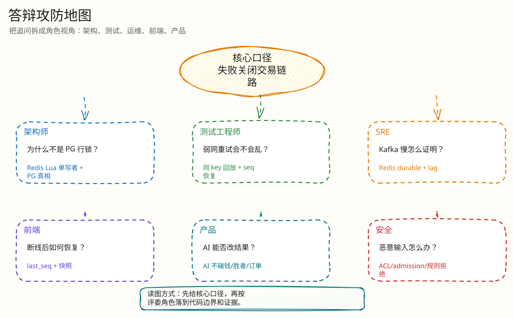

# 答辩与评委拷问索引

父文档：[文档库入口](../README.md)
子文档：[架构师拷问](01-architect-defense.md)、[测试/SRE 拷问](02-sre-test-defense.md)、[产品拷问](03-product-defense.md)

## 先记住的主线

```text
不是做了一个竞拍网页，
而是把直播竞拍里最危险的一刻：最后一秒多人抢同一拍品，
做成了 Redis Lua 单写者原子决策 + Kafka WAL + PG 结算真相 + Reconciler 证据闭环。
AI 只是运营助手，不碰交易真相。
```

## 图 9-0-1：追问路由图


<!-- excalidraw-generated:start -->
<div class="excalidraw-diagram" style="overflow-x: auto; width: 100%; margin: 12px 0 18px 0; padding: 12px 12px 14px 12px; border: 1px solid #e2e8f0; border-radius: 8px; background: #fffdf7;">
  <a href="../assets/excalidraw/09-judge-defense-00-defense-index-01.excalidraw">打开可编辑 Excalidraw 源文件</a>
  <br />
  
</div>
<!-- excalidraw-generated:end -->

这张图用于答辩现场快速选文档路径。先判断问题类型，再回到对应闭环，不要被追问带散。

## 10 个必问

| 问题 | 最短回答 | 指向文档 |
|---|---|---|
| 为什么不是 PG 行锁？ | 同一拍品热点行锁串行化，p99 不可控；Redis Lua 一次原子决策。 | [系统架构](../01-architecture/00-system-architecture.md) |
| Kafka 是不是过度设计？ | 它是决策 WAL/重放源/故障证据，不是装饰。 | [Kafka 结算](../03-backend/02-kafka-settlement-closed-loop.md) |
| 你保证 exactly-once 吗？ | 不吹 Kafka EOS；PG 唯一约束 + CAS 是业务 exactly-once 边界。 | [数据一致性](../01-architecture/01-data-consistency.md) |
| Redis 丢了怎么办？ | fail-closed，RECONCILING，checkpoint/Kafka/PG 重建，校验后恢复。 | [Redis 恢复](../03-backend/03-redis-loss-recovery.md) |
| 出价幂等怎么做？ | `Idempotency-Key == client_bid_id` + request hash + PG 唯一约束。 | [热出价闭环](../03-backend/01-bid-decision-closed-loop.md) |
| 为什么拒绝也有 engine_seq？ | 证明所有决策 1..N 无空洞，拒绝也可审计。 | [领域模型](../02-domain/00-domain-model-and-rules.md) |
| 前端怎么防假成功？ | pending/uncertain，终态只认服务端，恢复中禁用危险操作。 | [H5 闭环](../05-frontend/01-mobile-h5-closed-loop.md) |
| WS 弱网怎么恢复？ | ticket + last_seq + history/db/snapshot，gap 触发快照。 | [WS 恢复](../04-realtime/01-websocket-recovery-closed-loop.md) |
| AI 会不会影响钱？ | AI 不在出价/订单决策链路，只做运营文案和解释。 | [AI 闭环](../03-backend/04-ai-ops-closed-loop.md) |
| 性能证据怎么证明？ | 数字要带环境和 verifier；正确性门禁比 HTTP 200 更重要。 | [证据映射](../07-performance-and-evidence/00-evidence-map.md) |

## 诚实边界

| 边界 | 推荐说法 |
|---|---|
| Kafka RF=1 | 本地/演示配置证明链路逻辑，不证明生产 broker 容灾；生产需 RF=3/minISR=2 重跑。 |
| 性能历史数字 | 可展示为历史云测结果，但当前答辩要按目标环境复跑确认。 |
| Go/Lua 双实现 | 线上以 Lua 为准；已识别延时公式差异，应补 parity test。 |
| `engine.go` 大文件 | 承认维护技术债，拆分不改变架构正确性。 |
| 真实支付/直播 | 本期聚焦竞拍交易内核，支付和直播流是 mock/占位。 |

## 被问不会怎么办

用这个模板：

> “这个点我当前没有完整实现/没有足够证据证明。按现有架构，我会先把它降级为不宣传的边界；如果要生产化，我会做 A、B、C 三步，并用 X 测试证明。”
