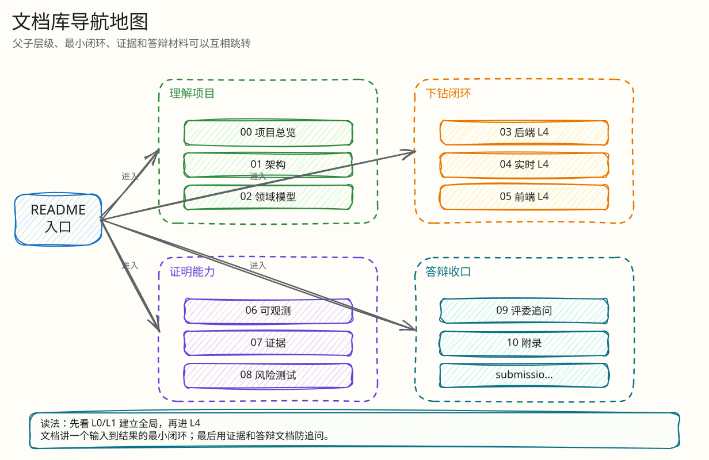

# Live Auction 新文档库

> 当前代码版本：以本提交所在 HEAD 为准。
> 文档状态：基于真实代码重建，替代旧 `docs/`/`exdocs/` 过程文档。
> 可信输入优先级：当前代码 > `submission/` 最终提交材料 > 本地原始证据归档 > 外部工业参考。

## 先读什么

| 读者 | 推荐路径 |
|---|---|
| 评委 / 面试官 | [项目总览](00-project/00-overview.md) -> [系统架构](01-architecture/00-system-architecture.md) -> [单次出价闭环](03-backend/01-bid-decision-closed-loop.md) -> [证据总览](07-performance-and-evidence/00-evidence-map.md) -> [答辩手册](09-judge-defense/00-defense-index.md) |
| 后端工程师 | [系统架构](01-architecture/00-system-architecture.md) -> [数据与一致性](01-architecture/01-data-consistency.md) -> [热出价闭环](03-backend/01-bid-decision-closed-loop.md) -> [Kafka 结算闭环](03-backend/02-kafka-settlement-closed-loop.md) |
| 前端工程师 | [实时恢复](04-realtime/01-websocket-recovery-closed-loop.md) -> [WebSocket L4](04-realtime/websocket/00-index.md) -> [H5 竞拍体验](05-frontend/01-mobile-h5-closed-loop.md) -> [H5 L4](05-frontend/mobile-h5/00-index.md) |
| 测试 / SRE | [可观测与运维](06-observability/00-ops-observability.md) -> [S1-S5 证据](07-performance-and-evidence/00-evidence-map.md) -> [风险测试](08-tests-and-risk/00-risk-and-abuse-matrix.md) |
| 产品经理 | [业务与范围](00-project/01-product-scope.md) -> [领域模型](02-domain/00-domain-model-and-rules.md) -> [产品答辩](09-judge-defense/03-product-defense.md) |
| 按模板自检 | [模板覆盖说明](00-project/03-template-coverage.md) -> [可视化覆盖矩阵](00-project/04-visualization-map.md) -> [技术选型与工业对标](01-architecture/02-technology-selection-and-benchmark.md) -> [工程难点](03-backend/05-engineering-difficulties.md) |

## 文档地图

<!-- excalidraw-generated:start -->

  <a href="./assets/excalidraw/readme-01.excalidraw">打开可编辑 Excalidraw 源文件</a>
   
  

<!-- excalidraw-generated:end -->

## 这套文档如何使用

- 每篇文档开头都有父文档、子文档、相关代码、相关测试。
- 第二期 L4 子目录用于答辩追问：按 [最小闭环索引](00-project/02-minimal-closed-loops.md) 进入，再下钻到某个“输入 -> 处理 -> 状态 -> 异常 -> 验证”的最小闭环。
- 代码引用使用当前仓库真实路径；行号会随后续改动漂移，优先相信路径、函数名和测试名。
- 外部参考只用于工业对标与术语边界，不替代本项目真实实现。
- 性能数字按证据等级解释：自动化正确性门禁可以作为强证据，历史 PTS 数字必须按运行环境和原始材料边界解释。

## 附录

- [代码地图](10-appendix/code-map.md)：答辩时按模块找文件。
- [模板覆盖说明](00-project/03-template-coverage.md)：对照 `构建文档库模版提示词.txt` 检查文档库要求。
- [可视化覆盖矩阵](00-project/04-visualization-map.md)：对照“图表与可视化强制要求”检查图、表、代码证据。
- [最终提交材料覆盖矩阵](10-appendix/submission-coverage.md)：确认 `submission/` 主题都被新文档覆盖。
- [参考资料](10-appendix/references.md)：外部官方资料与内部可信材料。

## 与旧材料的关系

旧 `exdocs/` 里的叙述型过程文档已清理，避免 50ms/60ms、旧缺陷状态、旧 `docs` 路径等过时口径继续污染答辩阅读入口。原始压测/风险/故障注入证据保留在本地 `artifacts/perf/raw/legacy-exdocs/`，该目录被 `.gitignore` 忽略；需要追溯历史 S1-S5 证据时再读取。当前讲解以本目录、当前代码和 `submission/` 为准。
